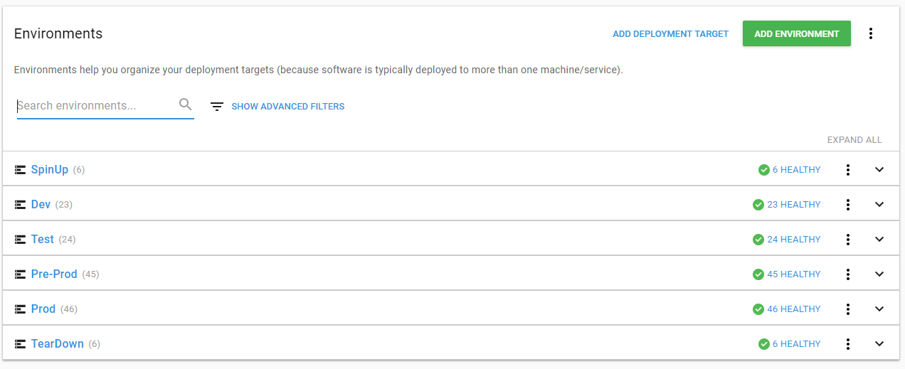
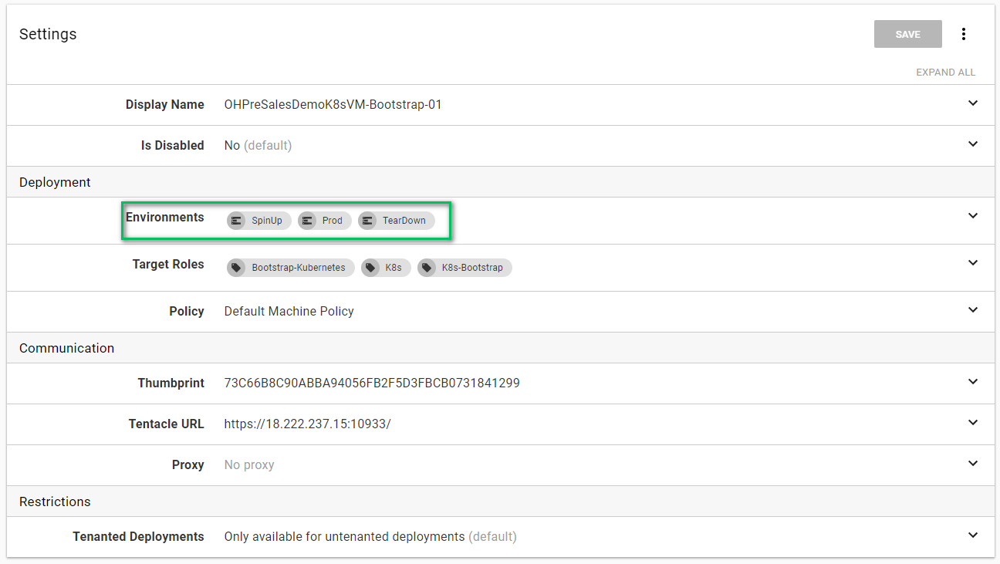
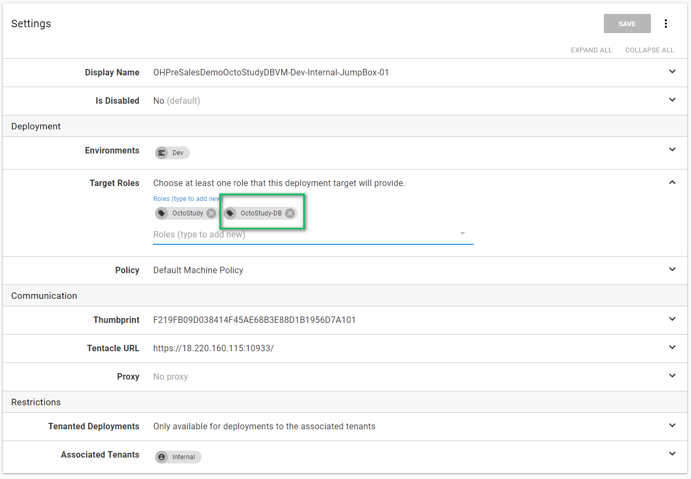
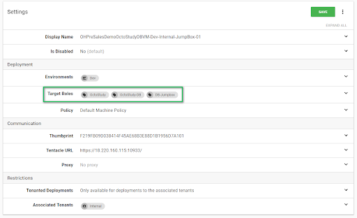
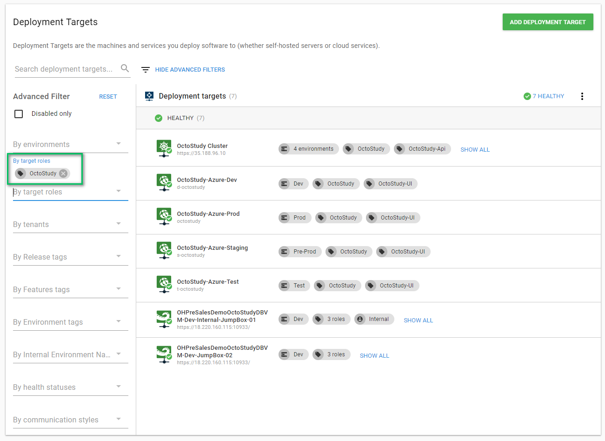
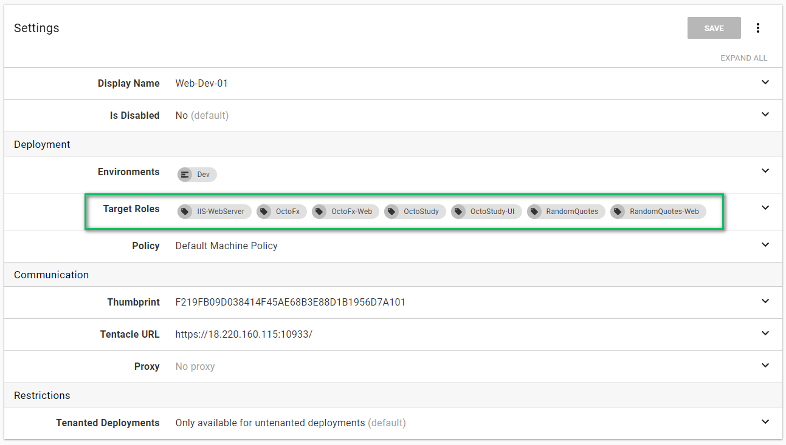

Roles, Deployment Targets, and Environments Oh My

The first time you went to add a machine to Octopus Deploy you were confronted with a lot of options.  Phrases like roles, deployment targets, tentacles, and environments.  What do those mean?  How are they used?  Well, let’s walk through each one and discuss some best practices in setting them up.

## Deployment Targets  

A deployment target is where you want to send your code to run on.  This could be a Windows machine, a Linux machine, an Azure web application, an offline drop or a Kubernetes cluster.  The list of deployment targets is always growing, as soon as we list them out that list will be out of date!

## Environments

Environments are a group of deployment targets.  Some common environment names people tend to use are Dev, Test, Staging and Production.  Machines in the Dev environment are used by developers to test their code.  The expected uptime for these machines is rather low due to testing and deployments.  Whereas machines in the production environment are used by customers and are expected to be up 99.999999% of the time.

The recommended approach to configuring environments is to follow your company’s terminology.  But keep it general.  Think how you want to phrase it during a conversation.   “I’m pushing some code up to dev” or “I’m deploying my app to production” makes a lot more sense than “I’m pushing to Dev Omaha 45.”  What does Omaha mean?  The data center?  Where did 45 come from?  

A good rule of thumb for environments is to keep it under a dozen.  For our personal Octopus instances our environments are Dev, Test, Pre-Prod, Production, SpinUp and SpinDown.  That seems to cover 99% of our possible scenarios.

A lot of the customers we work with have machines in multiple data centers.  They don’t want to deploy to all of them at the same time.  Our recommendation is to use the multi-tenancy feature in Octopus Deploy so you can control which data center gets which version of the code.

We have an excellent guide in our documentation on how to get you set this solution set up.

A single deployment target can be tied to more than one environment.  Most of our customers don’t do this, but the functionality is there.  

## Roles

Roles are tags assigned to a deployment target.  A deployment target can have 1 to N number of roles.  Because they are tags, you can get as generic or as specific as you want with the role.  The role assigned to the machine is how Octopus Deploy knows to deploy to it.

For example, a machine has the role of “OctoStudy-DB.”  This indicates that this machine is used to deploy database changes for the application “OctoStudy.”

In the OctoStudy project, when I want to deploy database changes I assign those steps to the role “OctoStudy-DB.”

Octo Horror: We have seen instances where customers will assign very generic roles such as “IIS-Server” or “DB-Server.”  They then set their project steps to deploy to “IIS-Server” because all of the web applications are hosted on a single IIS Server.  This does not scale well.  If one of the applications needs to be moved to another server then a lot of steps in the project need to change.

Our recommendation for roles is to create both generic roles and specific roles.  Going back to the previous deployment machine for OctoStudy.  A good set of roles for that machine would be “DB-Jumpbox”, “OctoStudy-DB” and “OctoStudy.”  

“OctoStudy-DB” is used in the project process.

While the other two roles are used for grouping and organization.  When set, you can now see all the machines used for “OctoStudy” or for “DB-JumpBox” by using the advanced filters.

Having a single machine be used for multiple applications is more than fine.  Just please be sure to include all the necessary roles so you are prepared in the future to move machines around.

