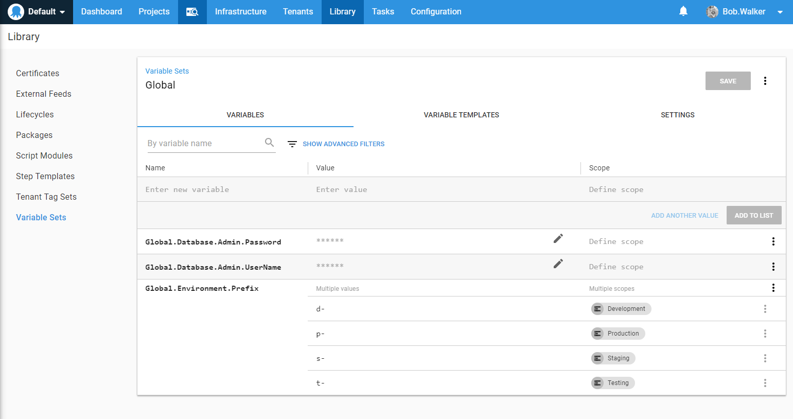
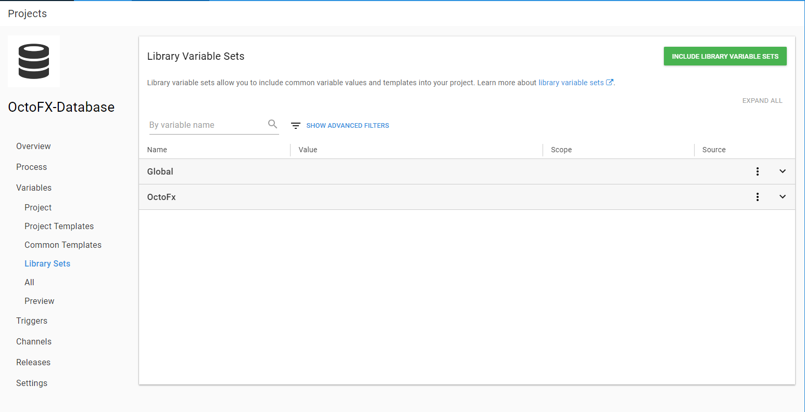
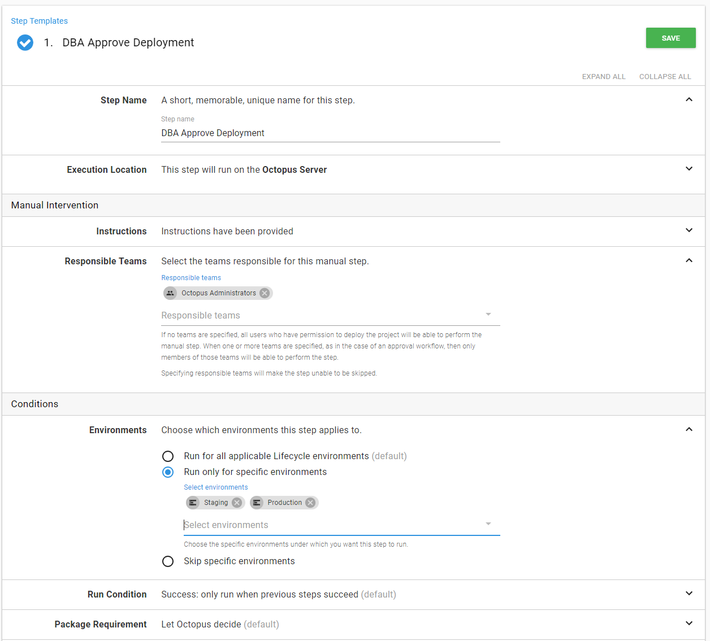
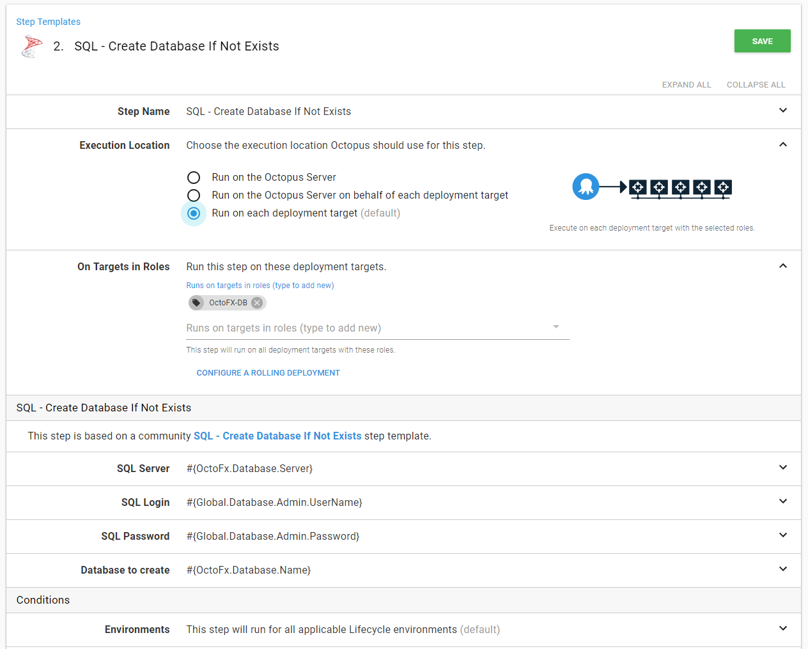
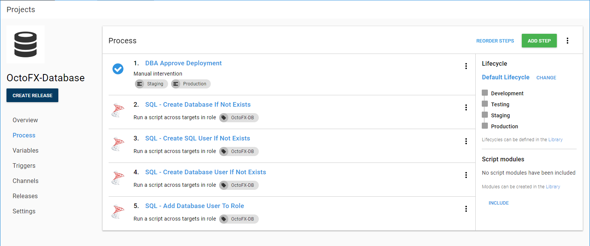

# Finally...time to setup some projects and deployment targets

Earlier we set up the necessary infrastructure scaffolding for our Octopus Deploy server to help it scale.  In this chapter we will take that infrastructure and use it to set up a simple project.  We know...we know...this is something you already did in your Proof of Concept.  But please bear with us, there are a number of recommendations we are going to make on helping to set up your project as well as deployment targets so they can easily scale as well.

## Project Recommendations

Octopus Deploy was built with the core concept consistency across all environments.  The process which is used to deploy to the development servers is the same process which is used to deploy to production.  You can disable and enable specific steps, but overall it is the exact same process.  The end goal of this is to make going to production a non-event.  Because by the time that project has been deployed to production that process has been tested a number of times.  In our case, it has been tested at least three times, in Development, Testing and Staging.  

Knowing the underlying concept of Octopus Deploy is consistency we can take that and create a number of recommendations.  

### Keep your projects simple

One of our favorite programming maxims is the single responsibility principle.  A class / function / method should do one thing and one thing well.  The same holds true for projects.  Projects should be very simple and should deploy a component of an application.  

For example, your project has a Windows Service, a UI and a database.  The temptation is there to create a single project to deploy all three components at the same time.  The project wouldn't be very complex.  Maybe four or five steps if you include a manual intervention.  But consider this, how often do you deploy a UI change which doesn't require a database change?  Or, what if you could make a small UI fix without having to worry about deploying your database and windows service?  Think about how much faster you could respond to customer feedback.  Or, what if you could add an index into your database and push that to production without having to worry about deploying your UI or Windows service?  

Rather than have a single project to deploy all three components, each component should have their own project.  This will give you the flexibility to deploy the pieces of your application only when a change has actually occurred.

Octopus Deploy provides a mechanism for a project to call other projects.  This will allow you to set up a orchestrator, or what we like to call a traffic cop, to deploy your projects in a specific order.

### Projects should be responsible for setting up what it needs to run

Imagine you are working on a greenfield application for six months.  It only exists in your development and testing environments.  Now it is time to deploy to staging.  The web admins have set up a web server running IIS for you using a base image.  The DBAs have created an account for the application to use.  What about the configuration?  What should the database name be?  

When you set up a project's processes you should work under the assumption the key base applications are present (.NET Framework, IIS, SQL Server, WildFly server, Oracle Database, etc) but they have never been configured for your application.  Assume SQL Server is there but the database has never been created.  Assume IIS is there but the web application has never been configured.

Going back to earlier, when it is time to deploy to staging you should just need to verify the servers are there and hit the deploy button.  The project deployment process will take care of the rest.  As an added bonus, if a new server is added you can just deploy to that new server without having to worry about the configuration.  And going back to consistency, all the servers will be configured the exact same.

### Take advantage of the run conditions

Almost everyone is familar with the environment run conditions.  Run this step in production only.  Don't run this step in development or testing.  But there are several other run conditions, such as only running when the previous step was successful, only running on failure, always running, and only run when a variable is set to true.  

Those additional conditions are very useful.  You can configure a step to send an slack notification when a failure occurs.  You could configure a manual intervention to only occur if you are deploying during business hours.  You can also configure steps to run in parallel of one another.

These conditions allow you to have a degree of control with your deployments.  

### Every Component's Deployment Should Be Automated

A very common scenario we see is application deployments are automated, but the database piece is not.  That is still a manual process.  What ends up happening is on the night of deployment to production a DBA has to run the scripts, then after they are done then the automated process can be kicked off.  Because this is manual there is a good chance the scripts were not included in the deployments to dev or testing or staging.  So there is a pretty good chance the database deployment piece will take quite a while to finish and verify.  

Essentially there is this great automated process which takes a few minutes to finish but it is dependent on a manual process which takes anywhere from 10 minutes to an hour to finish.  Every component of the application needs to be automated.  Even the database.  Octopus Deploy integrates with a number of database deployment tools to help with this sort of automation.

## Setting up the project

Whew...that got a bit long winded.  Enough talk, it is time for action.  Let's configure a project using all those principles so we can see what they look like.  The application we are going to be deploying is called OctoFX.  It is a small ASP.NET application with a database and a user interface.  When we are finished with this set up we will have a three projects.  One to deploy the UI, another to deploy the database, and a traffic cop project to coordinate those deployments.

Let's first get the project scaffolding in place and see what that looks like.  Start with creating a project group called "OctoFX."

>  Project groups are a great way to organize your deployment projects.  They have many uses, not only do they visually separate the projects, you can also configure the dashboard to hide/show specific project groups as well as configure permissions to restrict access to them. 

That group looks a little empty.  Lets add in the three projects we discussed earlier. 

>  Just like with tenants, adding an image to your project is a useful way to visually set them apart from other projects.  In addition to supporting .jpg and .png files, we also support .gif files.  Which means...you can have an animated icon to add a little flair to your Octopus Deploy instance!

### Sharing Variables Between Projects

We have the three projects set up but there is going to be a need to share some common variables between them.  Some which come to mind right away are the SQL Server to deploy or connect to, the database name, the application name.  To accomplish this we are going to create a library set for this specific application.

>  A project can reference 0 to N number of library sets.  Variable naming is very important.  A good practice is to use a NameSpace style syntax on naming, [LibrarySetName].[ComponentName].[SubName].  Project variables can then be called [Project].[ComponentName].[SubName].  This gives you the ability to distinguish in the project steps and logs which variable is from a library set and which is from the project.

It is also a good idea to have a couple of other library sets to handle some non-project specific values.  A couple we like to set up are global and another to handle any infrastructure as code or IaC.  The same naming convention applies as the project specific variable set example, just replacing "OctoFx" with "Global."

### OctoFX-Database Project

The first project we are going to configure is the OctoFX-Database project.  If we follow the recommendations from earlier in this chapter we are going to assume that the SQL Server is running but this database and required user does not exist.  This means we are going to have steps in place to check to see if the database exists as well the necessary user for the environment.  If they don't exist then we will need to create them.  In addition, we want to build some trust in the process, this can be done by having a manual intervention for a DBA to approve.

Before adding in steps to the process we need to add a reference to the library variable sets we created earlier.

Next, we are going to add in the manual intervention for the DBAs to approve.  If you are configuring a fresh instance of Octopus Deploy you likely haven't had the chance to configure a DBA team yet.  That is okay, for now, just put in Octopus Administrators or a team which already exists.  We will get to configuring teams in a later chapter.

>  This project deploy a database package using DBUp, a free database deployment tool.  Some tools provide the ability to generate a difference report prior to deployments which Octopus can store as an artifact and a DBA can download and review.  In that case it makes more sense to have the manual intervention occur after that report has been generated.

A number of community step templates have been created to help with some of this database scaffolding.  We are going to be using the SQL - Create Database If Not Exists step template to create the database if it doesn't exist.  We are going to be using variables out of the library sets we brought in previously.  For now we are going to execute this script on a tentacle with the role "OctoFX-DB."  Later in the book we will convert this over to using workers.

There are few more maintenance tasks to add, such as creating the SQL Login if not exists, assigning that user to the database and assigning them to a role.  Keep in mind, all of the steps being added are occuring before an actual deployment happens.  Without even doing a deployment we have added in five steps.  And that is just to deploy the database.  Imagine if this project also deploy a website, a windows service and other components.  The project would become very hard to manage.  

Now we are ready to configure the database deployment.  As you most likely learned when creating a PoC or other deployment projects, you need to package up the database into either a NuGet or a Zip file.  In this book we haven't configured anything to push the packages to Octopus Deploy's internal package feed for it to deploy.  However, the deploy a package step requires us to specify a package.  The way we are going to short-circuit this chicken/egg scenario is by using variables.    