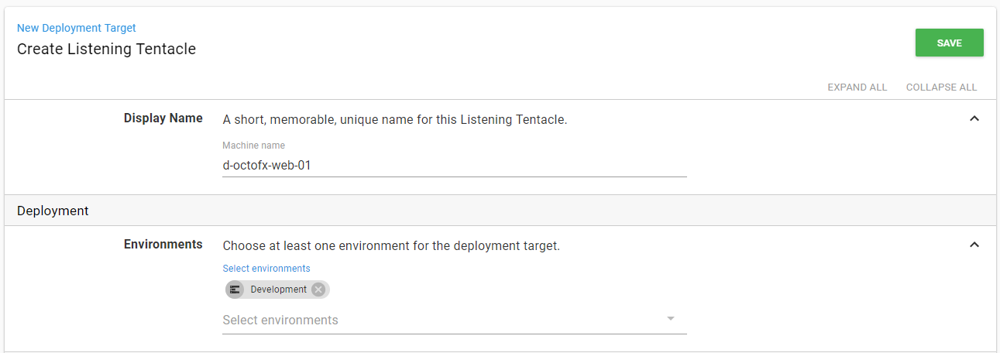
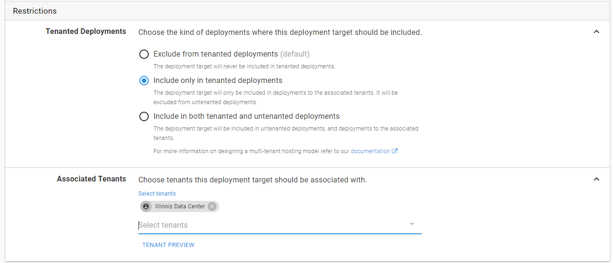
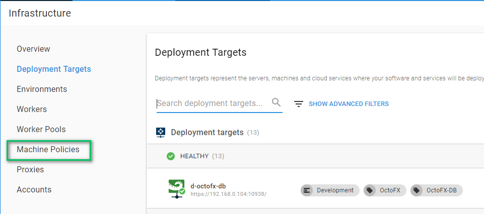
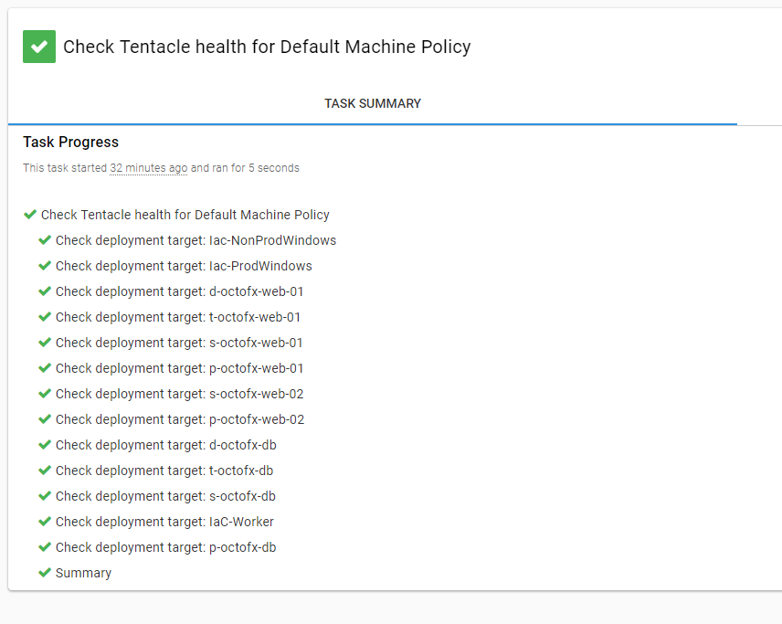
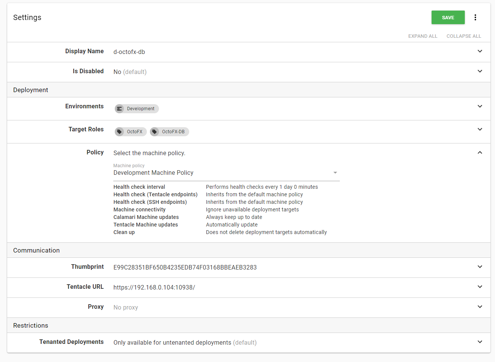
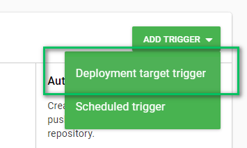
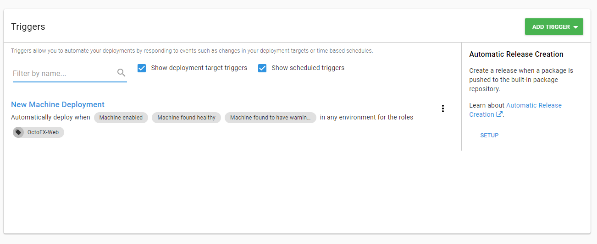

# Everything you wanted to know about deployment targets, roles and machine policies (but were afraid to ask)

We have the environments and project processes.  Now we need to configure a couple of deployment targets.  Deployment targets are what you will deploy the code to.  A deployment target is typically a Windows VM running a small windows service known as a tentacle.  The Octopus Deploy server connects to that tentacle and instructs it to do work.  But a deployment target is not just a tentacle.  As time has gone on we have added more and more deployment targets types.  Now there are Windows Targets, SSH Connections (for Linux machines), Azure Targets, Kubernetes Clusters, Offline Drops and Cloud Regions.  That list keeps growing and growing.  We are willing to bet that by the time you read this book that list will have changed.

When you were setting up a proof of concept or a pilot project chances are you didn't much thought to the add target form.  We know we didn't.  We just wanted to add a machine into Octopus so we could start defining our deployment process and getting some code pushed out.  When registering a deployment target there is the standard "what environment should this target be placed in" option, but you are also given a few other options, such as roles, machine policies, and tenants that tend to create some confusion and the opportunity for some misconfigurations.  


## Naming

Naming.  Easy to learn.  Hard to master.  A good machine name will describe the machine and its purpose in a succinct manner.  You might have your own internal naming conventions for machines, and that is great, use that if possible.  The problem a lot of people will run into is when they are naming PaaS targets such as Kubernetes, Azure Web Apps and Service Fabric clusters.

If each application gets its own set of resources or its own machine, a good naming guideline to follow is [EnvironmentPrefix]-[AppName]-[Component]-[Number].  Or [EnvironmentPrefix]-[AppName][Component][Number].  For example, the machine hosting the OctoFX Website in Dev would be named `d-octofx-web-01`.



If you have multiple applications sharing the same resources then having a succinct name describing the type of apps it hosts is key.  For internal websites on test a good name would be `t-internal-web-01`.

## Roles

Roles are a little trickier and tend to trip up a lot of people.  If you remember when we created the deployment process we had to pick a role for the step to run on.  How it works with Octopus Deploy is it will grab all the machines for that role and run the script on that machine.

All too often we run across scenarios where a customer has created a role called `IIS-Server` because they only had one or two servers hosting all their web applications.  This worked fine until they decided to move a small subset of applications to a new server.  They tried using the same role, `IIS-Server` but when they went to deploy they had all the projects being deployed to both the new and the old servers.  

The problem is the role `IIS-Server` is too generic.  Some of the customers we have talked to think that a machine can only have a single role.  But in reality, roles are nothing more than tags.  You can have 1 to N number of roles assigned to a specific target.  Because of that, we recommend using specific roles.  

For the machine deploying to OctoFX-Web we recommend the roles `OctoFX` and `OctoFX-Web`.  


For the database the roles would be `OctoFX` and `OctoFX-DB`.  


The reason we recommend including the role `OctoFX` is for organization and searching.  Tou can then use the filtering functionality on the deployment target page to find all the machines being used for OctoFX deployments.  


The roles `OctoFX-Web` and `OctoFX-DB` are what is being used in the deployment process.


If you wanted to keep track of all the IIS Servers in your infrastructure then by all means add the role `IIS-Server`.  Just don't have any steps specifically target that role.

In the event you have several applications being hosted on the same target then you can add a role for each application.


It does feel a bit tedious to constantly be adding roles to an existing target, but it makes changes in your infrastructure much easier to change.  If new servers are created to move a subset of applications over all you need to do is remove those roles from the old machine and add them to the new machine.  You don't have to adjust your deployment process or create a new release.  In fact, once the roles are added you can re-run the deployment for the environment and the new machines will get the latest and greatest code (in later chapters we will discuss triggers on how to automate this).    

>  Adding dozens upon dozens of application roles to a single target might be an indication that server is trying to host too much.  If you have the resources consider splitting up the server.  

## Tenants

The last piece of the add deployment target form is the tenants section.  This will allow you to specify if the target should be used for tenant deployments.  If the deployment target is going to be used for a specific tenant then it would make sense to adjust the name [EnvironmentPrefix]-[TenantName]-[AppName]-[Component]-[Number].  So `d-ford-octofx-web-01` if we wanted the machine to deploy the OctoFX website for Ford to Dev.

It is possible for a deployment target to be used for both non-tenant deployments as well tenant deployments.  This typically done for virtual machines which host lots of applications and tenants.  This is not something we would recommend in production, but it is possible.  It would make more sense in the lower environments when the resources tend to be more limited.

In the scenario where you are using tenants to deploy to multiple data centers this is where you would specify the data center this deployment target is for.  



## Machine Policies

One screen and concept we have danced around for the past several chapters is machine policies.  You probably noticed it on the left hand menu and didn't think much of it.



Periodically the Octopus Deploy server needs to make sure that it can still connect to all the deployment targets doing what is known as a health check. It does this because a lot of our users want to know about problems with a machine prior to doing a deployment.  If a system admin can fix a minor problem before it becomes a major problem then it is well worth the effort.  It also does this as a sanity check and also to make sure the server has crashed or is about to run out of space.  By default health checks are performed every hour.  And by default all machines are added into the default machine policy.  And finally by default if Octopus is unable to connect to the machine it will throw an error and fail the health check.  All of this is configurable on the machine policy screen.


When a machine policy performs a health check it queues a task on the Octopus Server.  That is a blocking task for any deployments.  The server needs to make sure the machines are there before it can deploy code.



Having all the deployment targets on the same machine policy is not a big deal when you only have a couple of dozen of machines.  The health checks are quick.  It really starts to cause problems when you have thousands of machines.  A health check could take hours to complete.  It can only connect to 10 machines at a time to perform the health check, it can take a while to finish up.  

You also might have a group of machines which are flaky and tend to go up and down.  Perhaps they are test instances or they are hosted on a client's site and your connection is spotty.  You anticipate them to fail once in a while.  You shouldn't change your default machine policy to account for one or two spotty machines.  The other machines in the machine policy should be running.  You want to know about those if they go down.

Our recommendation is to create several machine policies.  Some possible strategies are:

1) Machine policy per environment
2) Machine policy per data center
3) Machine policy per tenant (if the tenant is hosting their own servers and you deploy to them)
4) Transient Machine Policy (for machines which tend to go offline randomly)

If you are going the machine policy per environment you could change the time between checks to be something large for dev, say once a day, while production stays at once an hour.  And maybe you know that development machines tend to go up and down at random, so you can change those to not fail the health check.  


>  Each machine policy health check is a unique task.  This will allow you to multi-thread your health checks.  If you are using Octopus Deploy's High Availability functionality (available with data center licenses) the health checks can now be spread across multiple nodes.  

You change the machine policy for a specific deployment target by going to the deployment target screen.



## Automating tentacle installation

The tentacle is an MSI you have to install on a VM.  To get going with the PoC you probably downloaded the tentacle onto the server, manually installed it, and manually configured it.  Then you went back to the Octopus Deploy UI and registered the target with the Octopus Deploy server.  For a few tentacles that isn't terrible.  Once you get above 20 or so machines you realize rather quickly that doesn't scale.

We strongly recommend creating a process to automate the tentacle installation.  If you are using Azure or AWS you can leverage Azure Resource Manager Templates (ARM Templates) or CloudFormation to spin up new virtual machines and bootstrap them using a PowerShell script.  

>  CloudFormation templates allow you to include PowerShell directly in them.  ARM templates require you to use the custom script extension.  We recommend using Google to find the latest examples.  

Meanwhile, if you are on-premise you might be using hypervisor software such as Hyper-V or VMWare.  Those have a robust API so you can also script out spinning up a VM and bootstrapping them using a PowerShell script.  

>  We are not including samples on how to do this as your hypervisor and configuration is unique to your organization.  If we tried to include scripts for every possible hypervisor and version this chapter would end up being hundreds of pages long.

Regardless of the technology you are using, you will need a PowerShell script to Bootstrap the tentacle installation.  Below is a sample script we wrote for this book to bootstrap tentacles.  

``` PS

Param(    
    [string]$octopusServerUrl,    
    [string]$octopusApiKey,	
	[string]$octopusServerThumbprint,
	[string]$instanceName,	
    [string]$registrationName,
    [string]$environment,
    [string]$tenant,
    [string]$roles,
    [string]$machinePolicy
)

## This assumes you are installing on premise.  
$IpAddresses = Get-NetIPAddress -AddressFamily IPv4 

$ipAddress = ""
foreach ($address in $IpAddresses)
{
    $addressToCheck = $address.IPAddress
    
    # Change this to match against your own internal IP address range
    if ($addressToCheck -match "192.168.0.*"){
        $ipAddress = $addressToCheck
    }
}

Write-Host "Instance name: $instanceName"
Write-Host "Registration Name: $registrationName"
Write-Host "Environment: $environment"
Write-Host "Tenant: $tenant"
Write-Host "Roles: $roles"

Set-Location "${env:ProgramFiles}\Octopus Deploy\Tentacle"

$tentacleListenPort = 10933
Write-Host "Going to use port $tentacleListenPort"

Write-Output "Open port $tentacleListenPort on Windows Firewall" 
& netsh.exe firewall add portopening TCP $tentacleListenPort "Octopus Tentacle $instanceName" 
if ($lastExitCode -ne 0) { 
	throw "Installation failed when modifying firewall rules" 
} 

$tentacleHomeDirectory = "C:\Octopus\$instanceName" 
$tentacleAppDirectory = "C:\Octopus\$instanceName\Applications" 
$tentacleConfigFile = "C:\Octopus\$instanceName\Tentacle\Tentacle.config"

$rolesToRegister = $roles -split "," | foreach { "--role `"$($_.Trim())`"" }
$rolesToRegister = $rolesToRegister -join " "

if ([string]::IsNullOrWhiteSpace($tenant) -eq $false){
	$tenantToRegister = "--tenant `"$tenant`""
}

& .\tentacle.exe create-instance --instance $instanceName --config $tentacleConfigFile --console | Write-Output
if ($lastExitCode -ne 0) { 
	throw "Installation failed on create-instance" 
} 
& .\tentacle.exe configure --instance $instanceName --home $tentacleHomeDirectory --console | Write-Output
if ($lastExitCode -ne 0) { 
	throw "Installation failed on configure home directory" 
} 
& .\tentacle.exe configure --instance $instanceName --app $tentacleAppDirectory --console | Write-Output
if ($lastExitCode -ne 0) { 
	throw "Installation failed on configure app directory" 
} 
& .\tentacle.exe configure --instance $instanceName --port $tentacleListenPort --console | Write-Output
if ($lastExitCode -ne 0) { 
	throw "Installation failed on configure port" 
} 
& .\tentacle.exe new-certificate --instance $instanceName --console | Write-Output
if ($lastExitCode -ne 0) { 
	throw "Installation failed on creating new certificate" 
} 
& .\tentacle.exe configure --instance $instanceName --trust $octopusServerThumbprint --console | Write-Output
if ($lastExitCode -ne 0) { 
	throw "Installation failed on configure trust with server" 
} 	                  
& .\tentacle.exe service --instance $instanceName --install --start --console | Write-Output
if ($lastExitCode -ne 0) { 
	throw "Installation failed on service install" 
} 
$cmd = "& .\tentacle.exe register-with --instance `"$instanceName`" --server $octopusServerUrl $rolesToRegister --environment `"$environment`" --name $registrationName $tenantToRegister --publicHostName $ipAddress --apiKey $octopusApiKey --comms-style TentaclePassive --force --console --policy=`"$machinePolicy`""
Write-Host $cmd
Invoke-Expression $cmd | Write-Host
if ($lastExitCode -ne 0) { 
	throw "Installation failed on register-with" 
} 
```

>  By automating the tentacle bootstrapping process you also put yourself in a position to better handle increased load.  With automation you can spin up a new server in a matter of minutes rather than hours or even days.

The bootstrap script can do so much more than install the tentacle.  You can also leverage applications such as Chocolatey and built-in features such as DISM to install IIS, .NET Core, SQL Server Management Objects, and so on.  Chocolatey is a application manager which allows you install third-party applications in an automated fashion.  DISM, or Deployment Image Servicing and Management, is built into Windows to allow you to enable or disable features.  For example, if you wanted to automatically configure a VM to host a .NET core application this would be a script to do so.

```PS
Write-Output "Installing ASP.NET 4.5"
Dism /Online /Enable-Feature /FeatureName:IIS-ASPNET45 /All | Write-Output

Write-Output "Installing CertProvider"
Dism /Online /Enable-Feature /FeatureName:IIS-CertProvider /All | Write-Output

Write-Output "Installing IIS Management"
Dism /Online /Enable-Feature /FeatureName:IIS-ManagementService /All | Write-Output

Write-Output "Installing Chocolatey"
Set-ExecutionPolicy Bypass -Scope Process -Force; iex ((New-Object System.Net.WebClient).DownloadString('https://chocolatey.org/install.ps1'))

Write-Output "Installing .NET Core"
choco install dotnetcore-windowshosting -y
```

>  For other deployment target types (Kubernetes, SSH, Azure Web Apps, etc), you should leverage the Octopus Deploy API to register the target.  Octopus Deploy is an API first application.  Everything you can do in the UI you can do in the API.

## Project Triggers

The creation of the deployment targets is now automated.  The next step is to set up a project trigger which will see when a new machine is added for a specific role and then automatically deploy to that machine.  This way the entire process is automated, from machine creation to deployment.  

Before we get going on creating the triggers lets take a quick step back and think about what this means.  In the previous chapters we setup three projects.  


Of those three projects which one is most likely going to have a new machine added to it for scale?  Probably the OctoFX-WebUI project.  If you add a new machine to a SQL Server cluster the DBAs will go through the effort of getting everything synced up as that is required by SQL Server.  And you typically are not adding new machines willy nilly to a SQL Cluster.  But adding new machines into a webfarm for the OctoFX-WebUI project is a lot more plausible.  Maybe to handle some additional load.  Maybe to replace an existing machine.  OctoFX-WebUI is where we are going to add the trigger.

This is done by going to the project and selecting the triggers option in the left hand menu.


From here you are going to want to select the add triggers button in the top right corner of the screen and select deployment targets trigger.



On the next screen you will want to the event, which should be "machine becomes available for deployment," and select the machine role to monitor.  This is also a great reason to have a specific role per project.  It allows a project to monitor for machines it cares about.


And with a simple click of the save button we have the trigger configured.



## Conclusion

We now have deployment targets configured and ready for code to be pushed to them.  By using specific roles we have also positioned ourselves so if we do make changes to the infrastructure we don't have to make changes to our projects.  And we have set up multiple machine policies to ensure we have a high signal to noise ratio if/when Octopus Deploy cannot connect to a tentacle.  Production is checked the most because typically that has the least number of deployments.  An environment such as development is getting deployed to hundreds of times a day and if a machine were to go down most people would know about it but it would have the smallest impact on the business.  Finally we wrapped discussing some techniques to automate tentacle installation and automatically redeploying releases new machines come online.

In our next chapter we will get to packaging up code and finally deploying it!