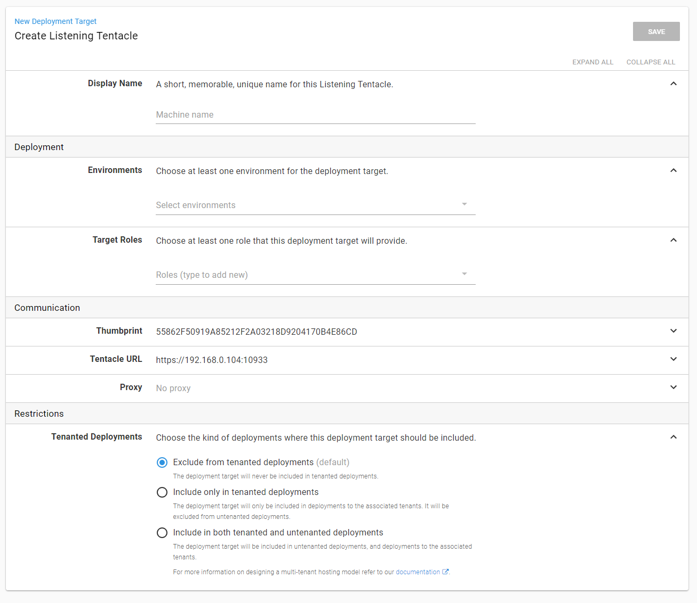
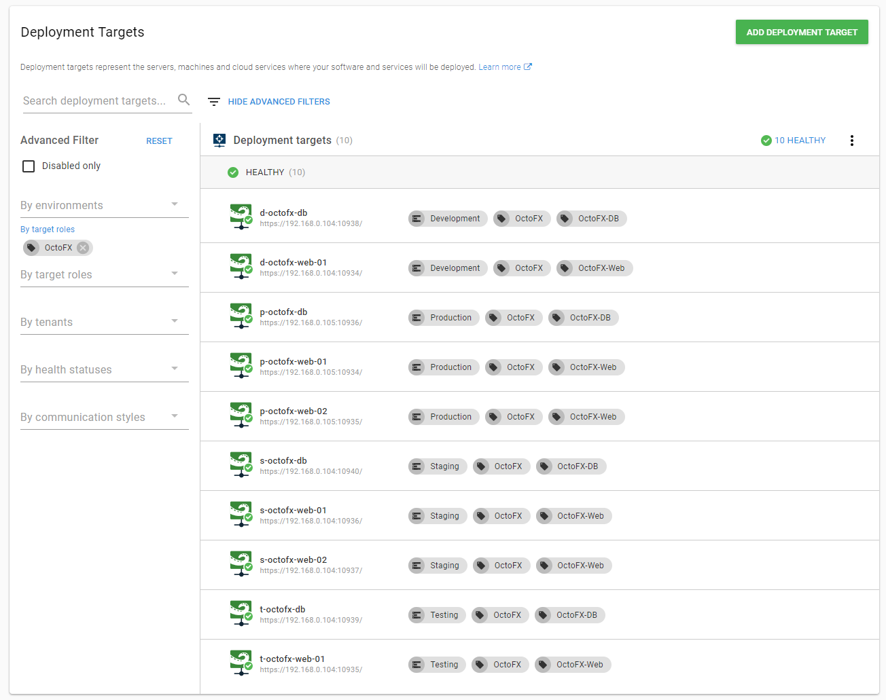
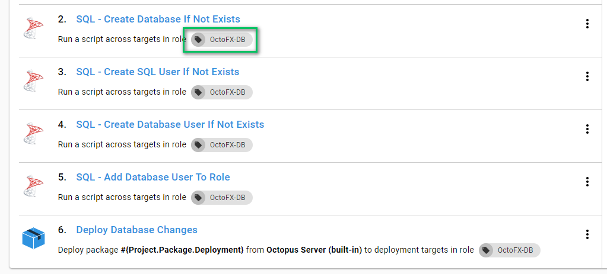

# Everything you wanted to know about deployment targets and roles (but were afraid to ask)

We have the environments and project processes.  Now we need to configure a couple of deployment targets.  Deployment targets are what you will deploy the code to.  Originally, deployment targets were Windows VMs running the tentacle windows service.  The Octopus Deploy server connects to that tentacle and instructs it to do work.  But a deployment target is not just a tentacle.  As time has gone on we have added more and more deployment targets types.  Now there are Windows Targets, SSH Connections (for Linux machines), Azure Targets, Kubernetes Clusters, Offline Drops and Cloud Regions.  That list keeps growing and growing.  We are willing to bet that by the time you read this book that list will have changed.

When you were setting up a proof of concept or a pilot project chances are you didn't much thought to the add target form.  We know we didn't.  We wanted to get to defining our deployment process.  All we cared about was which environment the machine is registered in. We didn't give much thought to roles, machine policies or tenants.  Unfortunately, that is where we see a lot of misconfiguration.  

## Naming

Naming.  Easy to learn.  Hard to master.  A good machine name will describe the machine and its purpose in a succinct manner.  You might have your own internal naming conventions for VMs. If that is already in place, use that.  Naming conventions tend to not apply to PaaS targets such as Kubernetes, Azure Web Apps and Service Fabric clusters.

If each application gets its own set of resources or its own machine, a good naming guideline to follow is [EnvironmentPrefix]-[AppName]-[Component]-[Number].  Or [EnvironmentPrefix]-[AppName][Component][Number].  For example, the machine hosting the OctoFX Website in Dev would be `d-octofx-web-01`.

If you have a web server hosting many websites a succinct name is important.  For internal websites on test a good name would be `t-internal-web-01`.

## Roles

Roles are a little trickier and tend to trip up a lot of people.  If you remember when we created the deployment process we had to pick a role for the step to run on.  During a deployment, Octopus Deploy will grab all machines with that role and run the deployments on those machines.

All too often we run across scenarios where a customer has created a role called `IIS-Server` because they only had one or two servers hosting all their web applications.  This worked fine until they decided to move a small subset of applications to a new server.  They tried using the same role, `IIS-Server` but when they went to deploy they had all the projects being deployed to both the new and the old servers.  

The problem is the role `IIS-Server` is too generic.  Some of the customers we have talked to think that a machine can only have a single role.  But in reality, roles are nothing more than tags.  You can have 1 to N number of roles assigned to a specific target.  Because of that, we recommend using specific roles.  

For the machine deploying to OctoFX-Web we recommend the roles `OctoFX` and `OctoFX-Web`.  

For the database the roles would be `OctoFX` and `OctoFX-DB`.  

The reason we recommend including the role `OctoFX` is for organization and searching.  Using the filtering functionality on the deployment target page you can see all the machines for OctoFX.

The roles `OctoFX-Web` and `OctoFX-DB` are what is being used in the deployment process.

If you wanted to keep track of all the IIS Servers in your infrastructure then by all means add the role `IIS-Server`.  Don't have any steps target that role.

In the event you have several applications being hosted on the same target then you can add a role for each application.

It does feel a bit tedious to be adding roles to an existing target, but it makes changes in your infrastructure much easier to change.  For example, two new servers are created for a subset of applications.  You only need to remove the roles from the old servers and add them to the new ones.  You don't have to adjust your deployment process or create a new release.  In fact, once the roles are added you can re-run the deployment for the environment and the new machines will get the latest and greatest code.  In later chapters we will discuss triggers on how to automate this.    

>  Adding dozens upon dozens of application roles to a single target is a good litmus test the server is doing too much.  If you have the resources consider splitting up the server.  

## Tenants

The last piece of the add deployment target form is the tenants section.  We will be covering tenants in later chapters.  The major takeaway for this chapter is this will allow you to specify if the target is for tenant deployments.  If the deployment target is for a specific tenant then it would make sense to adjust the name [EnvironmentPrefix]-[TenantName]-[AppName]-[Component]-[Number].  Use `d-ford-octofx-web-01` if we wanted the machine to deploy the OctoFX website for Ford to Dev.

It is possible for a deployment target to be used for both non-tenant deployments as well tenant deployments.  This typically done for virtual machines which host lots of applications and tenants.  This is not something we would recommend in production, but it is possible.  It would make more sense in the lower environments when the resources tend to be more limited.

## Conclusion

We now have deployment targets configured and ready for code to be pushed to them.  By using specific roles we have also positioned ourselves so if we do make changes to the infrastructure we don't have to make changes to our projects.  We now have targets to deploy to, in our next chapter we will talk about how to get code out to them.