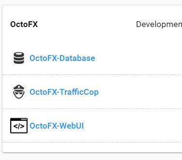
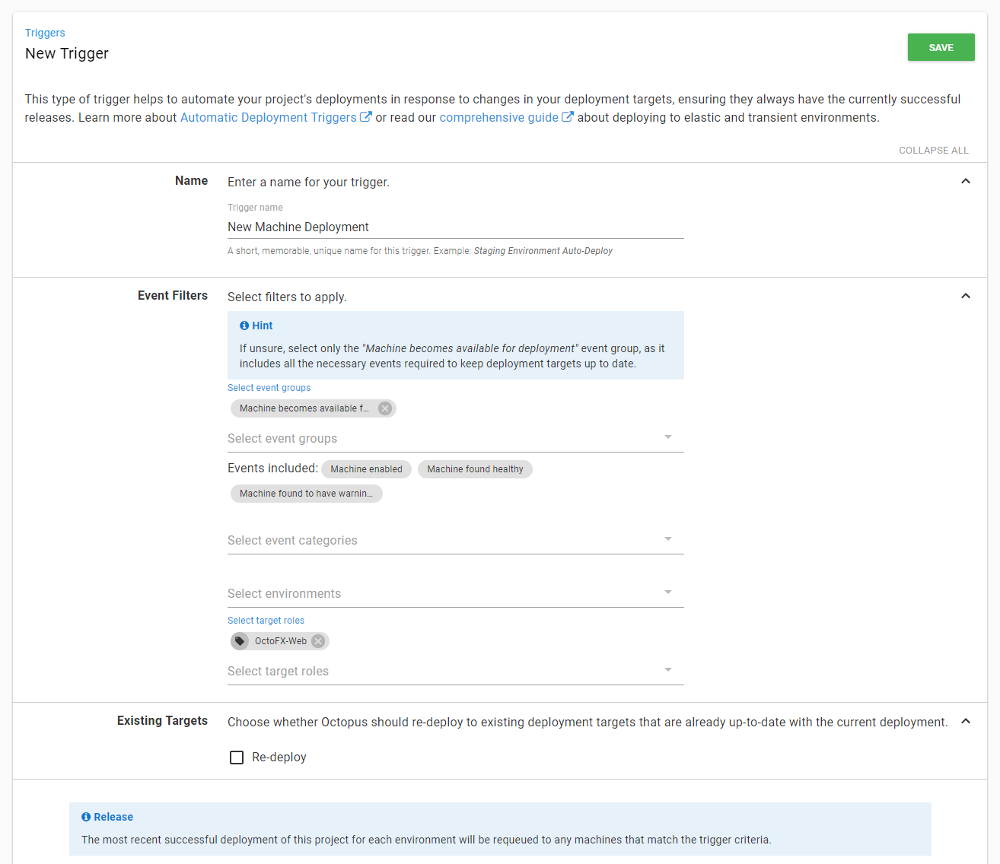

## Spinning up Deployment Targets and deploying to them automatically using Infrastructure as Code

The tentacle is an MSI you have to install on a VM.  To get your POC going, you went the manual route.  Download the MSI onto the VM, install it and configure it.  Then you went back to the Octopus Deploy UI and registered the target with the Octopus Deploy server.  For a few tentacles that works.  Once you get above 25 or so machines, you realize that doesn't scale.

We recommend creating a process to automate the tentacle installation.  If you are using Azure, you can leverage Azure Resource Manager Templates (ARM Templates).  For AWS, you can leverage or CloudFormation to spin up new virtual machines.  Both processes support running a PowerShell script to bootstrap them.

>  CloudFormation templates allow you to include PowerShell in them.  ARM templates require you to use the custom script extension.  We recommend using Google to find the latest examples.  

Meanwhile, if you are on-premise, you might be using hypervisor software such as Hyper-V or VMWare.  Those have a robust API to script out spinning up a VM and bootstrapping them using a PowerShell script.  

>  We are not including samples on how to do this as each hypervisor is unique.  If we tried to include scripts for every possible hypervisor and version, this chapter would end up being hundreds of pages long.

Regardless of the technology you are using, you will need a PowerShell script to Bootstrap the tentacle installation.  Below is a sample script that we wrote for this book to bootstrap tentacles.

``` PS

Param(
    [string]$octopusServerUrl,
    [string]$octopusApiKey,
    [string]$octopusServerThumbprint,
    [string]$instanceName,
    [string]$registrationName,
    [string]$environment,
    [string]$tenant,
    [string]$roles,
    [string]$machinePolicy
)

## This assumes you are installing on premise.  
$IpAddresses = Get-NetIPAddress -AddressFamily IPv4

$ipAddress = ""
foreach ($address in $IpAddresses)
{
    $addressToCheck = $address.IPAddress

    # Change this to match against your own internal IP address range
    if ($addressToCheck -match "192.168.0.*"){
        $ipAddress = $addressToCheck
    }
}

Write-Host "Instance name: $instanceName"
Write-Host "Registration Name: $registrationName"
Write-Host "Environment: $environment"
Write-Host "Tenant: $tenant"
Write-Host "Roles: $roles"

Set-Location "${env:ProgramFiles}\Octopus Deploy\Tentacle"

$tentacleListenPort = 10933
Write-Host "Going to use port $tentacleListenPort"

Write-Output "Open port $tentacleListenPort on Windows Firewall"
& netsh.exe firewall add portopening TCP $tentacleListenPort "Octopus Tentacle $instanceName"
if ($lastExitCode -ne 0) {
    throw "Installation failed when modifying firewall rules"
}

$tentacleHomeDirectory = "C:\Octopus\$instanceName"
$tentacleAppDirectory = "C:\Octopus\$instanceName\Applications"
$tentacleConfigFile = "C:\Octopus\$instanceName\Tentacle\Tentacle.config"

$rolesToRegister = $roles -split "," | foreach { "--role `"$($_.Trim())`"" }
$rolesToRegister = $rolesToRegister -join " "

if ([string]::IsNullOrWhiteSpace($tenant) -eq $false){
    $tenantToRegister = "--tenant `"$tenant`""
}

& .\tentacle.exe create-instance --instance $instanceName --config $tentacleConfigFile --console | Write-Output
if ($lastExitCode -ne 0) {
    throw "Installation failed on create-instance"
}
& .\tentacle.exe configure --instance $instanceName --home $tentacleHomeDirectory --console | Write-Output
if ($lastExitCode -ne 0) {
    throw "Installation failed on configure home directory"
}
& .\tentacle.exe configure --instance $instanceName --app $tentacleAppDirectory --console | Write-Output
if ($lastExitCode -ne 0) {
    throw "Installation failed on configure app directory"
}
& .\tentacle.exe configure --instance $instanceName --port $tentacleListenPort --console | Write-Output
if ($lastExitCode -ne 0) {
    throw "Installation failed on configure port"
}
& .\tentacle.exe new-certificate --instance $instanceName --console | Write-Output
if ($lastExitCode -ne 0) {
    throw "Installation failed on creating new certificate"
}
& .\tentacle.exe configure --instance $instanceName --trust $octopusServerThumbprint --console | Write-Output
if ($lastExitCode -ne 0) {
    throw "Installation failed on configure trust with server"
}
& .\tentacle.exe service --instance $instanceName --install --start --console | Write-Output
if ($lastExitCode -ne 0) {
    throw "Installation failed on service install"
}
$cmd = "& .\tentacle.exe register-with --instance `"$instanceName`" --server $octopusServerUrl $rolesToRegister --environment `"$environment`" --name $registrationName $tenantToRegister --publicHostName $ipAddress --apiKey $octopusApiKey --comms-style TentaclePassive --force --console --policy=`"$machinePolicy`""
Write-Host $cmd
Invoke-Expression $cmd | Write-Host
if ($lastExitCode -ne 0) {
    throw "Installation failed on register-with"
}
```

>  By automating the tentacle bootstrapping process, you also put yourself in a position to better handle increasing load.  With automation, you can spin up a new server in a matter of minutes rather than hours or even days.

The bootstrap script can do so much more than install the tentacle.  You can also leverage applications such as Chocolatey and built-in features such as DISM to install IIS, .NET Core, SQL Server Management Objects, and so on.  Chocolatey is an application manager which allows you to install third-party applications in an automated fashion.  DISM, or Deployment Image Servicing and Management, is built into Windows to allow you to enable or disable features.  For example, if you wanted to automatically configure a VM to host a .NET core application this would be a script to do so.

```PS
Write-Output "Installing ASP.NET 4.5"
Dism /Online /Enable-Feature /FeatureName:IIS-ASPNET45 /All | Write-Output

Write-Output "Installing CertProvider"
Dism /Online /Enable-Feature /FeatureName:IIS-CertProvider /All | Write-Output

Write-Output "Installing IIS Management"
Dism /Online /Enable-Feature /FeatureName:IIS-ManagementService /All | Write-Output

Write-Output "Installing Chocolatey"
Set-ExecutionPolicy Bypass -Scope Process -Force; iex ((New-Object System.Net.WebClient).DownloadString('https://chocolatey.org/install.ps1'))

Write-Output "Installing .NET Core"
choco install dotnetcore-windowshosting -y
```

>  For other deployment target types (Kubernetes, SSH, Azure Web Apps, etc), you should leverage the Octopus Deploy API to register the target.  Octopus Deploy is an API first application.  Everything you can do in the UI you can do in the API.

## Project Triggers

The creation of the deployment targets is now automated.  The next step is to set up a project trigger which will see when a new machine is added for a specific role and then automatically deploy to that machine.  This way the entire process is automated, from machine creation to deployment.  

Before we get going on creating the triggers, let's take a quick step back and think about what this means.  In the previous chapters, we set up three projects.  



Of those three projects which one is most likely going to have a new machine added to it for scale?  The OctoFX-WebUI project.  If you add a new machine to a SQL Server cluster a DBA is required.  There is quite a bit of work on the back-end for them to do.  And you are not adding new machines willy-nilly to a SQL Cluster.  But adding new machines into a web farm for the OctoFX-WebUI project is a lot more plausible.  Maybe to handle some additional load.  Maybe to replace an existing machine.  OctoFX-WebUI is where we are going to add the trigger.

This is done by going to the project and selecting the triggers option on the left-hand menu.


From here you are going to want to select the add triggers button in the top right corner of the screen and select deployment targets trigger.


On the next screen, you will want to the event, which should be "machine becomes available for deployment."  Next select the machine role.  This is also a great reason to have a specific role per project.  It allows the trigger to monitor for machines it cares about.



And with a simple click of the save button, we have the trigger configured.


## Conclusion

You can leverage technology to automatically spin up and down deployment targets.  This can be done whether you are using a cloud provider such as AWS and Azure or if all your deployment targets are on-premise you running Hyper-V or VMWare.  With deployment triggers, you can then tell Octopus Deploy to automatically deploy code when new machines come online.  This allows you to scale up your application in a few minutes, and when you no longer need that extra horsepower, scale back down.