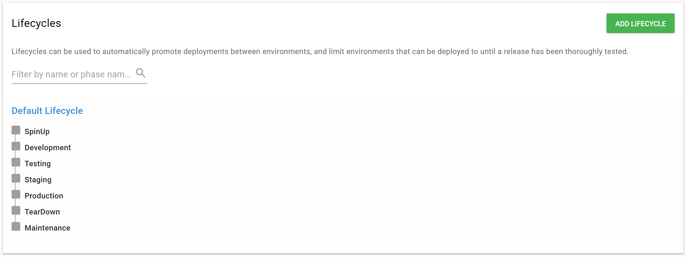
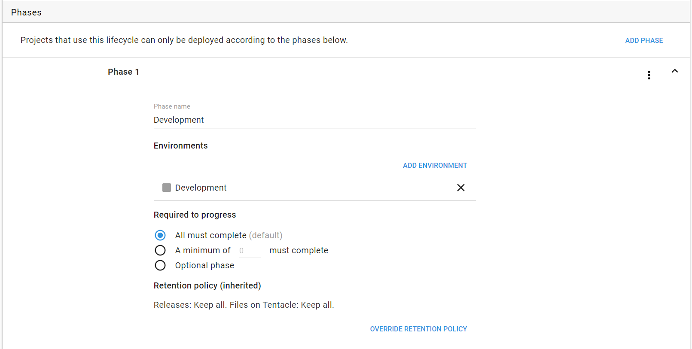
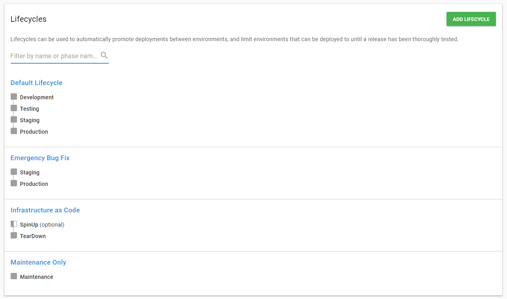

# Lifecycles

Now that we have some environments, how can we tell Octopus the order of the environments that we want to deploy our applications to? This is where lifecycles comes into play. Lifecycles let you define a promotion path for your applications as well as automate deployments and set retention policies.

Early in your Octopus journey, you likely won't even know that lifecycles are there since the Default Lifecycle will handle most cases for small or simple configurations. Let's talk about the Default Lifecycle and why we recommend updating it early on.

## The Default Lifecycle

When you first navigate to Library > Lifecycles, you'll notice a single lifecycle named "Default Lifecycle". Let's take a look at ours.

We can see that the environments we created in Chapter 1 are listed in order. These are actually Phases created implicitely by the Default Lifecycle. By convention, the Default Lifecycle will create one phase per environment and the phases will be in the order that the environments are listed in on the Environments page. If we view the Default Convention, we can see this information in the Phases section.

This means that if we add a new environment, it will automatically be added to the Default Lifecycle. It also means that if we reorder the environments, it will change the order of the phases in the Default Lifecycle. In some cases, this can be a good thing, but in others it can be a liability. Let's look at what phases are and how we can use them to set the default lifecycle to an explicit configuration.

## Phases

A phase represents a stage in your deployment lifecycle. Phases are deployed to in order and must have a successful deployment in order to move to the next phase. For example, there must be a successful deployment to the Development phase before we can proceed to the Testing phase. Phases can also include multiple environments, but we're going to focus on single environment phases in this chapter.

Let's create a Development phase for our lifecycle. We will give it the name "Development" and add the Development environment to the phase.

>  Phase names usually match the environment it contains, and while this is a good practice, it is not a requirement.

We'll leave the radio button set to the default **manually deploy** on the add environment screen and also leave the **Required to progress** and **Retention policy** settings with the default values as we'll be covering these later.

Let's repeat the process to create phases for Testing, Staging, and Production.

Now that those changes are in, we have a good default lifecycle for deploying our applications.

## Other Lifecycles

### Emergency Bug Fix Lifecycle

What happens when there's a critical bug in production that needs to be fixed quickly? Deploying to a Development and Testing environment might take too much time but you still need follow good deployment practices and validate the change prior to pushing to production. We often see changes like these go directly to a Staging environment and then to Production after being validated.

For this we recommend creating a emergency bug fix lifecycle. Our bug fix lifecycle will only have two phases, Staging and Production, though yours might be different to account for your internal policies and how your team decides to handle hotfixes. In a later chapter, we'll look at how to configure your project to use this lifecycle in addition to the default, but for now we'll be content with configuring it so that it's ready to go later.

### Infrastructure as Code Lifecycle

You may have noticed that we didn't include SpinUp, TearDown, or Maintenance in the default or emergency lifecycles. We are going to create a lifecycle for our Infrastructure as Code projects that includes SpinUp and TearDown. We'll cover the use of this lifecycle later, but for now, create the lifecycle with a SpinUp and TearDown phase. There is a twist in creating the SpinUp phase as we're going to make it an optional phase.

#### Optional Phases

One of the settings when creating a phase is the **Required to progress** setting. This is usually set to the default value which is **All must complete**. This means that all environments in the phase must be deployed to successfully before we can promote to the next phase.

The second choice is to set a minimum number of environments that must be deployed to successfully before promoting to the next phase. This is handy for cases where you have two or three QA environments, but only one is used for each release of your application. You can configure your Testing phase such that it contains three environments, but only one needs to be successful before you can promote to the Staging environment.

The last choice is to set the phase to be completely optional. This means that it can be skipped completely and you can deploy directly to the phase after it.

Because errors and issues can arise when building up infrastructure, especially when setting up the IAC scripts for the first time, we want to be able to deploy directly to TearDown so that we can start fresh. As you're setting up these phases, make the SpinUp phase optional.

### Maintenance Lifecycle

TODO

## Conclusion

In this chapter, we configured our default lifecycle as well as some auxillary ones toset ourselves up for future success. In addition we walked through how to configure retention policies to help keep your Octopus Deploy instance lean and mean.  In the next chapter, we'll walk through retention policies and how to keep your server from being cluttered with old releases and packages.