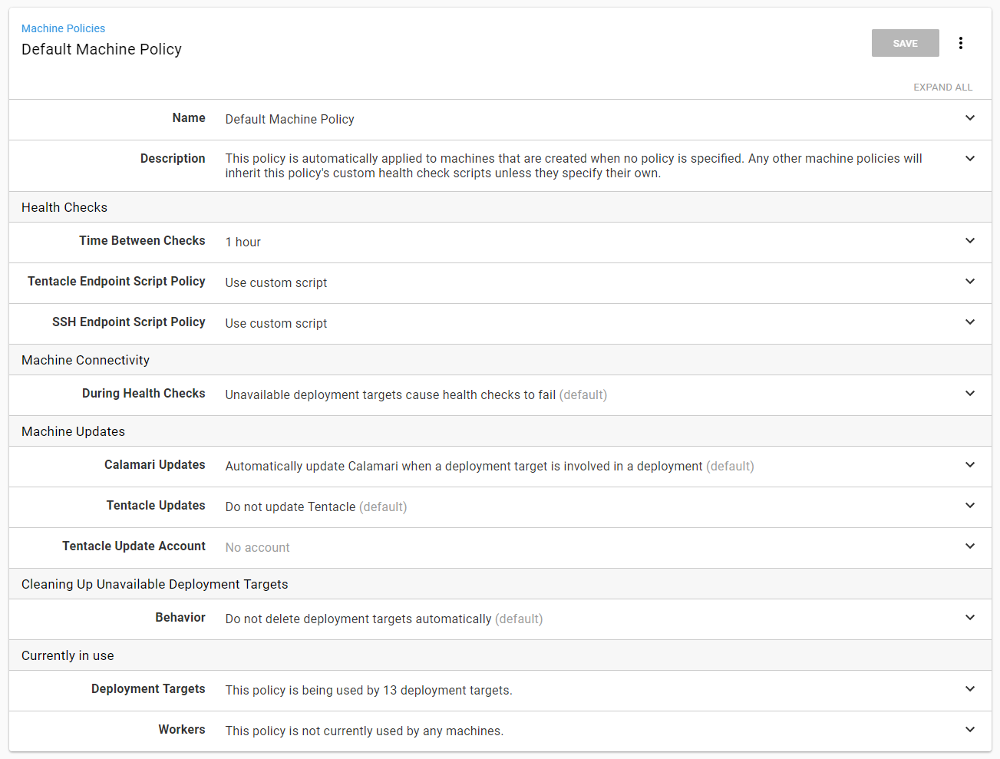
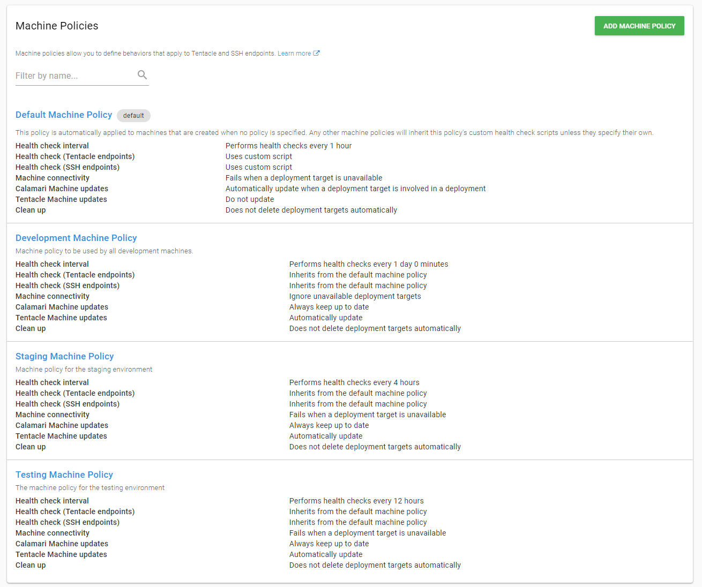

# Making Sure Your Server Can Connect to Deployment Targets Using Machine Policies

A topic that we have been dancing around for the past several chapters is machine policies.  You probably noticed it on the left-hand menu and didn't think much of it.

The Octopus Deploy server needs to make sure that it can still connect to all the deployment targets.  We call that a health check.  It runs periodically on the Octopus Deploy server.  It does this because many of our users want to know about problems with a machine before doing a deployment.  If a system admin can fix a minor problem before it becomes a significant problem, then it is well worth the effort.  It also does this as a sanity check to make sure the server has not crashed or is about to run out of space.  By default, health checks run every hour.  If the Octopus Server cannot connect to the machine, it will fail the health check.  All machines are added to the default machine policy when no policy is specified.  That is configurable on the machine policy screen.

When a machine policy performs a health check, it queues a task on the Octopus Server.  That is a blocking task for any deployments.  The server needs to make sure the machines are there before it can deploy code.

Using the default machine policy for less than a hundred machines is excellent.  The health checks are quick.  It starts to cause problems when you have thousands of machines, and a health check might take hours to complete.  The Octopus Server can only connect to ten machines at a time to perform the health check; it can take a while to finish up.  

You also might have a group of machines which are flaky and tend to go up and down.  Perhaps they are test instances, or they're hosted on a client's site, and your connection is spotty.  If you expect the connection to fail once in a while, it doesn't make much sense to change default machine policy to account for one or two spotty machines.  The other machines in the machine policy should be running.  You want to know about those if they go down.

We recommend you create several machine policies.  Some possible strategies are:

1. Machine policy per environment.
2. Machine policy per data center.
3. Machine policy per tenant (if the tenant is hosting their servers and you deploy to them).
4. Transient Machine Policy (for machines which tend to go offline randomly).

If you go the machine policy per environment route, we recommend changing the times between health checks.  Something substantial for dev, say once a day, while production stays at once an hour.  Dev is deployed to several times per day while production deployments happen once a week. Dev machines tend to go up and down at random, change the configuration to not fail the health check.  

>  Each machine policy health check is a unique task.  That allows Octopus Deploy to multi-thread the health checks.  If you are using Octopus Deploy's High Availability functionality (available with a data center license), the health checks are spread across multiple nodes.  

You change the machine policy for a specific deployment target by going to the deployment target screen.

## Conclusion

In this chapter, we set up multiple machine policies to ensure we have a high signal to noise ratio if/when Octopus Deploy cannot connect to a Tentacle.  Production is checked the most because typically that has the least number of deployments.  An environment such as development is getting deployed to hundreds of times a day, and if a machine were to go down most people would know about it, but it would have the smallest impact on the business.
