# Deploying to Multiple Data Centers

In the age of cloud providers and disaster recovery, it is very common to see scenarios where our users want to deploy to multiple data centers.  In some cases, a customer could be running a live/live scenario, where the code is running in all the data centers.  In other cases we see customers wanting to deploy to the main data center first and then deploy to a disaster recovery data center.  Another common scenario is a data center might the "canary" where new code is deployed.  After that 5% of all traffic is routed to that data center.  Assuming everything looks good then the deployment is pushed to all remaining data centers.  

With some of our customers, we see all those scenarios on a single Octopus Server.  All too often we see lots of "Production" environments and a lot of unique and custom lifecycles.

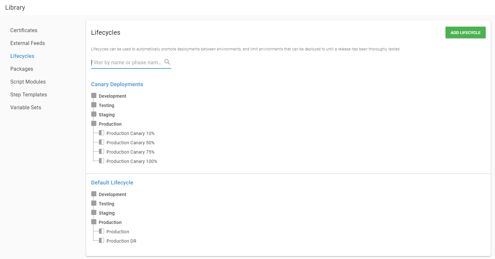

Scalability is a major concern with this approach.  What happens if you want to add `Production Canary 30%` as an environment?  You would first have to add the environment.  Then you have a decision to make, do you add it to the Canary Deployments Lifecycle?  That means any project gets that new environment to deploy to.  Is that good or bad (we don't know, but it is a question you would need to ask).  What about any variables scoped to environments?  How would you know which projects needed new variables added for Production Canary 30%?

>  A good indicator something isn't quite right with your environments or lifecycles is when you have to add [Environment Name] [Qualifier], such as `Production DR` or `Production Canary 30%`.

Earlier in the book, we created three tenants, `Internal`, `Illinois Data Center`, and `Texas Data Center`.  In this chapter, we will cover how to leverage those tenants to support a multi-data center deployment.

The use case for those tenants is as follows.

- Internal: These are servers hosted at our main headquarters.  All development and testing are done against these servers.  
- Texas Data Center: Our primary production data center for our external applications.  This is a data center for a cloud provider and we have VMs running.  
- Illinois Data Center: Our disaster recovery data center.  Our cloud provider has a fast connection between these two data centers.  During the day the VMs are running, whereas on the nights and weekends they are turned off.  In the event the Texas Data Center would go offline the load balancer would automatically redirect all traffic to Illinois.

When we do a deployment we are first going to deploy to the internal data center for Dev, Test, and Staging.  Assuming everything looks good in Staging on the internal data center we would then push to Staging for Texas and then Illinois.  For a production deployment we would deploy to Texas first and the next day we would deploy to Illinois.

## Infrastructure

First, we need to make some changes to our existing infrastructure.  We have already had several servers located on-premise.  The servers for Development, Testing and Staging are shared for internal and external applications.  We want to configure those for both tenanted and non-tenanted deployments.

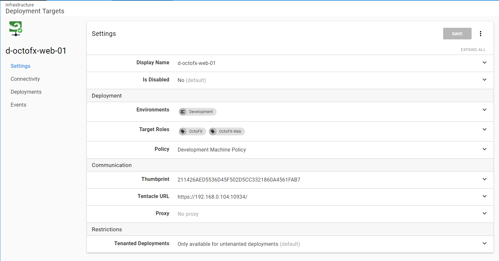

This can be done by expanding out the tenant section and selecting `Include in both tenanted and untenanted deployments` and then selecting the internal tenant.

>  This can get rather tedious if you have more than 20 targets to update.  It would be a good idea to automate this using the API to speed this up.

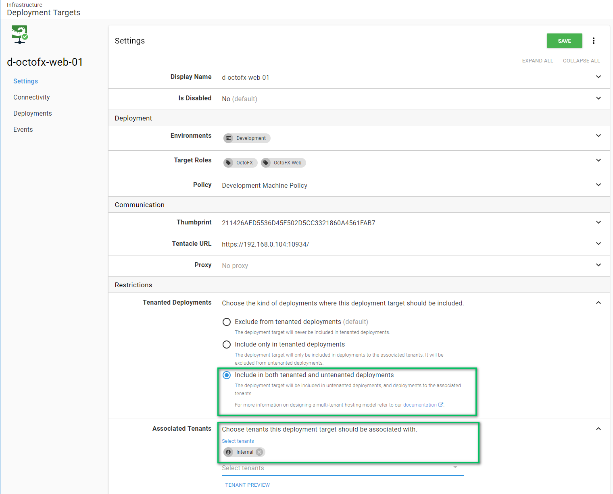

For the machines in the Texas and Illinois Data Centers, we only want to use those for tenanted deployments.  The tenant options for that machine will be `Include only in tenanted deployments` as well as the tenant for the machine.  Please note, that for these machines the display name now includes the data center, for example, `s-octofx-illinois-web-01`.  

>  This is somewhat contradictory to the recommendation about environments.  Environments are used almost everywhere, lifecycles, variable scoping, step scoping, etc.  Machine display names are used much less, they are primarily used for logging during a deployment.  While it is possible to scope a variable to them, that is rare.

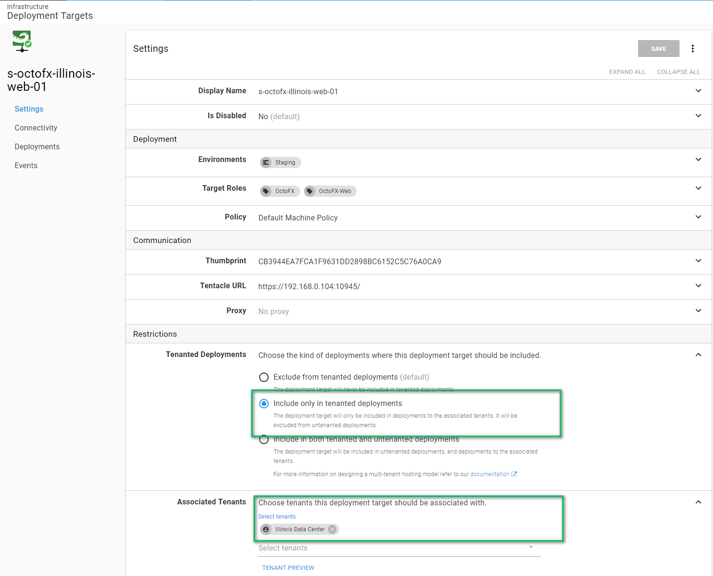

## Projects

Next up is project configuration.  For the purposes of this demo, we went ahead and cloned the existing projects and called them `OctoFx-Database Multi Data Center`, `OctoFx-Traffic Cop Multi Data Center`, and `OctoFx-Web Multi Data Center`.  In the real world, you wouldn't have two projects, one tenanted and the other untenanted.  

We need to let the project know that it will be used for multi-tenant deployments.  Go to the project and then click on the settings link on the left.  Expand out the multi-tenant deployment section and select `Require a tenant for deployments`.

>  While it is possible to have deployments with or without a tenant it is not recommended.  The project should either require tenants or not allow tenants.  Having projects with or without a tenant makes it very confusing to most users and it increases the chances of someone making a mistake.

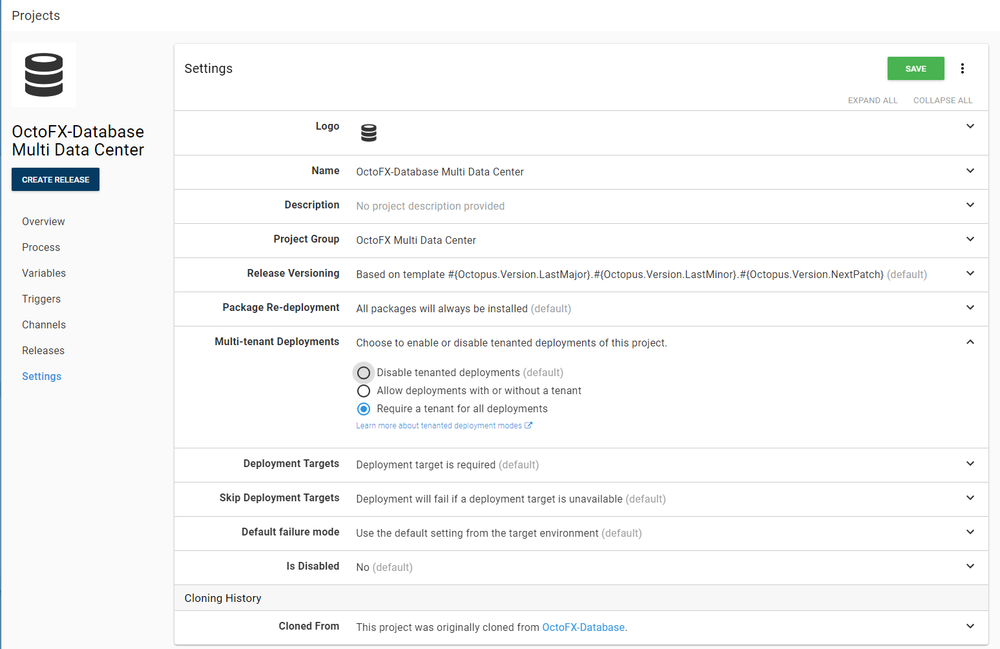

Let's take a quick step back and think about this specific project, which handles the database deployments.  What would be different between the data centers?  The database server would be different.  But other than that, everything else should be the same.  To account for these differences we are going to create a project template variable.  The nice thing about the project template variables is they also support the ability to mark the value as sensitive.

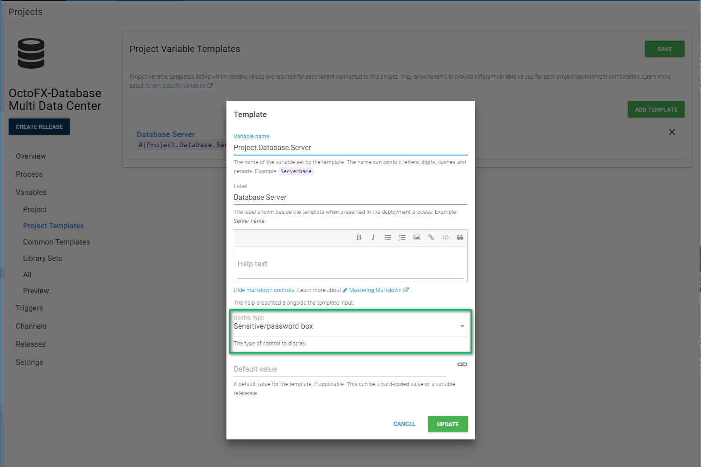

We will have to set up a couple of project template variables for the WebUI project, but that process is the same.  Aside from that, that is all we need to configure on the project side.

## Tenants

Finally, we need to link the data center tenants up to the projects.  This is done by going to the tenant's screen, selecting the tenant you wish to link up, and then clicking the `Connect Projects` button.

When you are connecting the project to the tenant you can select the environments the tenant will be for.  If you recall from earlier, the Illinois Data Center will have two environments, `Staging` and `Production`.

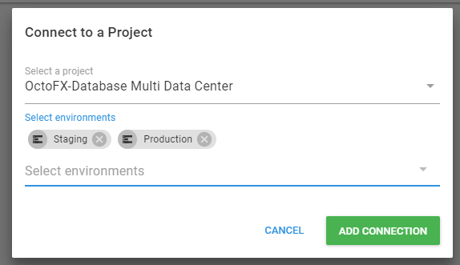

After connecting the project the screen will then notify you of missing variables.  We need to go to the variables section and fill out the database server variable.

After linking the other projects the end result for the Illinois Data Center will look like this.

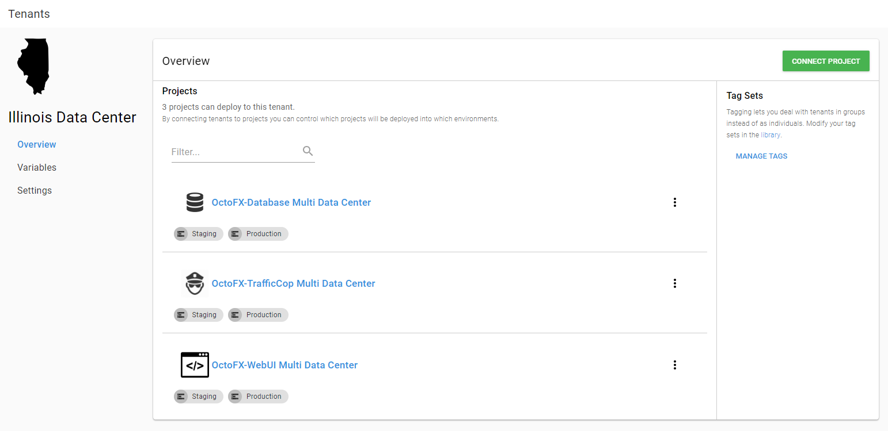

The internal tenant will look like this.  Note that it is only linked to `Development`, `Testing`, and `Staging`. 

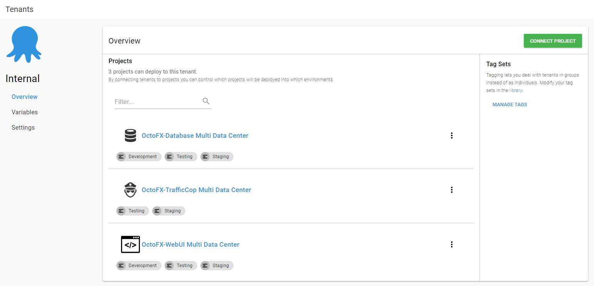

Finally, we can wrap it all up with the Texas Data Center.  With regards to environments, it matches the Illinois Data Center.

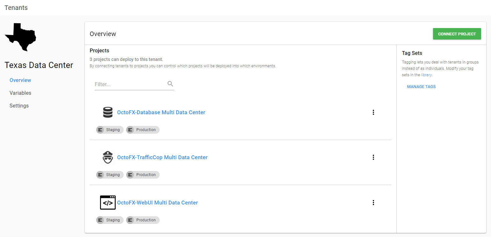

When we look at the database project's dashboard we can see the view has changed from the typical untenanted deployment dashboard.  Make note that you cannot deploy to the Texas or Illinois Data Centers for the `Development` or `Testing` environments.

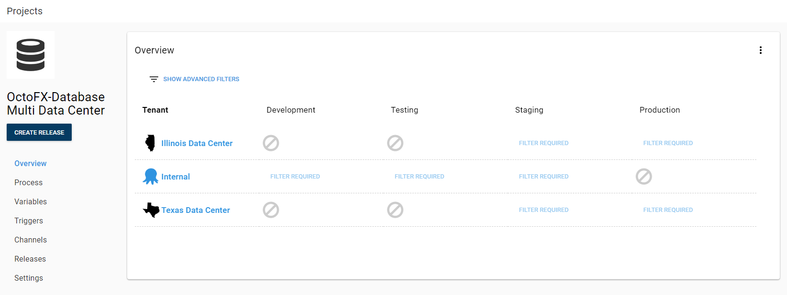

## Deploying Code

Creating a release is the same as before, you provide a version number and select the package you wish to deploy.

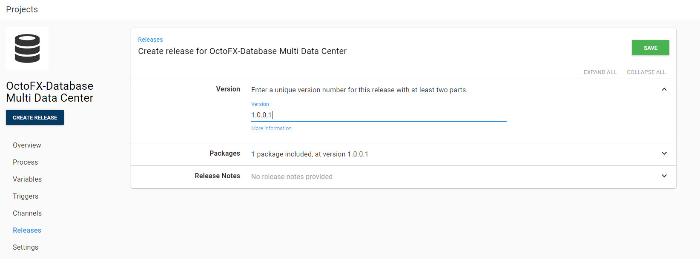

But now, when you deploy to development you can choose the tenants to deploy to.  Because there is only one tenant that is automatically pre-populated for you in the UI.

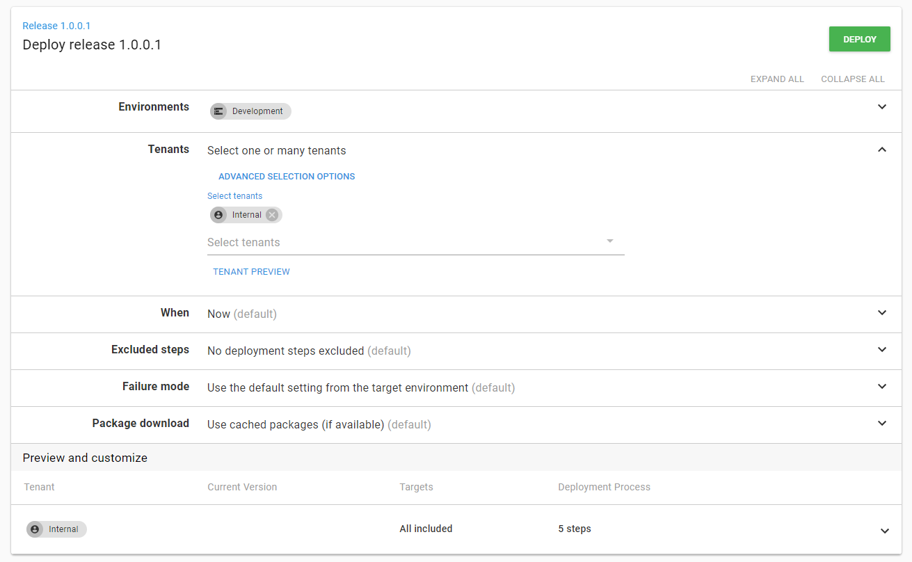

Let's get the WebUI, Database, and the Traffic Cop pushed up to the `Testing` environment.  If you look closely at the main dashboard you will notice a gray box has now appeared with `1/1`.  The numerator is how many tenants have been deployed with that release.  The denominator is how many total tenants are available in that environment.  What this is telling us is 1 out of 1 tenant in both `Development` and `Testing` have the `1.0.0.1` release.

Going to the traffic cop dashboard you will see that the other data centers are ready to be deployed but instead of `Deploy` we see `Filtered Required`.  This is because we haven't selected the release to deploy.  You can do this by clicking on the `Filter by Release` drop-down list.

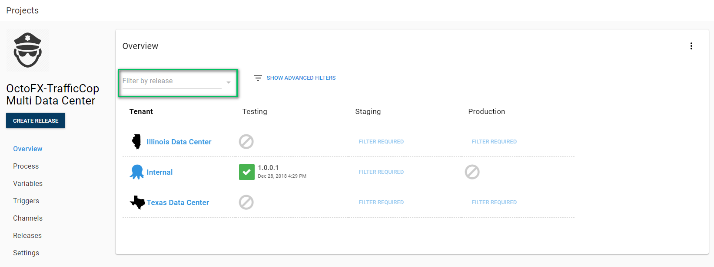

Once I select a release now the `Deploy` buttons appear.  Notice that each tenant has the `Deploy` button for the `Staging` environment.  This allows us to deploy to `Staging` for the `Internal` data center first and then we can deploy to the other data centers.

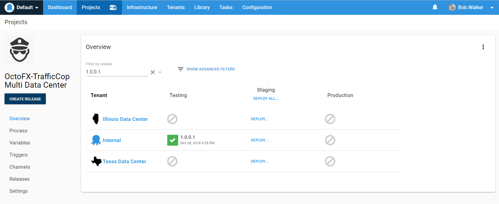

When I click on the `Deploy` button I have the choice on how many of the data centers I wish to deploy to.  I can deploy to 1 to N number of tenants at a time.  Right now we are just going to pick the `Internal` data center.

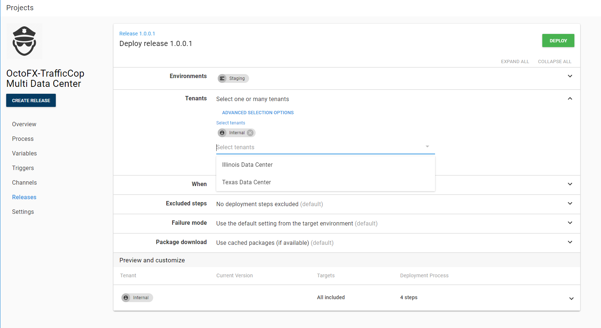

That deployment was successful.  

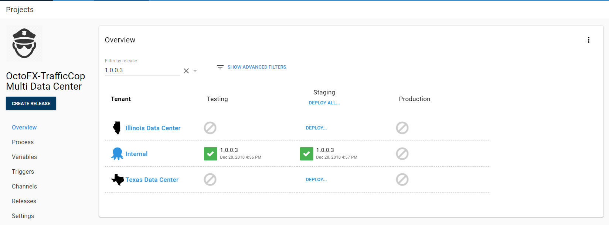

Now we can deploy to both Illinois and the Texas Data Center. 

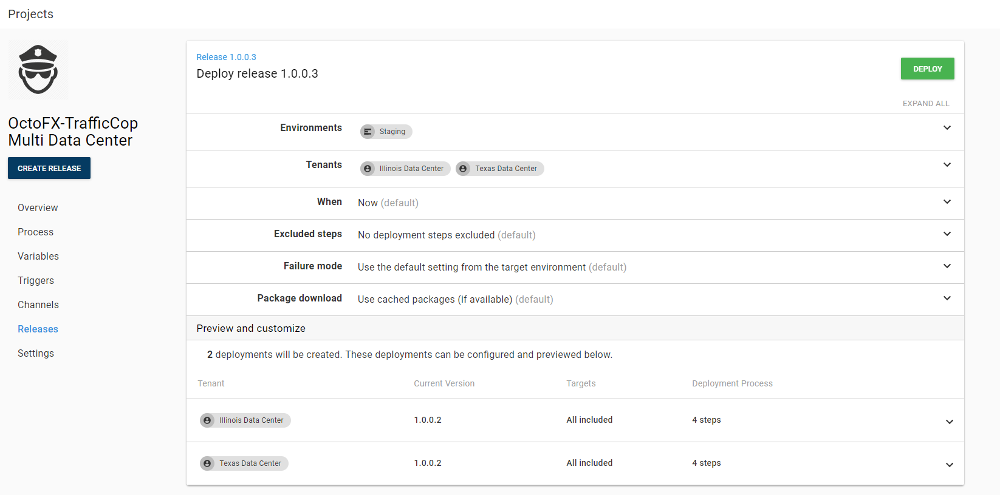

When clicking on the deploy button for both data centers you will be taken to a new screen.  This one shows that the deployment to each data center is treated as a unique task.  This means both deployments can run at the same time.  Which makes the window for the data centers to be out of sync much smaller (assuming the deployment to both were successful)

The option to deploy to internal is not there when deploying to `Production`.  Only deployments the Illinois and Texas Data Center are allowed.

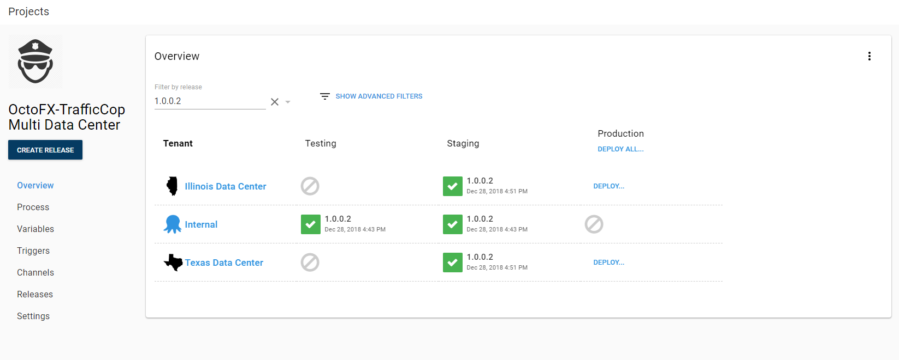

## Conclusion

In this chapter, we walked through how to configure a Multiple Data Center deployment using tenants.  The primary advantage to using tenants is you can keep the same lifecycle as before (Development -> Testing -> Staging -> Production), but still have the flexibility to choose which data center to deploy to.  It also provides the ability to know when specific variables are scoped to a data center which you must change.  Finally, each deployment to each data center is treated as a unique task, allowing you to deploy to both data centers at the same time.