# Deploying to Multiple Customers

In the previous chapter we walked through what is multi-tenancy as well as some common multi-tenant scenarios.  In this chapter we are going to take an existing set of projects and configure them to deploy to multiple customers.  

We will be reusing the OctoFX project we have been using for this entire book.  To make the example a little clearer, we have cloned that existing project.  In a real-world scenario you would not clone it, but just update it.  

## Scenarios

We want to be able to support the following scenarios for our Multi-Tenant applications.  

1. Each of our customers have their own web servers and database.  They get the same code.  The deployment process should be the same.  The only difference is the destination server and some variables such as the database server and user.
2. We should be able to choose when a customer gets a specific version of our code.  Some of our customers want to be on the cutting edge, their tolerance for risk is high.  They have no problem being the "guinea pig" for a new feature.  Some of our other customers have a low risk tolerance.  They only want to be on the stable version.
3. We should be able to group our customers into different release rings, such as Alpha, Beta and Stable.  This allows us to release new versions of code to multiple customers at once.
4. Some of our customers have custom branding.  During deployments we need to have the ability to run an additional step to add in the branding.  

## Target Configuration

Before jumping into the projects we want to first configure our deployment targets.  In a previous chapter we offloaded all database deployments onto workers.  This means we only need to configure the Web Servers for OctoFx.  There are a couple of small items to point out when configuring a target for a specific tenant.

The name of the deployment target should include the name of the tenant.  [EnvironmentPrefix]-[TenantName]-[AppName]-[Component]-[Number] is a an easy to remember naming convention.  For example, `d-ford-octofx-web-01` if we wanted the machine to deploy the OctoFX website for Ford to Dev.  In the event the target is used for multiple tenants, it is a good idea to group them together using tenant tags and name the server after the tenant tag.  [EnvironmentPrefix]-[TenantTag]-[AppName]-[Component]-[Number], or `d-alphacustomers-octofx-web-01`.  As always, naming is easy to understand, difficult to master, as long as you have consensus around your naming conventions you should be fine. 

A good rule of thumb is to configure targets to only be used for tenanted deployments.  Allowing untenanted deployments for a target should be an exception.  Typically we see our customers use a target for tenanted and untenated deployments in lower environments when the number of test resources available to them is limited.  

In a perfect world each tenant would get their own web server and database server.  In the real world that is not very cost effective.  Especially when it comes to hosting VMs on a cloud provider such as AWS or Azure.  Don't be afraid to tie multiple tenants to the same machine.  Octopus Deploy allows 1 to N number of tenants.  

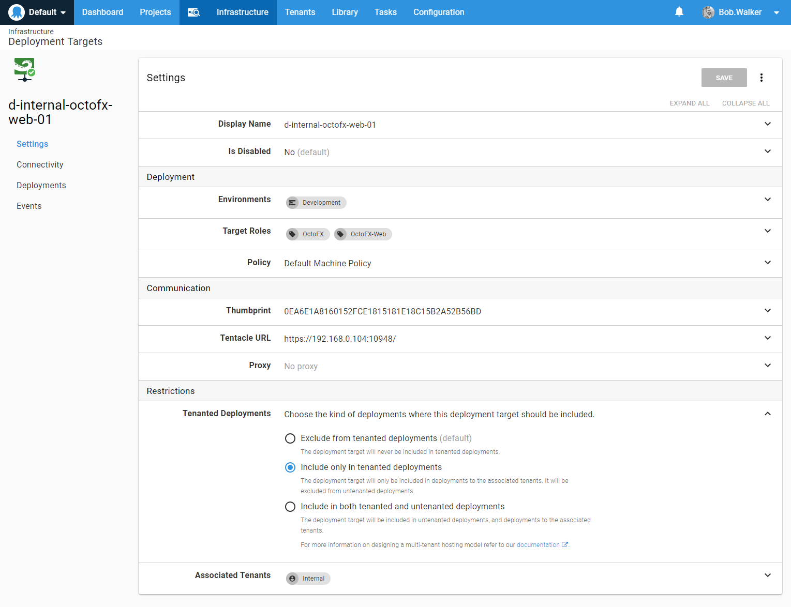

## Tenant Tags

Tenant tags are a way to group tenants together.  To support our scenarios we are going to be creating two tenant tag sets, one called `Release` and the other called `Custom Features`.  This can be accomplished by going to the Library -> Tenant Tag Sets page.  

When creating the tenant tags it is possible to assign each tag a color.  We recommend doing this when it makes sense.  The `Release` tenant tag is a great example.  Red for Alpha customers as they are used to risk.  Yellow for beta testers as they are okay with some limited risk.  Blue for stable customers as they want no risk.

Now we can go back to each of our tenants and assign them the various tenant tags.  For this example we will be assigning the following tenant tags:

1. Internal - Alpha Release, Custom Branding Custom Features
2. Coca-Cola - Beta Release, Custom Branding Custom Features
3. Nike - Alpha Release, no custom features
4. Ford - Stable Release, no custom features
5. Starbucks - Stable Release, Custom Branding Custom Features

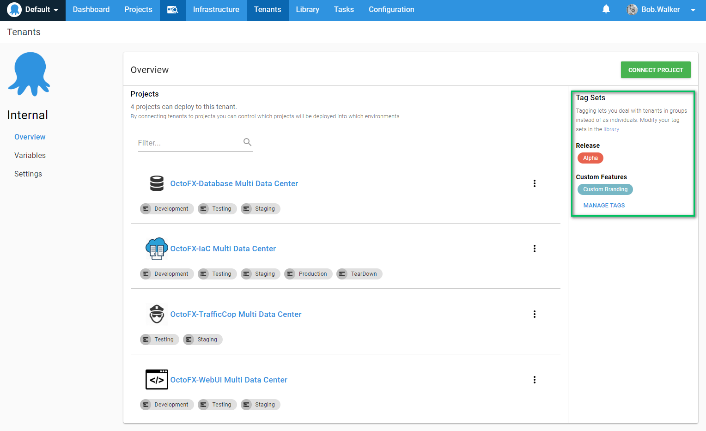

If you are using custom colors for your tenant tags, the tenant overview screen provides a quick overview of which tenants are assigned which tag.  

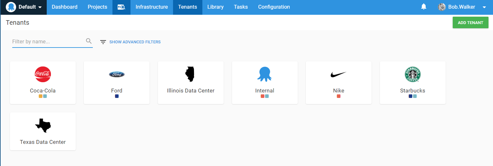

You can also apply filters based on Tenant Tags on the tenant screen.  This will help find all the customers assigned to a specific tag.

## Project Configuration

Now that we have that scaffolding out of the way, we can now move onto the project configuration.  First we need to go each project we want to make multi-tenant and enable multi-tenant deployments.  We selecting the option `Require a tenant for all deployments`.  As we go through this configuration we will make use of tenant specific variables.  Requiring a tenant for all deployments will ensure consistency across your deployments.  You don't have some deployments without a tenant and some with.

>  A lot of times our customers want to enable allowing deployments with or without a tenant because they want to test internally first.  Creating a set of internal tenants will accomplish the same goal while keeping your deployments consistent.

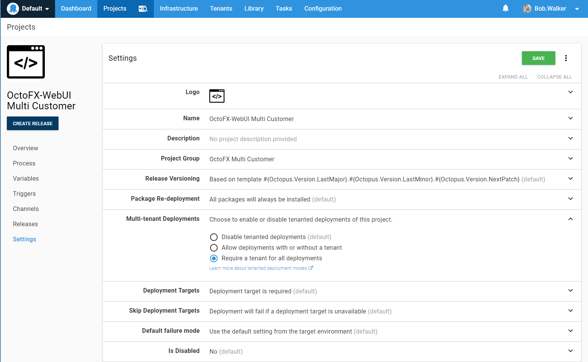

Next we want to go to each tenant and link them to the projects to deploy to.  For this demo we will using the following scenarios for the customers.

1. Internal - This is our internal testing customer.  They are in the alpha release group because they are always testing new features.  Because they are an internal testing customer they have access to all environments.
2. Coca-Cola - This is a customer who wants to try out new features but they don't want to be on the bleeding edge.  They are beta testers.  Due to the increased risk of being a beta tester they have machines in testing, staging and production.
3. Nike - this is our customer who always wants to be on the cutting edge.  This includes some risk.  To help mitigate the risk they have been given resources in the testing environment as well as staging and production.
4. Ford - this is our most risk adverse customer.  They only want the most stable releases.  They want to test all releases prior to going to production.  They have access to staging and production.
5. Starbucks - this customer doesn't have a lot of tolerance for risk.  Sometimes they want to test changes prior to going to production.  Sometimes they don't.  They have access to staging and production.

We link up these customers to their projects by going to the tenants screen and clicking the `connect project` button.

After connecting up Coca-Cola to our projects the screen will look like something like this:

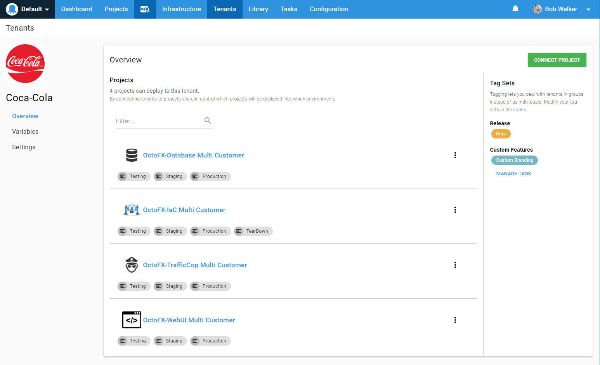

Now we just need to repeat for the remaining four customers.  Based on the scenarios described earlier, the project overview screen should look something like the the one below.  The text which says "filter required" indicates the project can deploy to that tenant for that environments.

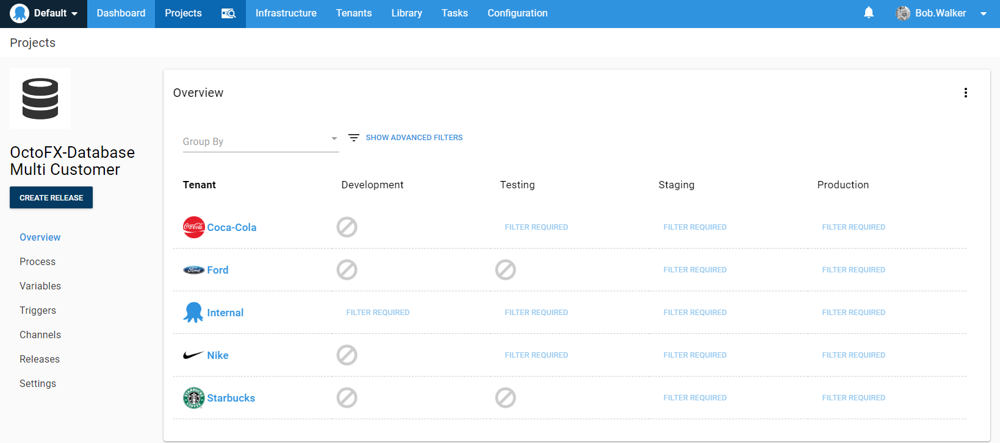

## Project Variable Templates

For a moment, lets jump over to the WebUI project for OctoFX.  Diving into the step which deploys to IIS we can see that every tenant, at the moment, will be deploying to the same web application.  That...is not ideal.

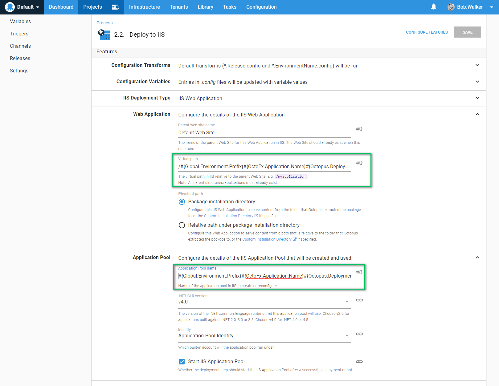

A far better solution is the the customer gets their own custom sub-domain on their own set of servers.  Majority of the time, we can set a default value, but in some cases the tenant should have the ability to override that default value.  To accomplish this we are going to be using project template variables.  You get to this screen by going to the variables section and selecting the project templates option on the left.

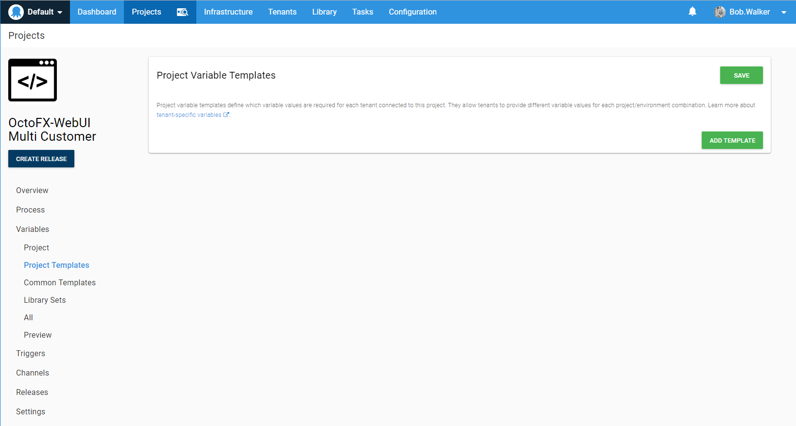

From here we are going to create a new variable to store the sub-domain name.  We are going to use the tenant name and the application name as a default value for this variable.

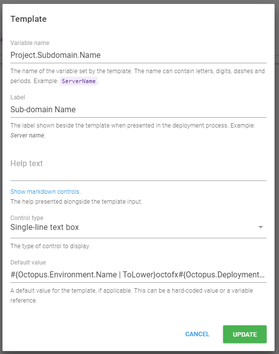

After saving the variable we can see what it ends up looking like.

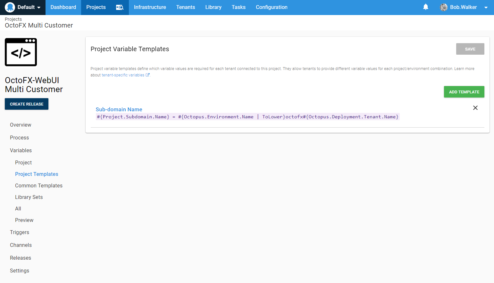

That variable can now be used by the Deploy to IIS step.

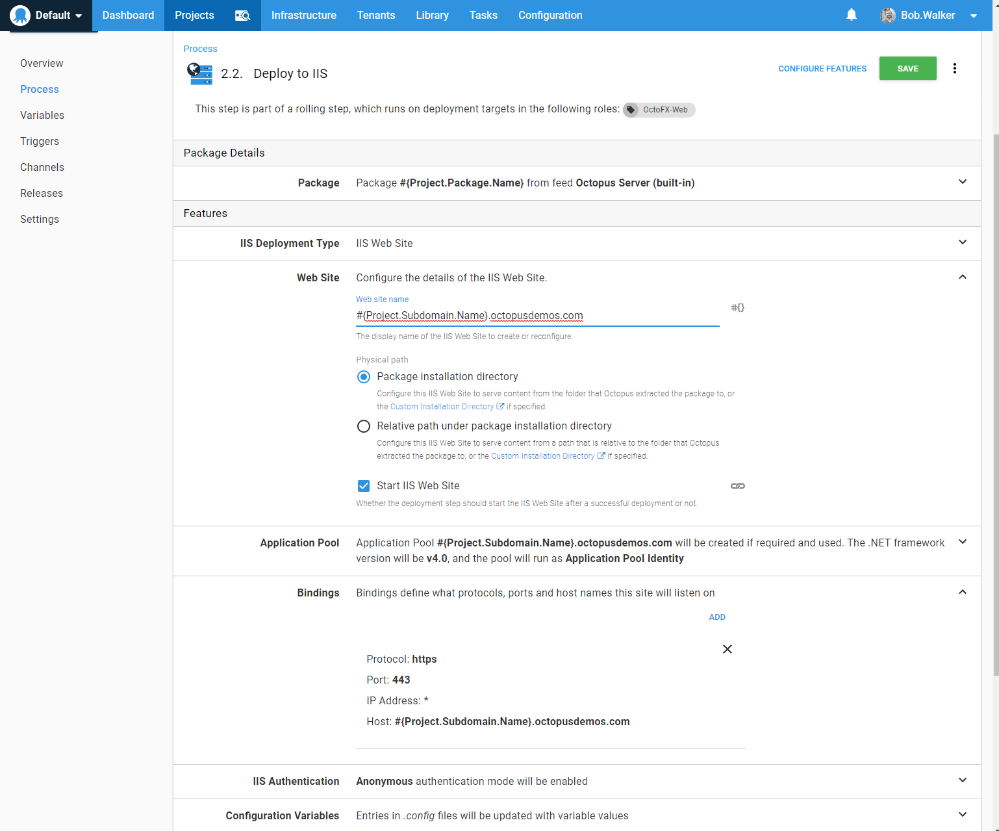

For the majority of the tenants the default value is perfectly fine.  But in other cases we want to overwrite that variable.  For example, maybe in production we want to call the domain name for Coca-Cola `productionoctofxcoke.octopusdemos.app` instead of `productionoctofxcoca-cola.octopusdemos.app`.  By going back to tenant screen and changing the variables we can.

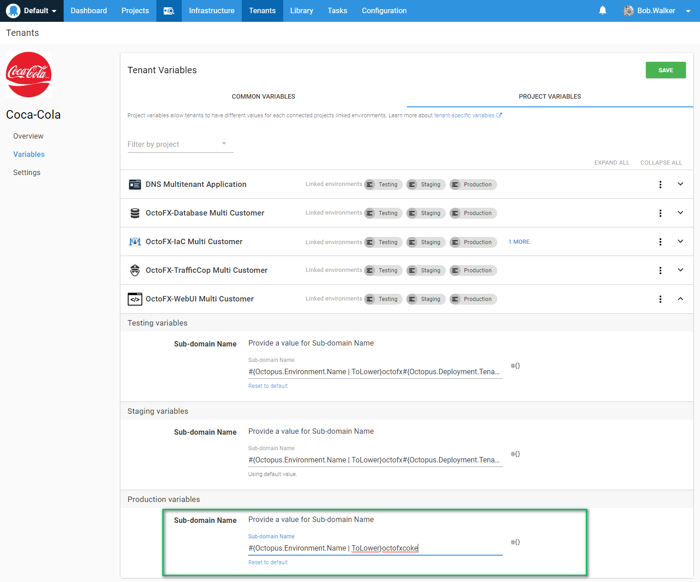

## Tenant Specific Variables

Each one of these customers gets their own set of resources.  Including a SQL Server.  If you recall, we have multiple projects, one for the database and the other for the web site.  We want to share this information between the web project and the database project.  We could go the project variable route, but that would mean duplicating data.  The chances of remembering to change both is very slim.  

In an earlier chapter we set up a variable set for the OctoFx application share values between the two projects.  We are going to be making some changes to that to support multi-tenancy.

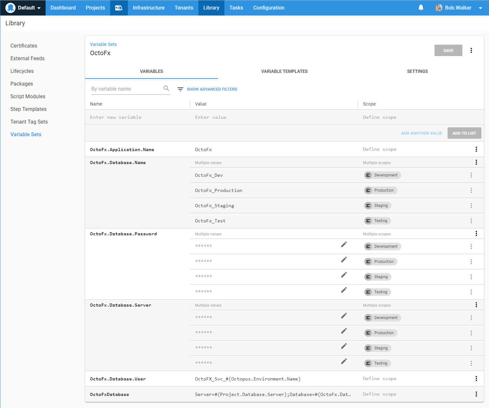

First, we are going to go to the variable template section on this screen and add in variables to store the tenant short name.  That will be used to create the database name and the user.  Then we will create a template for each environment.  

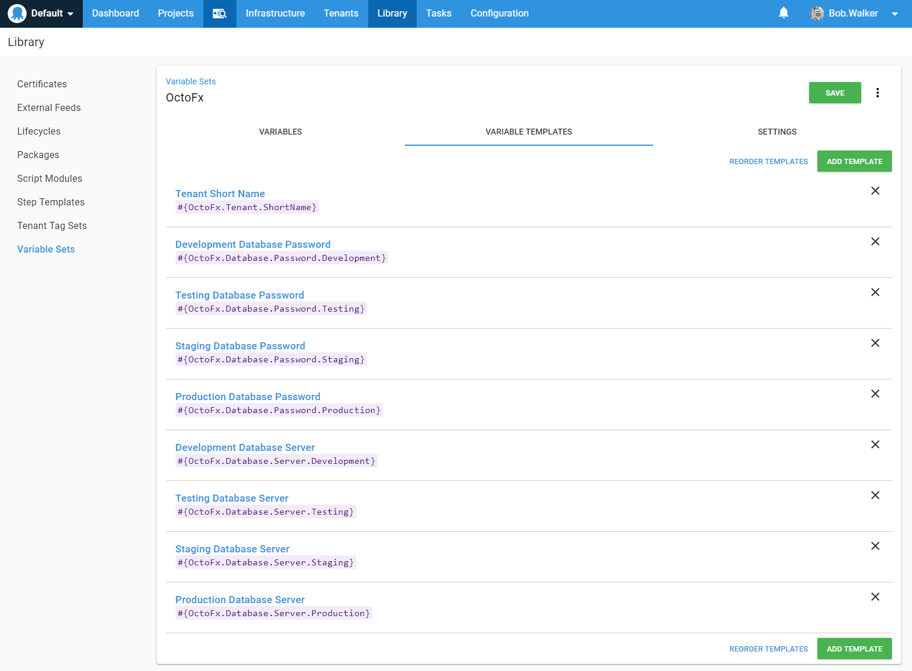

With those values we can now update the variable set to use them.  

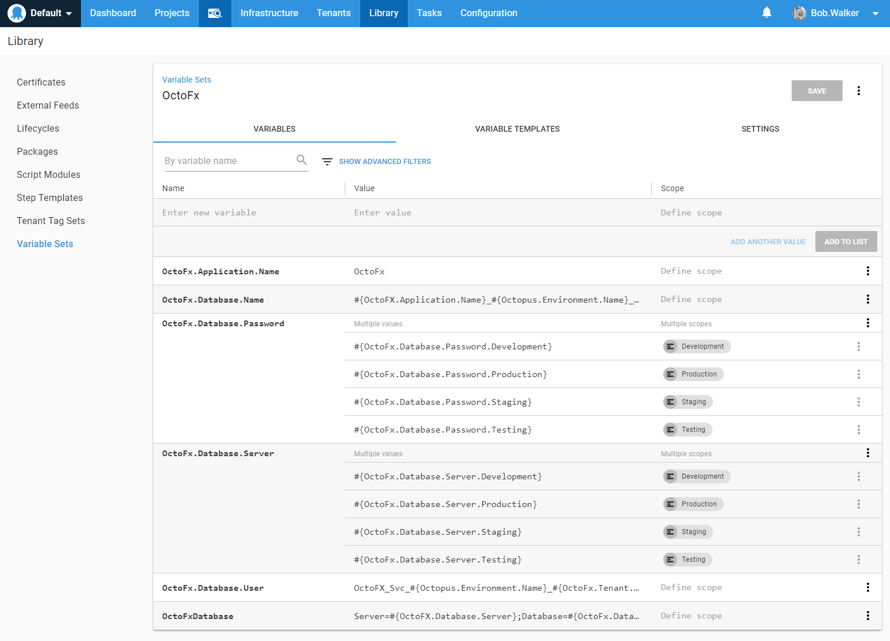

Because we didn't specify a default value for any of those variable templates we see orange icons for each tenant on the tenant screen.  

Drilling into the tenant and we see which variables are missing.

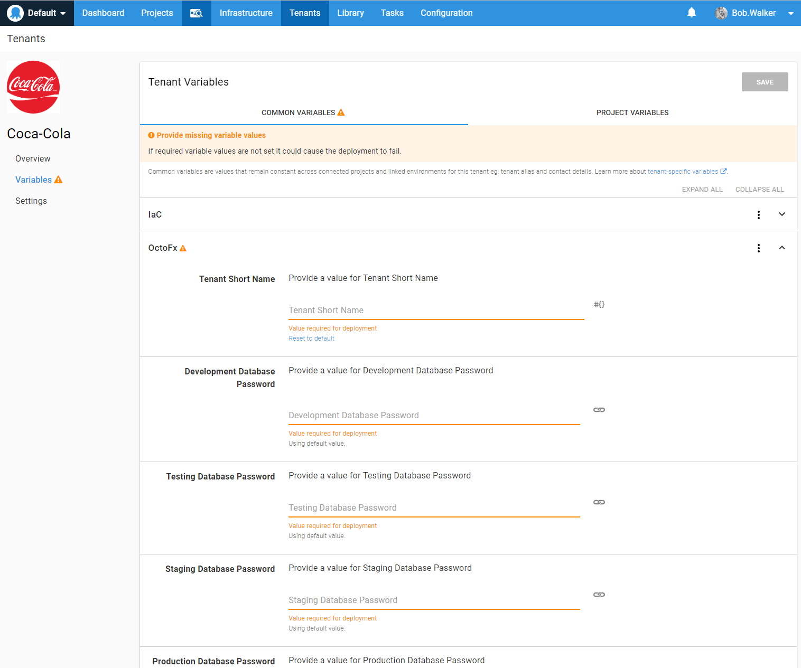

Now we just need to go through and fill out the variables for each tenant.

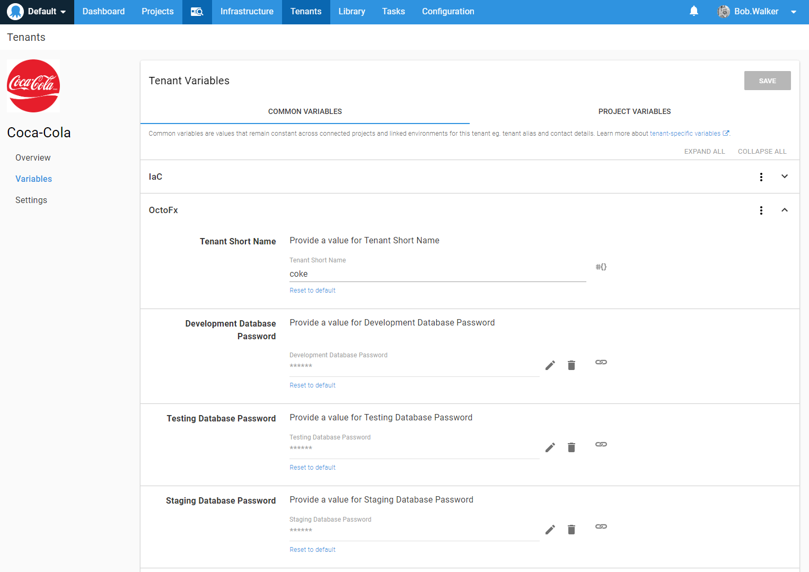

>  Adding variables to one or two tenants at a time isn't too terrible.  But this doesn't scale well when trying to work with 100s of tenants.  It would be a good idea to automate tenant setup using the API.

## Conclusion