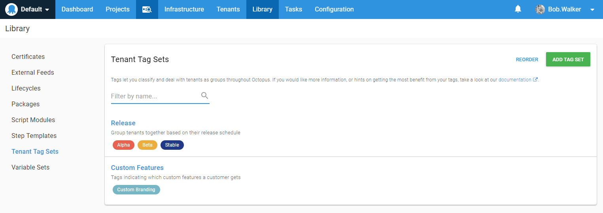
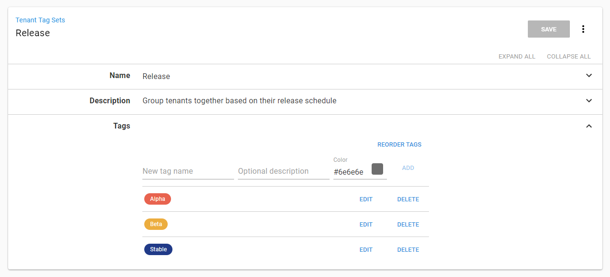

# Deploying to Multiple Customers

In the previous chapter we walked through what is multi-tenancy as well as some common multi-tenant scenarios.  In this chapter we are going to take an existing set of projects and configure them to deploy to multiple customers.  

We will be reusing the OctoFX project we have been using for this entire book.  To make the example a little clearer, we have cloned that existing project.  In a real-world scenario you would not clone it, but just update it.  

## Scenarios

We want to be able to support the following scenarios for our Multi-Tenant applications.  

1. Each of our customers have their own web servers and database.  They get the same code.  The deployment process should be the same.  The only difference is the destination server and some variables such as the database server and user.
2. We should be able to choose when a customer gets a specific version of our code.  Some of our customers want to be on the cutting edge, their tolerance for risk is high.  They have no problem being the "guinea pig" for a new feature.  Some of our other customers have a low risk tolerance.  They only want to be on the stable version.
3. We should be able to group our customers into different release rings, such as Alpha, Beta and Stable.  This allows us to release new versions of code to multiple customers at once.
4. Some of our customers have custom branding.  During deployments we need to have the ability to run an additional step to add in the branding.  

## Target Configuration

Before jumping into the projects we want to first configure our deployment targets.  In a previous chapter we offloaded all database deployments onto workers.  This means we only need to configure the Web Servers for OctoFx.  There are a couple of small items to point out when configuring a target for a specific tenant.

The name of the deployment target should include the name of the tenant.  [EnvironmentPrefix]-[TenantName]-[AppName]-[Component]-[Number] is a an easy to remember naming convention.  For example, `d-ford-octofx-web-01` if we wanted the machine to deploy the OctoFX website for Ford to Dev.  In the event the target is used for multiple tenants, it is a good idea to group them together using tenant tags and name the server after the tenant tag.  [EnvironmentPrefix]-[TenantTag]-[AppName]-[Component]-[Number], or `d-alphacustomers-octofx-web-01`.  As always, naming is easy to understand, difficult to master, as long as you have consensus around your naming conventions you should be fine. 

A good rule of thumb is to configure targets to only be used for tenanted deployments.  Allowing untenanted deployments for a target should be an exception.  Typically we see our customers use a target for tenanted and untenated deployments in lower environments when the number of test resources available to them is limited.  

In a perfect world each tenant would get their own web server and database server.  In the real world that is not very cost effective.  Especially when it comes to hosting VMs on a cloud provider such as AWS or Azure.  Don't be afraid to tie multiple tenants to the same machine.  Octopus Deploy allows 1 to N number of tenants.  

## Tenant Tags

Tenant tags are a way to group tenants together.  To support our scenarios we are going to be creating two tenant tag sets, one called `Release` and the other called `Custom Features`.  This can be accomplished by going to the Library -> Tenant Tag Sets page.  

When creating the tenant tags it is possible to assign each tag a color.  We recommend doing this when it makes sense.  The `Release` tenant tag is a great example.  Red for Alpha customers as they are used to risk.  Yellow for beta testers as they are okay with some limited risk.  Blue for stable customers as they want no risk.

Now we can go back to each of our tenants and assign them the various tenant tags.  For this example we will be assigning the following tenant tags:

1. Internal - Alpha Release, Custom Branding Custom Features
2. Coca-Cola - Beta Release, Custom Branding Custom Features
3. Nike - Alpha Release, no custom features
4. Ford - Stable Release, no custom features
5. Starbucks - Stable Release, Custom Branding Custom Features

If you are using custom colors for your tenant tags, the tenant overview screen provides a quick overview of which tenants are assigned which tag.  

You can also apply filters based on Tenant Tags on the tenant screen.  This will help find all the customers assigned to a specific tag.

## Project Configuration

## Project Template Variables

## Conclusion