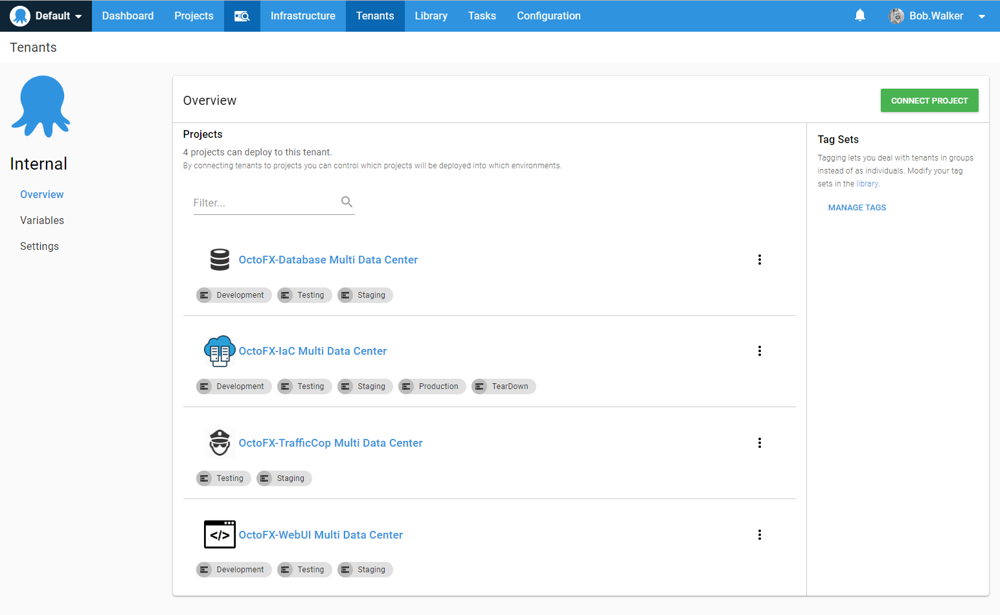
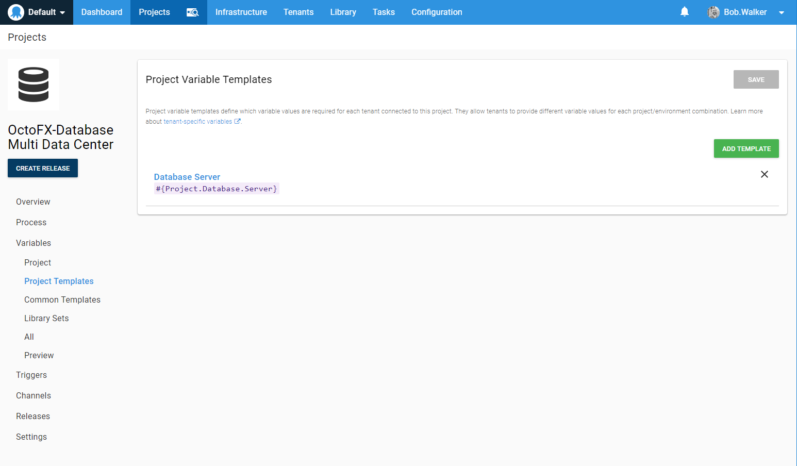
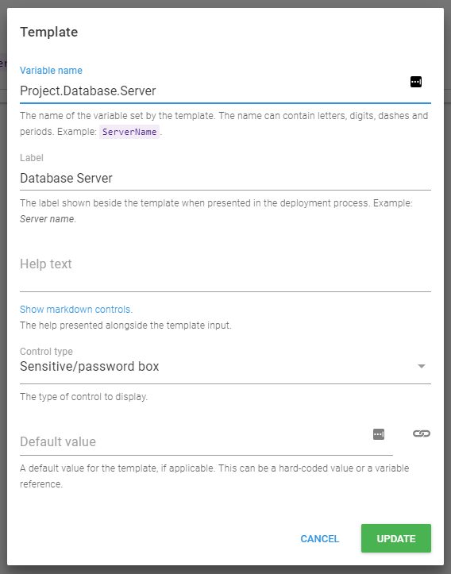
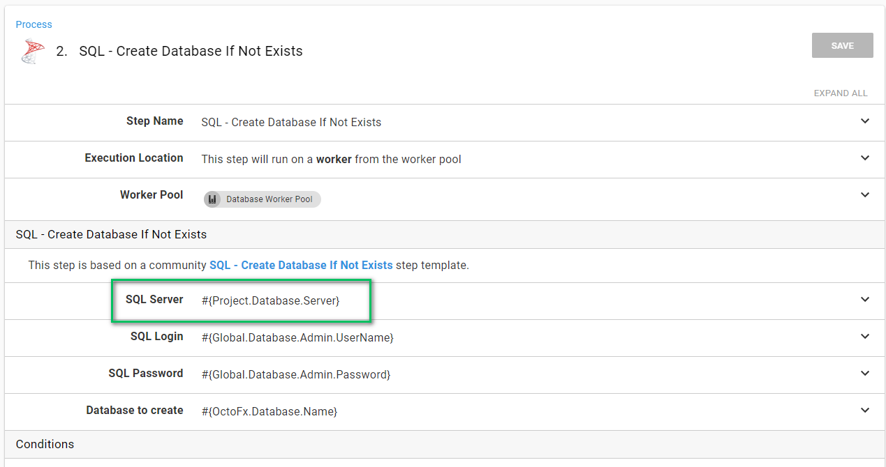

# Let's Talk Multi-Tenancy

A lot of our customers deploy SaaS software.  Typically, that SaaS software has more than one customer.  They don't want their customers to see other customers.  They make their application multi-tenant.  In our experience there are typically three ways an application is made multi-tenant.  

The first approach is the multi-tenancy is done in the code.  Each user is assigned to a tenant or a company.  When a user logs in they are only shown that companies information.  Everything is shared.  All users login to the same webfarm.  They all use the same database.  Every table in the database has a "CustomerId" column and every query has "where CustomerId=[LoggedInCustomerId]" attached to it.  This is the easiest option to deploy and maintain.  One code base and one database.  The risk for cross tenant contamination is high with this, a simple missed where clause could cause a very bad day.

The second approach is the multi-tenancy is also done in the code, but each tenant gets their own database.  All the users login to the same webfarm.  When a user logs in a Customer Id or connection string is attached to their session.  When the code needs to go to the database the connection string is pulled from the database or session.  Compared to the first option, the database queries are more simple and each customer gets their own database.  But there is still a risk of cross tenant contamination because everyone is using the same resources.  Deploying the code is easy.  Deploying the databases is not as easy as the first approach.  

The final approach is total isolation.  Each customer or tenant gets their own web server or servers and their own database.  The code is very simple compared to the first two options.  No need to worry about looking up a customer's id and maintaining the connection string somehow in memory.  And the risk of cross tenant contamination is non-existent as each customer gets their own set of resources.  The downside is deployments.  The deployment process is the exact same, the only thing which is different is the servers being deployed to and the connection string.  In addition, this approach lends itself nicely to being a combination hosted or on-premise solution.

## Multi-Tenancy In Octopus Deploy

In version 3.4 Octopus Deploy introduced the Multi-Tenancy feature to help support the total isolation approach.  The underlying concept of the feature is very similar to the underlying concept of Octopus Deploy.  Consistency.  The same process used to deploy to Customer A should be used to deploy to Customer B.  This is because the code is the same, only the destination is different.  

Another important scenario we support with that model is different versions for each customer.  It is very common to see a multi-tenant application deploying different versions to each customer.  Perhaps a customer is in the middle of testing a new feature, they want to be on the latest and greatest.  While another customer only wants the latest stable release.  The total isolation approach makes it easier for this scenario, but all to often it was rather difficult to do.  

## Terms

There are a number of Terms we use with the Multi-Tenancy feature which you should familiarize yourself with.  

### Tenants

A tenant can be a customer, a feature branch, or a data center.  This is the top level object.  We didn't want to limit ourselves to a specific one, so we picked tenant as the name.  

### Tag Sets

Tag sets allow you to group tenants together.  You can deploy all tenants in a tag set as well as tie specific steps to only run on a tag set.  We will cover tags set examples in a later chapter.

### Project Template Variables

Project template variables allow you to specify a variable which a tenant can change.  A perfect example would be a connection string or a database server.  With project templates you define them at the project level. 

You can specify the variable type for the project template, just like regular variables.  You can also provide a default value which the tenant can overwrite.  

On the tenant variable screen you can set those variables.

The nice thing about project template variables is they can be used like any other variable.  

### Library Set Variable Templates

Library set variable templates are similar to project template variables.  The main difference between the two is the library set variable templates can be used across multiple projects, and they are not scoped to environments.  For example, we needed to define an abbreviation for the tenant to use when creating a target using IaC.  We can configure a variable template for the library set.

And just like project template variables, those variables are defined at the tenant level.

