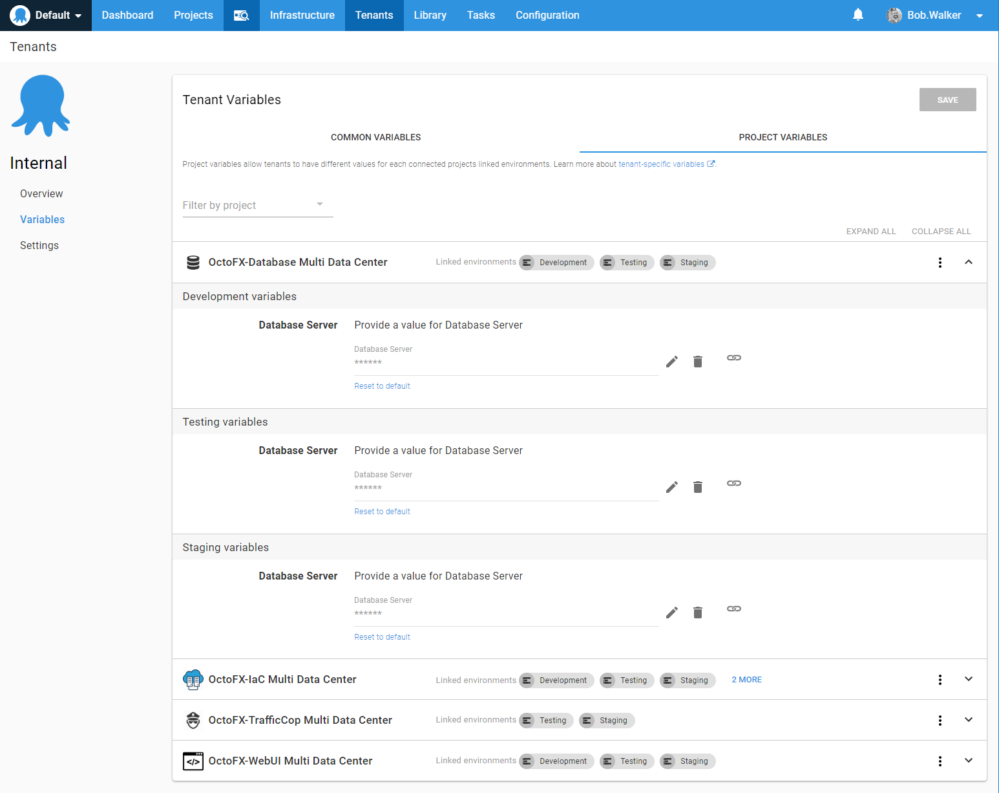
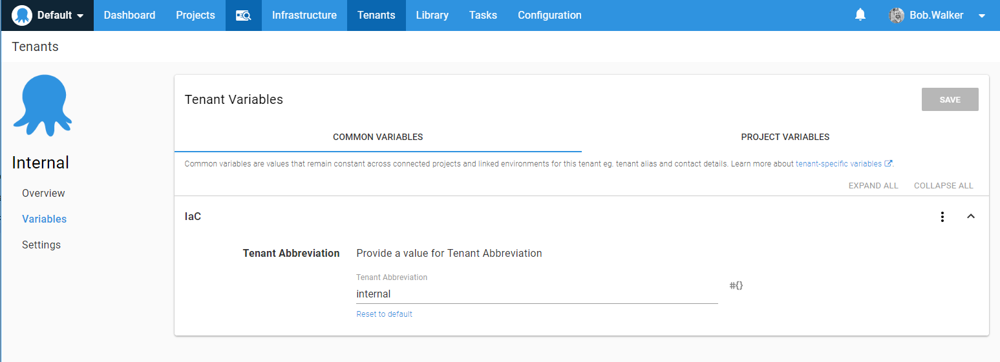

# Let's Talk Multi-Tenancy

Many of our customers deploy SaaS software.  Typically, SaaS software has more than one customer, but the companies deploying software to multiple customers don't want those customers to see each other. To avoid this, they make their applications multi-tenanted.  In our experience there are typically three ways an application is made multi-tenant.

## 1. Code based Multi-Tenancy

The first approach is code based multi-tenancy.  Each user is assigned to a tenant or a company.  When a user logs in, they are shown that companies information.  There is a single database and a single code base.  Every table in the database has a column that identifies the customer, such as a "CustomerId" column, and every query has "where CustomerId=[LoggedInCustomerId]" attached to it.  Code based multi-tenancy is the easiest option to deploy and maintain.  However, with code-based multi-tenancy the risk for cross tenant contamination is high. A missed "where" clause makes for a terrible day.

## 2. Database based Multi-Tenancy

The second approach is a slight twist on the code based multi-tenancy approach.  The twist is that each customer gets a separate database.  When a user logs in a Customer ID or a connection string is attached to their session.  When the code needs to go to the database, the connection string is pulled from the database session.  Compared to the first option, the database queries are more straightforward.  However, there is still a risk of cross tenant contamination because everyone is using the same resources.  Deploying the code is easy, but deploying the databases is not as easy as the first approach.  Databases need to be deployed to before a code push.  With a couple of databases, this isn't much of a concern, but a few dozen or a couple of hundred databases make it a concern.

## 3. Isolate Multi-Tenancy

The final approach is total isolation. Each customer or tenant gets a web site or web servers and a separate database.  Compared to the first two options, the code base is much more straightforward.  No need to worry about looking up a customer's ID and maintaining the connection string somehow in memory.  Also, the risk of cross tenant contamination is non-existent as each customer gets their own set of resources.  The downside is deployments.  The deployment process is the same, the only difference is the deployment targets and the connection strings.  Finally, this approach lends itself nicely to being a combination hosted or on-premises solution.

## Multi-Tenancy In Octopus Deploy

Octopus Deploy version 3.4 introduced the Multi-Tenancy feature to help support the total isolation approach.  The underlying concept of the feature is very similar to the underlying idea of Octopus Deploy.  Consistency.  The same process used to deploy to Customer A should be the same for Customer B.  This is because the code is the same; only the destination is different.  

Another essential scenario we support with this model is different versions for each customer.  It is very common to see a multi-tenancy application deploying different versions to each customer.  Perhaps a customer is in the middle of beta testing a new feature.  That customer has to be on the latest and greatest or on a pre-release version.  While another customer only wants the latest stable release.  The total isolation approach makes it easier for this scenario, but without a good deployment strategy, that scenario became challenging to support.  

## Terms

There are many terms we use with the Multi-Tenancy feature which are unique to Octopus Deploy.  

### Tenants

A tenant can be a customer, a feature branch, or a data center.  Tenant is the top level object.  We didn't want to limit ourselves to a specific one, so we picked tenant as the name.  

### Tag Sets

Tag sets allow you to group tenants together.  You can deploy all tenants in a tag set as well as tie specific steps to only run on a tag set.  We will cover tags set examples in a later chapter.

### Project Template Variables

Project template variables allow you to specify a variable which a tenant can change.  A perfect example would be a connection string or a database server.  With project templates, you define them at the project level.

You can specify the variable type for the project template, just like regular variables.  You can also provide a default value which the tenant can overwrite.  

On the tenant variable screen, you can set those variables.

The nice thing about project template variables is that they are treated like any other variable.  

### Library Set Variable Templates

Library set variable templates are similar to project template variables.  The main difference between the two is that the library set variable templates can be used across multiple projects, and they are not scoped to environments.  For example, we needed to define an abbreviation for the tenant to use when creating a target using IaC.  We can configure a variable template for the library set.

Just like project template variables, those variables are defined at the tenant level.

## Conclusion

In this chapter, we looked at multi-tenancy.  We also went through the common approaches to make an application multi-tenanted.  In the next few chapters, we will walk through some common uses of the multi-tenancy feature in Octopus Deploy.
