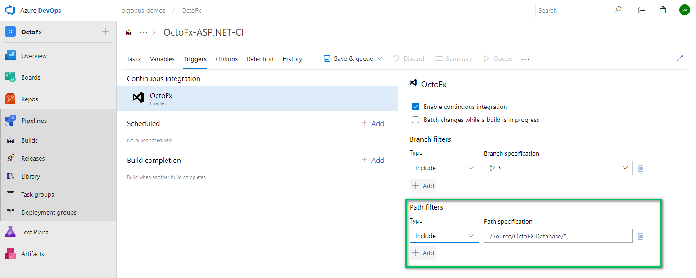
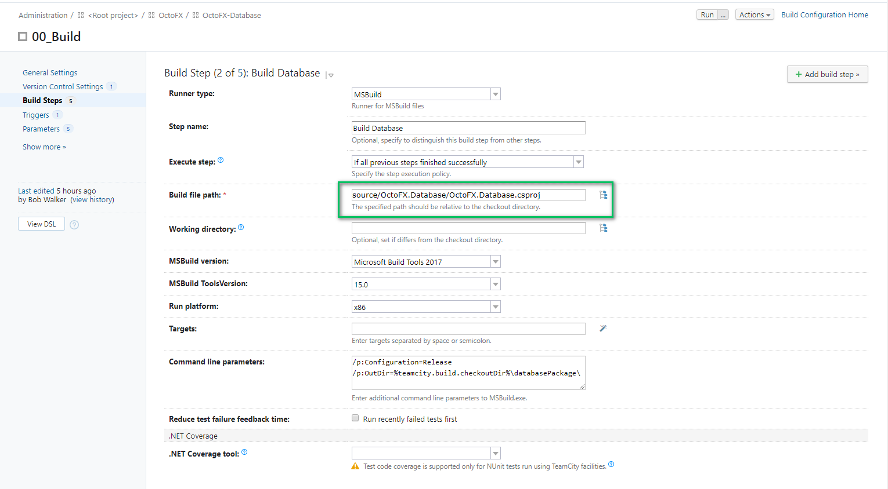
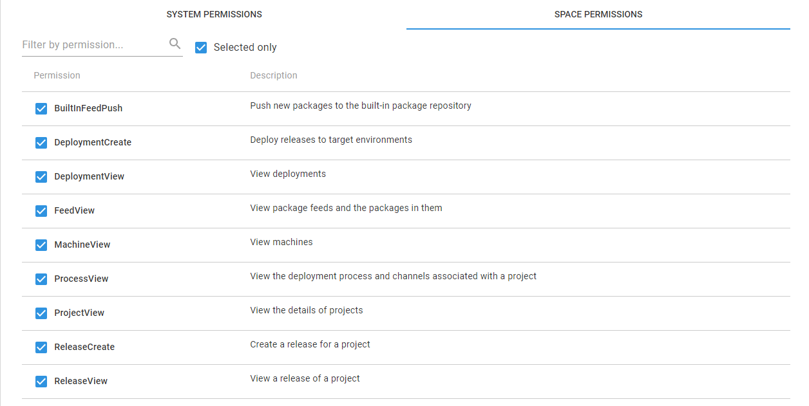
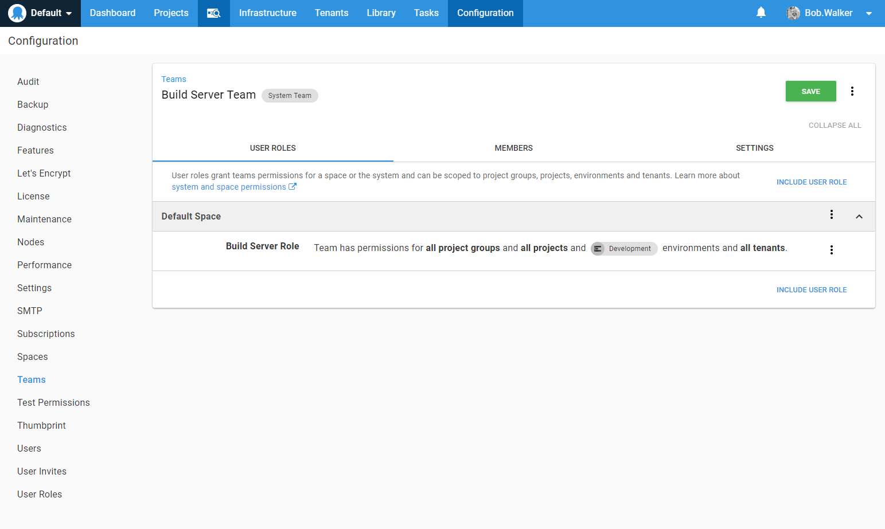

# Packaging Applications on the Build Server

Octopus Deploy will deploy a wide variety of package formats to deployment targets.  This list includes, but is not limited to;

 - NuGet packages.
 - Tar packages.
 - Docker Images.
 - Jar files.
 - Zip files.  

The build server, typically Jenkins, TeamCity, TFS/Azure DevOps, Bamboo, or AppVeyor, is most often responsible for packaging applications and pushing the packages to Octopus Deploy.  It is possible to package a folder without using a build server, but for this book, we are assuming the build server is the one packaging the applications.

The build server is responsible for packaging the application because the build server monitors your source control for any changes.  It builds and tests code when a change is detected.  Once the build server is done, it hands the package off to Octopus Deploy to handle the deployments.

Octopus Deploy is build server agnostic.  It doesn't care about the origin of the packages.  All it cares about is that it gets a package to deploy.  We have written many plug-ins to support the more popular build servers.  For the build servers where we don't have a plug-in, we have created a command line application called `octo.exe`.  The plug-ins are wrappers for that command line application so that you will get the same functionality as the plug-ins.  

## Build Server Process

Our recommended build server process is:

1. Pull down changes.
2. Build code.
3. Run static analysis.
4. Run unit tests.
5. Package the application.
6. Push the package to Octopus Deploy.
7. Create and deploy release in Octopus Deploy.
8. Run integration tests.

If any of the preceding steps fail, the build server will fail the build.  When Octopus Deploy gets a package to deploy, we know the code successfully passed analysis and unit tests.

The goal of the list above is to fail fast.  If the code cannot be built, there is no reason to run the static analysis.  If the static analysis fails, there is no need to run unit tests.  This way, the build server doesn't waste compute resources on a build.

>  Analysis and tests get exponentially more expensive as you move farther away from the build server.  In terms of time, fixing a problem because of analysis failure is much cheaper than fixing a problem in production.  Unit tests should be self-contained, repeatable, and fast while integration tests are more "soup to nuts" tests which require external components such as a database or file system.  They tend to be much slower and more expensive to maintain. We've seen some projects with 10,000+ unit tests and a couple of hundred integration tests.  The unit tests took a few minutes to run while the integration tests took 10+ minutes to run.  If there is a problem in the code, it should fail as fast as possible.  

## One Source Control Repository or Multiple Source Control Repositories?

If you recall, the OctoFX project has two components, a database, and a UI.  A question a team or even a company will struggle to answer is, should all components be in the same source control repository or should there be multiple source control repositories?  The answer to that depends on the build server chosen.  Several build servers can be configured to watch specific folders.  For example, OctoFx stores the database and WebUI in two folders.

- source/OctoFX.Database
- source/OctoFX.TradingWebsite

It is possible to configure a build server to have two builds, one to watch for changes to the DB folder and another to watch for changes to the src folder.  The TeamCity trigger page allows you to create a trigger based on a watched folder.

In TFS/VSTS/Azure DevOps, the trigger is located on the same page where you configure which branch to watch.

Both of these projects are in the same solution.  The build step for each project only builds that project.

It does seem a bit extreme to separate the components into two builds.  However, consider how often do you make a change to just the website?  What if you make a change to the database, say add a new index?  Should you have to wait for the entire application, both the front-end and database, to be built and tested because of a small index change?

>  A good rule of thumb is a build shouldn't take any longer than it takes to get a cup of coffee from the break room.

## Building and Packaging using Versioning Schemes

The Major, Minor, and Patch of the version should be stored somewhere in the source control repository or a variable on the build server.  You want to provide a source of truth for the version numbers.  

>  When compiling or building the code, those values should be used to version the .dlls or .jar files.  Versioning compiled items will allow you to easily see what version is on a specific server.

When packaging the application to ship to Octopus Deploy, you should also include a build number.  For example, if you compiled `1.5.2` then you should include the build number, say 1000, in the package name `1.5.2.1000` or `1.5.2-Build1000` depending on your internal versioning guidelines.  

>  Including the build number with your package allows you to have multiple builds for the same version.  Very rarely will a version have a single build which makes it to production.

## Releases

We recommend having the build server create and deploy a release to a Development environment.  The build server should control when the code is deployed to that environment.  Maybe your project needs to push two packages.  Waiting until after both packages are pushed to create the release ensures Octopus will deploy those two packages at the same time.  

All of our plug-ins allow you to wait for the deployment to development to complete.  It is recommended you enable that feature.  This way, the build will fail if the deployment to development fails.  You can also run integration tests after the deployment is complete.

It is possible to configure the Octopus Deploy server to create a release when a package is pushed automatically.  However, it only works if a particular set of conditions are met, such as using the internal NuGet feed, not using variables for package IDs, and so on.  As more and more people use the Octopus Deploy instance within your company, you will often find those conditions very constricting.  Automatic release creation using Octopus Deploy should be treated as an exception rather than a rule.

## Build Server Permissions

Your build server will need to communicate with the Octopus Deploy server.  To do that it will need to use the API Key of a user in Octopus Deploy.  The user should be a service account and not a user account in Octopus Deploy.  The service account property can only be set when a user is first created.  You need to click the `The user is a service account` checkbox.

Service accounts don't have passwords.  They only have API Keys.  That way if an API Key is compromised, all you need to do is delete it.  Password resets are slightly harder.  Also, service accounts are not tied to a specific user.  We've often seen a person configure the CI/CD pipeline using an API Key linked to their user account, and when they leave the company, the typical clean-up process runs and disables the user account.  Then all the builds start failing because they are unable to deploy.

It is also a good idea to limit what the service account can do.  We recommend creating a custom role for your build server service account, which we will call `Build Server Role`.

Create a new team and assign the user and the role to that team.  You can also limit the deployment environments.  That also helps lock down what that service account can do.

## Conclusion

By integrating a build server into the mix, we now have an entire CI/CD pipeline.  If you have any takeaway from this chapter, it is you should build your application once and then deploy those same build artifacts across all your servers.  The code which is tested in QA should be the same code which is going to run in production.  
