# Setting up Projects and Deployment Targets

In previous chapters, we set up the necessary infrastructure scaffolding for our Octopus Deploy server to help it scale.  In this chapter, we will take that infrastructure and use it to set up a simple project.  We know... we know... this is something you already during your Proof of Concept.  You already know how to set up a project.  The goal of this chapter isn't to rehash that. Instead, it is to provide you with a different way of thinking about projects.

## Project Recommendations

Octopus Deploy was built with the core concept of consistency across all environments.  The process used to deploy to the development servers is the same process which is used to deploy to production.  You can disable and enable specific steps, but it is the same process. This means the same bits that are deployed to testing will eventually make it to production and the production deployment will be a non-event, because you've tested the process many times. In our case, it has been tested at least three times, in Development, Testing, and Staging.

Knowing the underlying concept of Octopus Deploy is consistency; here our are recommendations.

### Keep Your Projects Simple

One of our favorite programming maxims is the single responsibility principle.  A class/function/method should do one thing and one thing well.  The same holds true for projects.  Projects should be straightforward and should deploy a component of an application.  

For example, your project has a Windows Service, a UI, and a database.  The temptation is there to create a single project to deploy all three components at the same time.  The project wouldn't be very complicated.  Four or five steps if you include a manual intervention.  However, consider this, how often do you deploy a UI change which doesn't require a database change?  What if you could make a small UI fix without having to worry about deploying your database and Windows Service?  What if you could add an index into your database and push that to production without having to worry about deploying your UI or Windows Service?   Think about how much faster you could respond to customer feedback.  

Each component should have its own project.  Unique projects will give you the flexibility to deploy the pieces of your application only when a change has occurred.

### Orchestrating Your Projects

Octopus Deploy provides a mechanism for a project to call other projects.  That feature will allow you to set up an orchestrator, or what we like to call a traffic cop, to deploy your projects in a specific order.

>  This will also allow you to isolate your code in your source control repository or have separate builds for each component.  This way your CI/CD pipeline only has to build and deploy something which changed rather than building and deploying the actual application.  An added benefit to that is reducing the build and deployment times.  

### Projects Should Set Up What They Need to Run

Imagine you are working on a greenfield application for six months.  It only exists in your development and testing environments.  Now it is time to deploy to staging.  The web admins have set up a web server running IIS for you using a base image.  The DBAs have created an account for the application to use.  What about the configuration?  What should the database name be?  

When you set up a project's processes you should work under the assumption the key base applications are present (.NET Framework, IIS, SQL Server, WildFly server, Oracle Database, and others) but they have never been configured for your application.  Assume SQL Server is there but the database has never been created.  Assume IIS is there but the web application has never been configured.

Going back to earlier, when it is time to deploy to staging you should only need to verify the servers are there and hit the deploy button.  The project deployment process will take care of the rest.  As a bonus, if a new server is added, you can deploy to that new server without having to worry about the configuration.  All the servers will be configured the same.

### Take Advantage of the Run Conditions

Almost everyone is familiar with the environment run conditions.  For instance, run a step in production only.  Alternatively, don't run this step in development or testing.  However, there are other run conditions:

 - Only running when the previous step was successful.
 - Only running on failure.
 - Always running.
 - Only run when a variable is set to true.  

Those additional conditions are advantageous.  You can configure a step to send a slack notification when a failure occurs.  You could set a manual intervention to only happen if you are deploying during business hours.  You can also configure steps to run in parallel with one another.

These conditions allow you to have a degree of control with your deployments.  

### Every Component's Deployment Should Be Automated

A typical scenario we see is application deployments are automated, but the database piece is not.  That is still a manual process.  This means on the night of a deployment to production, a DBA has to run the scripts.  After they finish then the automated process can be kicked off.  Because this is manual, there is a good chance the scripts were not included in the deployments to dev or testing or staging.  Without prior testing, the likelihood of success goes down and the deployment time goes up.

Essentially there is this great automated process which takes a few minutes to finish, but it is dependent on a manual process which takes anywhere from ten minutes to an hour to complete.  Every component of the application needs to be automated, even the database.  Octopus Deploy integrates with many database deployment tools to help with this sort of automation.

## Setting Up the Project

Let's configure a project using all those principles.  We are going to be deploying a sample application, OctoFX.  It is a small ASP.NET application with a database and a user interface.  When we are finished with this setup, we will have three projects.  One project will deploy the UI, another project will deploy the database, and a traffic cop project will coordinate those deployments.

Let's first get the project scaffolding in place.  Start by creating a project group called "OctoFX."

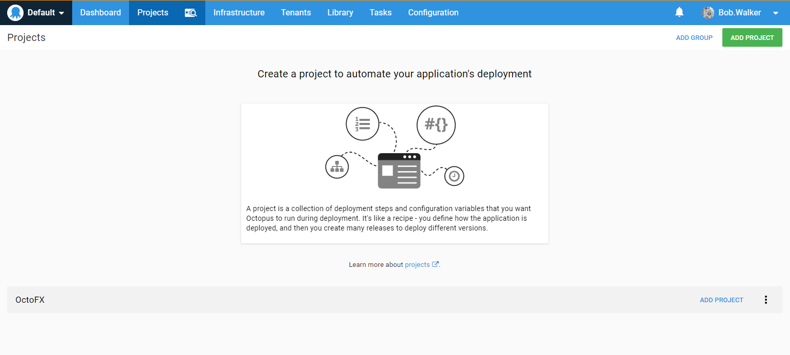

>  Project groups are a great way to organize your deployment projects.  They have many uses, not only do they visually separate the projects, but you can also configure the dashboard to hide/show specific project groups as well as configure permissions to restrict access to them.

That group looks a little empty.  Let's add in the three projects we discussed earlier.

>  Just like with tenants, adding an image to your project is a useful way to visually set them apart from other projects.  In addition to supporting .jpg and .png files, we also support .gif files.  Which means you can have an animated icon to add a little flair to your Octopus Deploy instance!

### Sharing Variables Between Projects

We have the three projects set up, but we need to share some common variables between them.  Some which come to mind right away are the SQL Server to deploy or connect to, the database name, the application name.  To accomplish this, we are going to create a library set for this specific application.

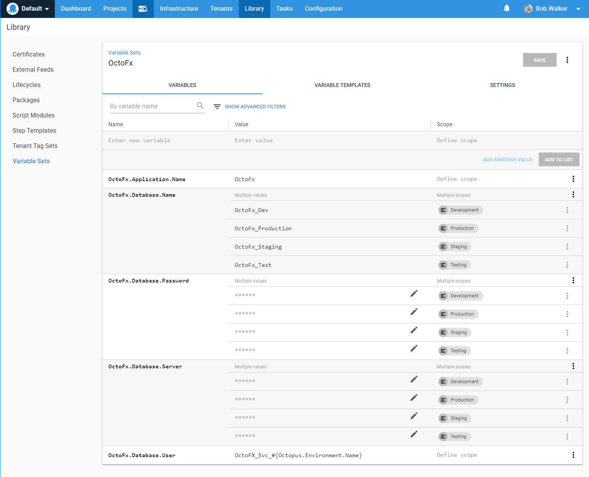

>  A project can reference 0 to N number of library sets.  Variable naming is significant.  A good practice is to use a NameSpace style syntax on naming, [LibrarySetName].[ComponentName].[SubName].  Project variables can then be called [Project].[ComponentName].[SubName].  Detailed variable names give you the ability to distinguish in the project steps and logs which variable is from a library set and which is from the project.

It is also a good idea to have a couple of other library sets to handle some non-project specific values.  For example, global and another to store any infrastructure as code or IaC variables.  The same naming convention applies as the project specific variable set example, just replacing "OctoFx" with "Global."

### OctoFX-Database Project

The first project we are going to configure is the OctoFX-Database project.  If we follow the recommendations from earlier in this chapter, we will assume that the SQL Server is running but this database and the required user do not exist.  We are going to have steps in place to check to see if the database exists as well as the necessary user for the environment.  If they don't exist, then we will need to create them.  Also, we want to build some trust in the process; this can be done by having a manual intervention for a DBA to approve.

Before adding in steps to the process, we need to add a reference to the library variable sets we created earlier.

Next, we are going to add in the manual intervention for the DBAs to approve.  If you are configuring a fresh instance of Octopus Deploy you likely haven't had the chance to configure a DBA team yet.  That is okay, for now, just put in Octopus Administrators or a team which already exists.  We will get to configuring teams in a later chapter.

>  This project deploys a database package using DBUp, a free database deployment tool.  Some tools provide the ability to generate a difference report before deployments which Octopus can store as an artifact and a DBA can download and review.  In that case, it makes more sense to have the manual intervention occur after that report has been generated.

Many community step templates have been created to help with some of this database scaffolding.  We are going to be using the SQL - Create Database If Not Exists step template to create the database if it doesn't exist.  We are going to use variables from the library sets we brought in previously.  For now, we are going to execute this script on a Tentacle with the role "OctoFX-DB."  Later in the book, we will convert this over to using workers.

There are few more maintenance tasks to add, such as creating the SQL Login if it doesn't exists, assigning that user to the database and assigning them to a role.  Keep in mind, all of the steps being added are occurring before an actual deployment happens.  Without even doing a deployment we have added in five steps.  That is to deploy the database.  Imagine if this project also deploys a website, a Windows Service, and other components.  The project would become very hard to manage.  

Now we are ready to configure the database deployment.  As you most likely learned when creating a PoC or other deployment projects, you need to package up the database into either a NuGet or a Zip file.  In this book, we haven't configured anything to push the packages to Octopus Deploy's internal package feed for it to deploy.  However, the deploy a package step requires us to specify a package.  The way we will short-circuit this chicken/egg scenario is by using variables.  In a later chapter, we will worry about getting the packages uploaded, but for now, we want just to set a variable.

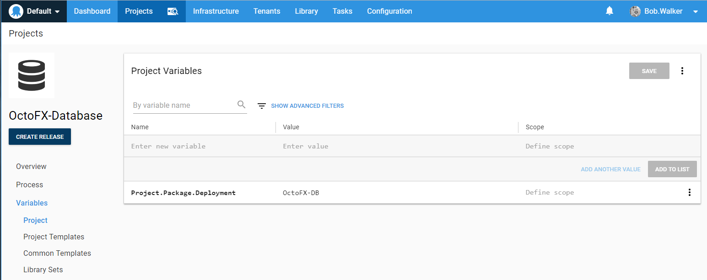

>  Using a variable to reference a package also makes it easier to clone this project to use with another application.

Now that we have our package referenced as a variable, we can add the step to deploy the package and run the scripts on the database.

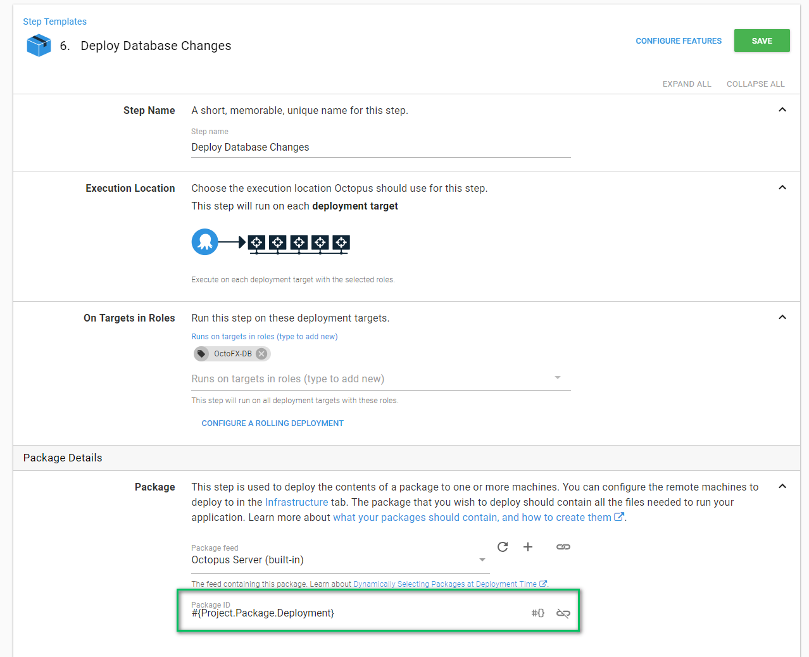

Finally, we are done with the database deployment process.  The process itself is relatively simple; there might be some more approvals or some additional steps you want to add.  Again, the idea is to keep all the database deployment work in this specific project.

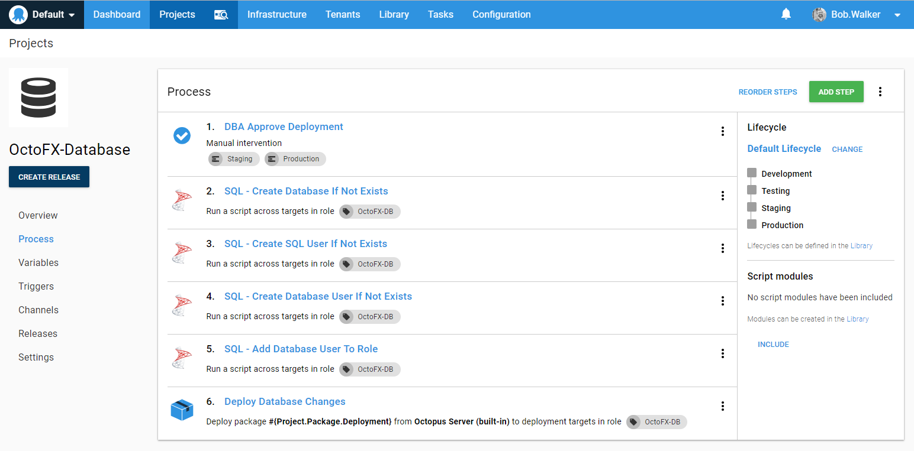

Don't spend too much time on the actual steps in the process.  The major takeaways from this are the database project is responsible for everything required to create, configure, and deploy a database.  You might be using a different tool (like Redgate or RoundhousE) to do your deployments which include some additional features.

### OctoFX-WebUI Project

Now it is time to move onto deploying the UI.  Unlike the previous section, we will not walk through all the necessary steps you need to configure your project.  We will follow the same rules as before; the project will do all the work required to deploy the web application as if it were the first time.  

That being said, do not forget to reference the variable sets in this particular project just like you did with the database deployment project.

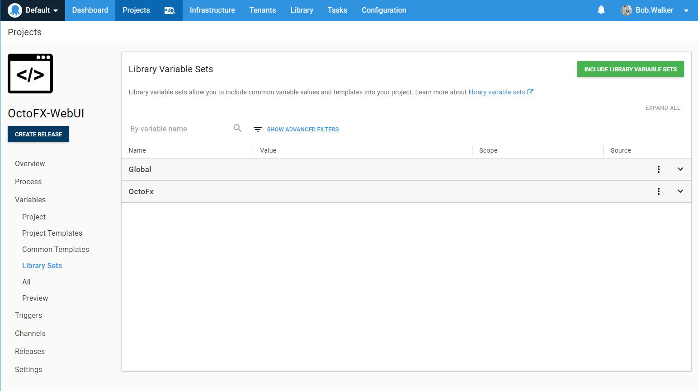

Below is the process we put together to deploy the web application.  First, it gets approval from the web admins to do the deployment; then it will do a rolling deploy across all the machines.

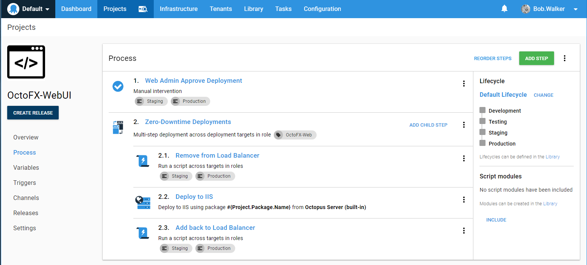

The rolling deployment is done by clicking on the overflow menu, the three "...", and then selecting "add child step."

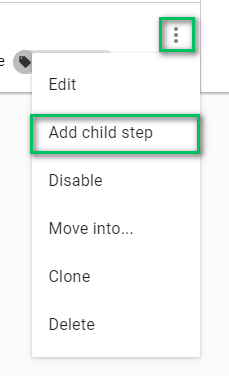

Once the child step has been added and saved, you can click on the primary parent step and configure a rolling deployment.  You can control the number of parallel machines being deployed to during the rolling deployment in this step as well.

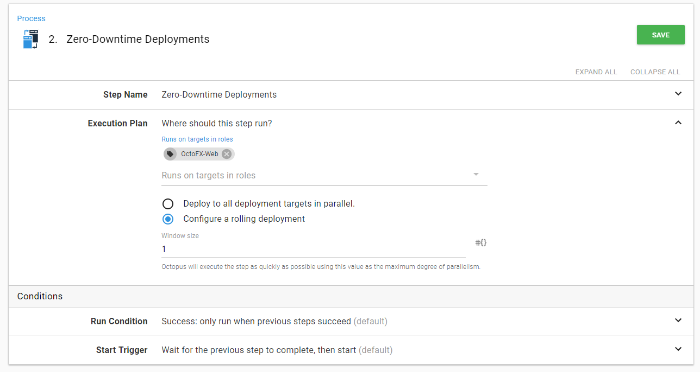

Just like with the database project, do not get too hung up on the steps.  We are not saying you need to do these steps to deploy a web application.  We just wanted to show you how we would configure a simple IIS web application deployment.  The most important thing to take away from this section is the WebUI project is only concerned about deploying the WebUI, and it will work if it is the first time, 10th time, or 1000th time deploying to a machine.  

### OctoFX-TrafficCop Project

The traffic cop project is the coordinator.  It knows the order to invoke the Database and WebUI projects.  This project is useful for times when the entire OctoFX application needs to be deployed.  This way you can still have a single project to schedule and deploy later.

We have added manual interventions to the Database and WebUI projects.  So it makes sense to have them if you are deploying the database or you are just deploying the WebUI.  It doesn't make a whole lot of sense to get approval for a WebUI deployment after the database has been deployed.  In an ideal world, those approvals would come before the deployments even started, which is what we are going to do.  

First, we need to add a couple of variables to the database project.  

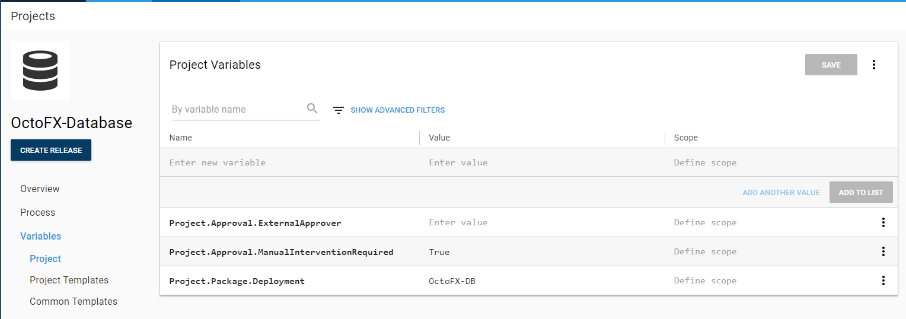

Next, we want to set the run condition on the manual intervention to look at the Project.Approval.ManualInterventionRequired variable.  If it is set to true, that step will run, and if it is set to false, it will skip that step.

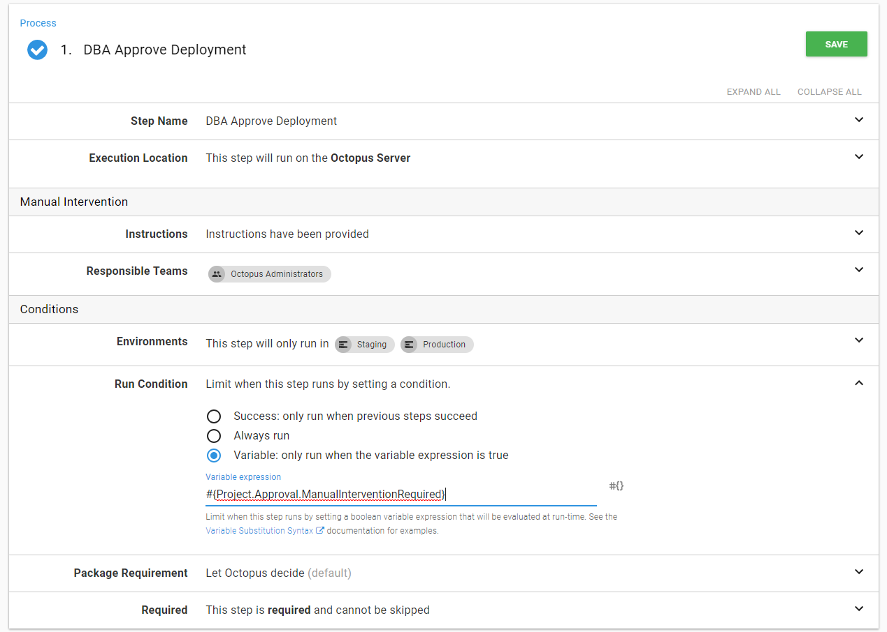

Let's repeat the same thing for the WebUI project.

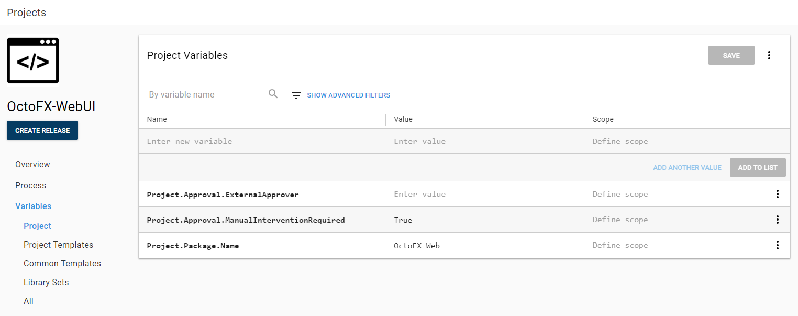

Then make the same change to the run condition on the manual intervention step.

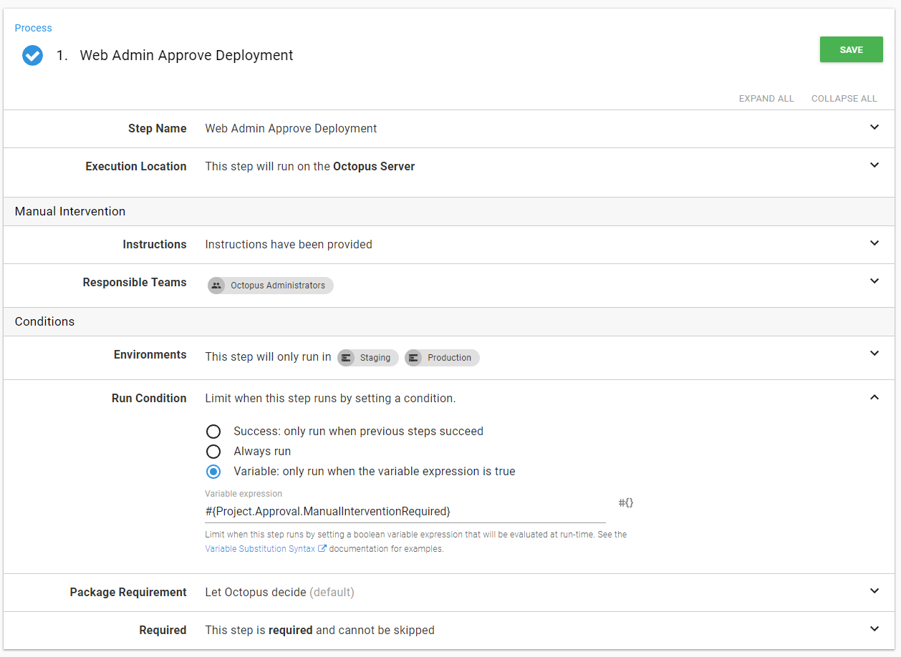

Now we can configure the traffic cop project.  First things first, add in the same library sets as the other two projects.

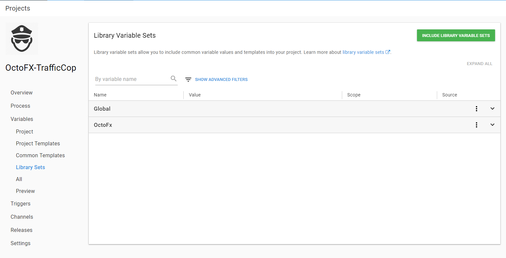

Next, we need to add in the manual interventions.  If you look closely at the screenshot, you will see this new icon appear in the process.

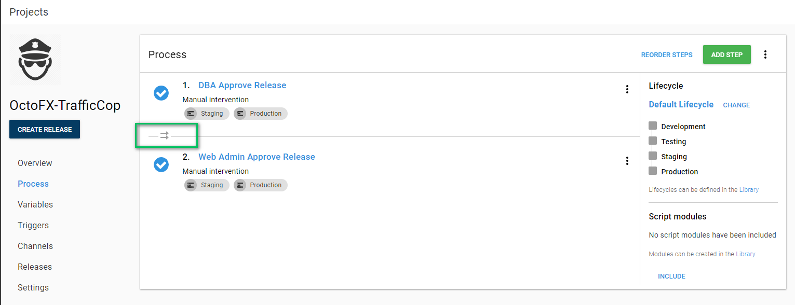

That new icon appears because the start trigger has been configured to be parallel to the previous step.  This means you won't have to wait for a DBA to approve before the web admin approves it.  The web admin can authorize the deployment, and then the DBA.

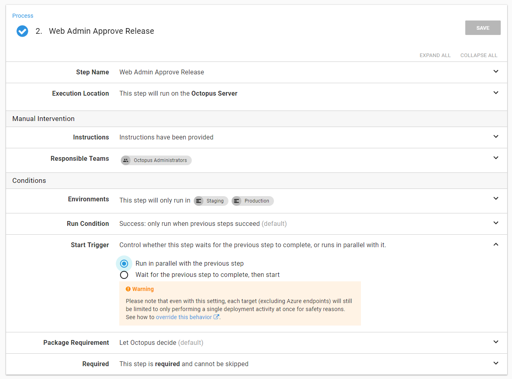

Now we can add in a deploy a release step for the database.  Make a note of the variable being sent in.  In this case, it is set to false.  That means the manual intervention on the database project will be skipped (because it has already been approved by the time it gets here).

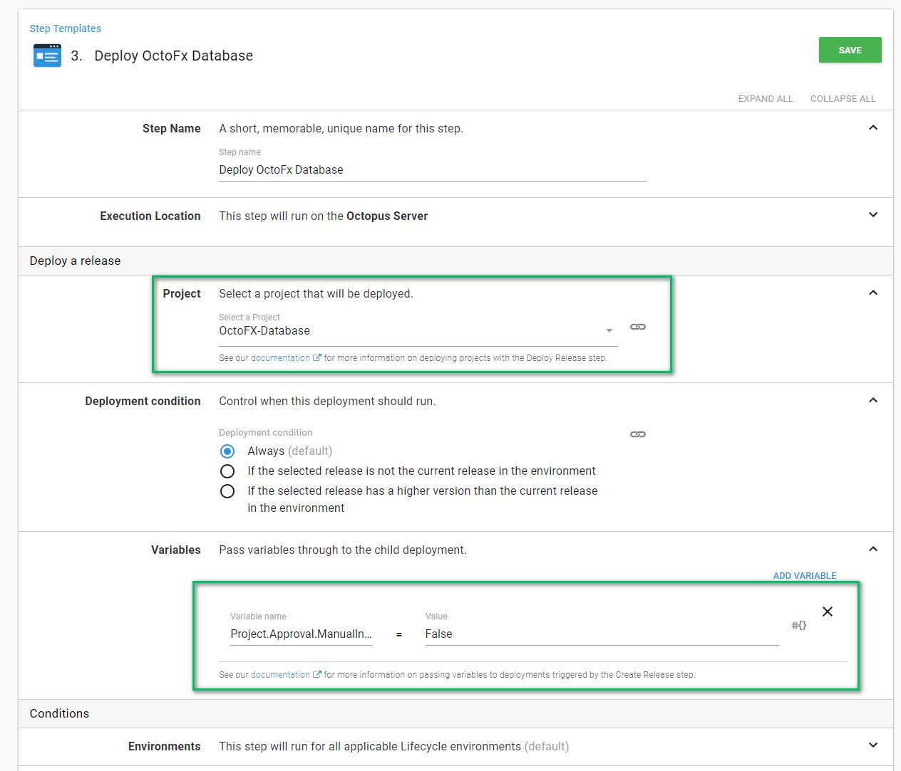

Now we can repeat the same thing for the WebUI project.

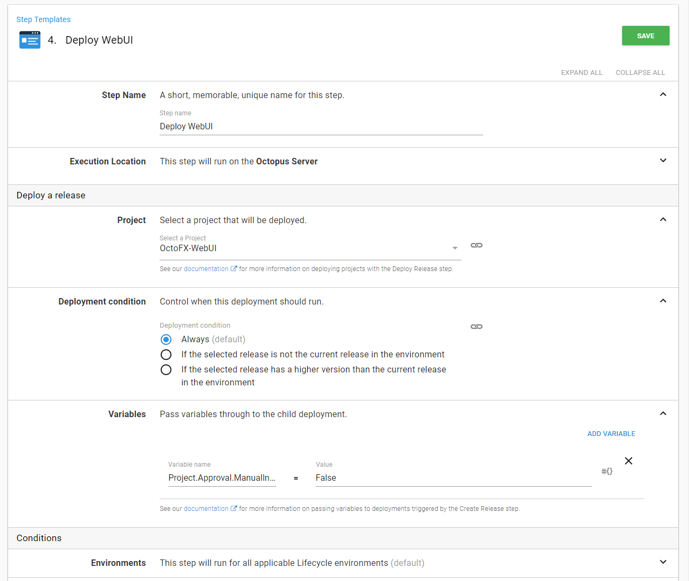

The final process in this example will look like this.

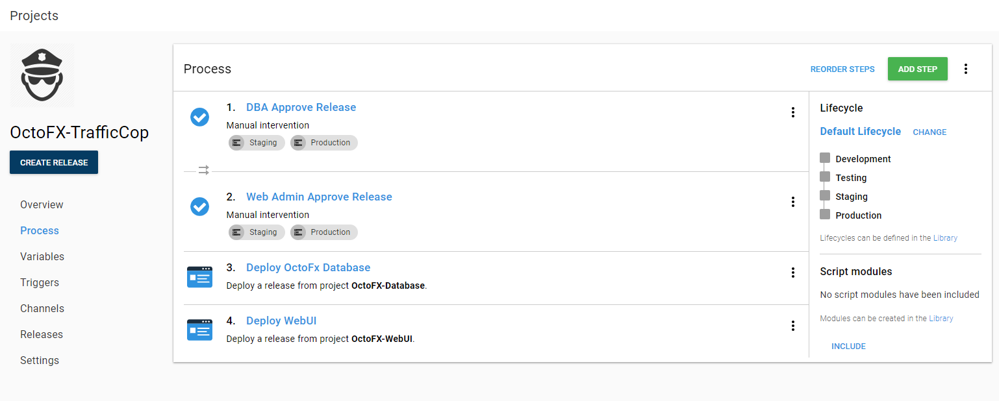

In a typical CI/CD setup the Database and WebUI projects will be automatically deployed to the development environment by the build server.  When should the traffic cop project come into the mix?  Not every Database and WebUI release will be promoted to a testing environment.  Moreover, you won't be deploying both projects all the time, only some of the time.  If the application were using something like Entity Framework without any stored procedures, then it could be entirely possible to have WebUI changes, even for a major release.  

Because of that, a unique lifecycle should be created for the traffic cop projects.  This lifecycle will skip the development environment and start at testing.

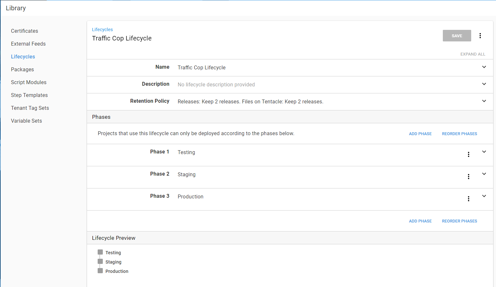

To change the default lifecycle for the project, you would go to the process screen and click the `Change` button next to the lifecycle.  

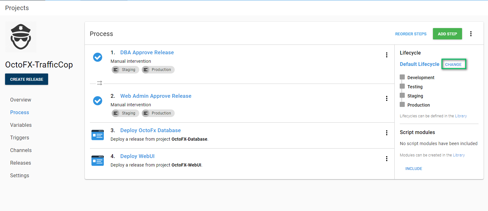

Now the default lifecycle for the project will be the "Traffic Cop Lifecycle."

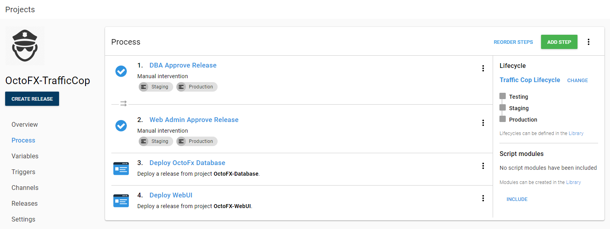

The important takeaway of this section is necessarily the individual steps rather than some of the core concepts.  We have a project which can coordinate the releases of other projects.  Also, the approvals are before the first deployment occurs.  Finally, we can have multiple approvals occur at the same time.  

## Conclusion

We had to cover quite a bit with this chapter; it was only about setting up projects!  Just like setting up environments, projects form another critical element in Octopus Deploy.  Getting them started on the right foot is very important in helping your Octopus Deploy instance scale.  We have talked to customers who have projects with 200+ steps deploying 80+ packages, and each deployment takes well over an hour.  That is very prone to error and doesn't scale all that well.  Hopefully, with these suggestions, you can avoid a similar setup!
