# Let's Deploy Some Code!

In previous chapters we got the environment scaffolding put together, then we created some projects for our application and finally we wrapped it up by setting up deployment targets for the projects to push code to.  After all that (whew!) it is finally time to deploy some code!

>  Typically the previous chapters will take anywhere from 10 to 20 minutes to set up and configure.  It does seem like a lot at first, the overall goal of the previous chapters was to provide you the foundation to get all the scaffolding configured so you can scale your Octopus Deploy.

Octopus Deploy will deploy code using what is known as a release.  When a release is created the project, variables, and packages being used are snapshotted.  You then deploy that release to the various environments and servers.  The idea behind a release is the core concept of Octopus Deploy, you build your code once, and you deploy that same code to all environments.  The same is true of the release.  The release is created once and that same release is deployed to all environments.

## Creating the first release

At this point we do not have our build server integration set up.  Which is okay, we don't need to do that at this very second.  An easy way to test our deployment process for the Web UI is to go to a development web server and zip up the application folder.  This will let us test our deployment process without having to worry about configuring the build server and getting that connection wired up.

For this first release I have created two packages, one for the website project and another for the database project.  For the website we went out to the dev server and packaged up the website into a zip file.  

Now we just need to upload them to the Octopus Server.  This can be done by going to Library -> Packages and clicking the upload packages button in the top right.

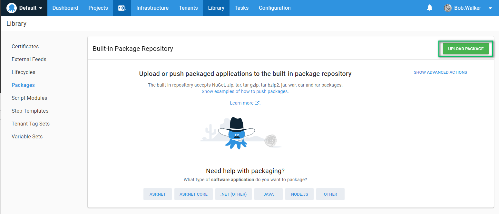

Now we have some packages to work with.

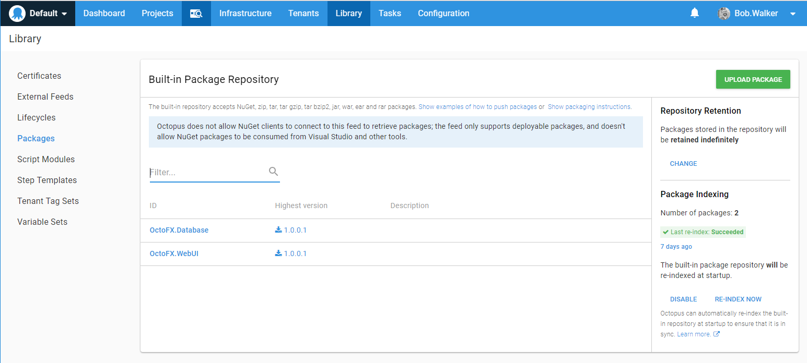

Before diving into the release let's talk about everyone's favorite subject, version numbers.  

## Version Numbers

The technology you're working with will, in some cases, determine the type of versioning scheme that you choose. We recommend using Semantic Versioning for your applications, unless you are deploying artifacts to a Maven repository, in which case you will need to use Maven Versions.

Consider the following factors when deciding on the versioning scheme you'll use for your applications and packages:

1. Can you trace a version back to the commit/check-in the application/package was built from? For example: We stamp the SHA hash of the git commit into the metadata component of the Semantic Version for Octopus Deploy which makes it easier to find and fix bugs. We also tag the commit with the version of Octopus Deploy it produced so you can quickly determine which commit produced a particular version of Octopus Deploy.
2. Can your users easily report a version to the development team that supports #1?
3. Will your version numbers be confusing, or will they help people understand the changes that have been made to the software? For example: bumping a major version component (first part) means there are potentially breaking changes, but bumping a patch (3rd part) should be safe to upgrade, and safe to rollback if something goes wrong.
4. Does your tool chain support the versioning scheme? For example: Octopus Deploy supports Semantic Versioning, which enables enhanced features like Channels.

The Octopus Deploy ecosystem includes a wide variety of external services which care about versions, with some of them being quite opinionated in their versioning implementations, with potential inconsistencies amongst them. Rather than implementing a "lowest common denominator" approach, we've taken a "string-based" approach. This enables you to leverage the idiomatic/natural versioning schemes of your target ecosystem.

Octopus Deploy supports regular Semantic Versioning or SemVer.  A typical example would be: `1.5.2`:

- Major
- Minor
- Patch

We also support pragmatic versioning, as not every version can fit into three numbers.  This means including a fourth number, or `1.5.2.3`:

- Major
- Minor
- Patch
- Build

Octopus Deploy also supports pre-release tags, for example `1.5.2.3-rc.1`.  

As you can see after uploading the packages the package versions are `1.0.0.1`.  This is because Octopus Deploy read the version number from the file name.

Strictly speaking about SemVer 2.0, a version like `1.5.2-rc.1` is considered a "pre-release" and `1.5.2` would be considered a "full release".  In practice, these concepts carry weight when you are talking about hierarchies of application dependencies like classical NuGet packages or NPM dependencies. This kind of strict semantic versioning enables dependency management tooling to interpret what kind of changes each package version represents. For example, they can automatically protect your software, by preventing accidental upgrades to pre-release versions, or versions that might introduce breaking changes.

A typical Maven version string is split into 5 parts:

- Major
- Minor
- Patch
- Build number
- Qualifier

The Major, Minor, Patch and Build number are all integer values.  The Qualifier can hold any value, although some qualifiers do have special meaning.

## Creating the release

We are going to first create a release to deploy the database changes.  No sense in deploying code if there isn't a database to connect to.  This can be done by going to the project page and clicking on the create release button.

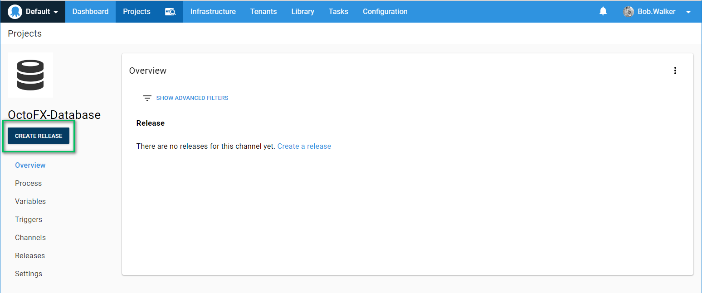

Before clicking on the save button, we want to pause on the screen and walk through what each value means.  

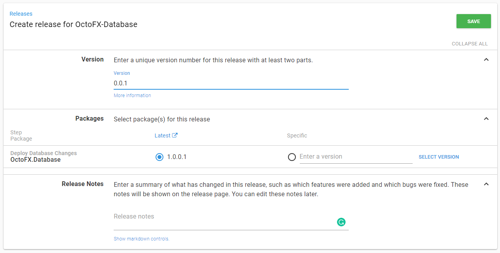

The first option is the version number for this release.  By default, Octopus Deploy is using a version number defined by the template which you can configure by going to the settings screen on the project.  

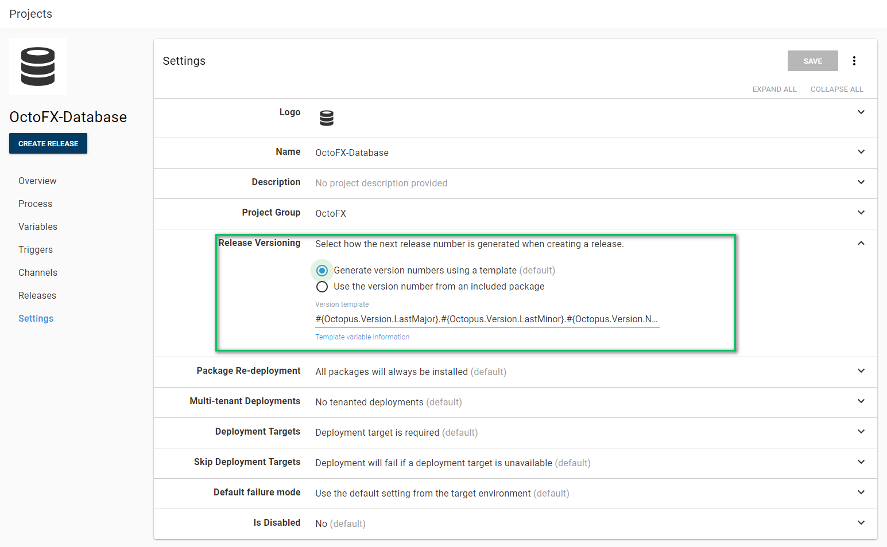

We recommend leaving that as is.  When you set up the integration with the build server you can configure the plug-in to specify the build number when creating a release.  When manually creating releases through the UI (typically done to test out changes to the process) the default option will create a new version for you with requiring you to have to make a bunch of changes to the version number.

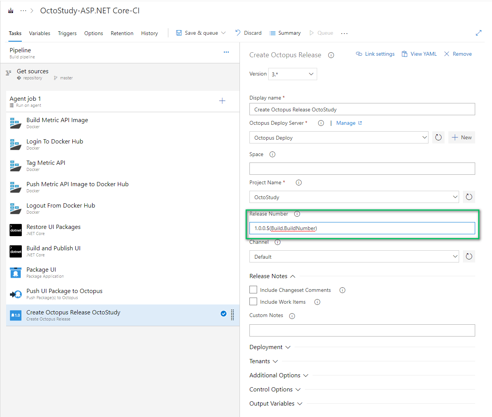

The next option on the release creation screen is the package selection section.  By default Octopus Deploy will select the latest version it can find.  But there are cases when you want to select a specific version.  To do that you can click on the select version button.

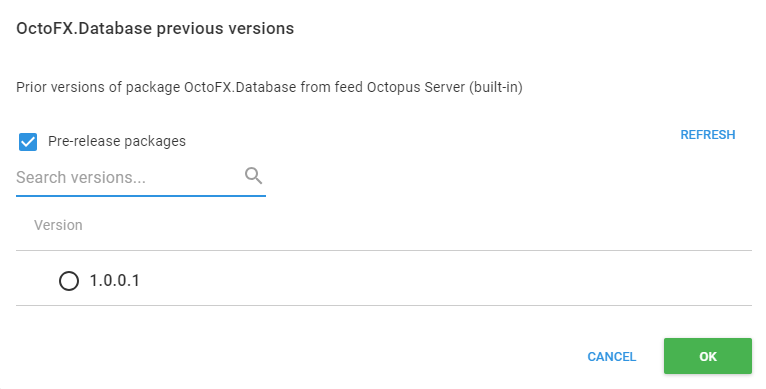

Finally there are the release notes.  The release notes support markdown syntax.  Because we are just testing out this deployment process for the first time, we are going to skip entering in anything into the release notes.  We recommend including as much information as you think as necessary for each release.  Some ideas include:

- All Git Commits since the last deployment
- Links to your internal tracking system such as Jira.  
- Detailed description of changes
- Git Commit Hash which triggered the deployment

## Deploying the release

Clicking the save button on the release will take you to the release overview screen.  From here you can view a lot of information about the release, such as what environments it has been deployed to, what variables have been snapshotted, what packages are being deployed, any artifacts created as well as the deployment history.

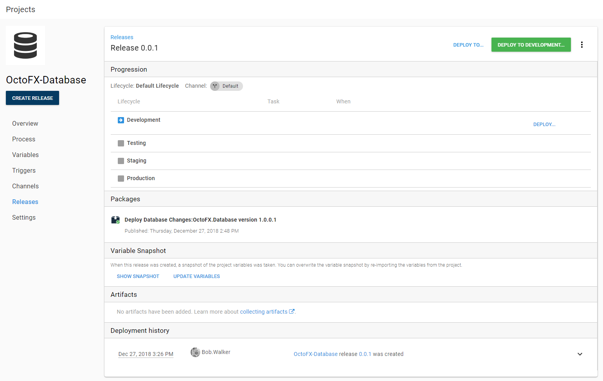

We don't really need to do anything on this screen, so we can proceed to the deploy to development by clicking on the `Deploy to Development...` button.  When you do that you will be taken to another screen to select some options.  Just like the release creation screen we want to take a moment to walk you through each of the options.

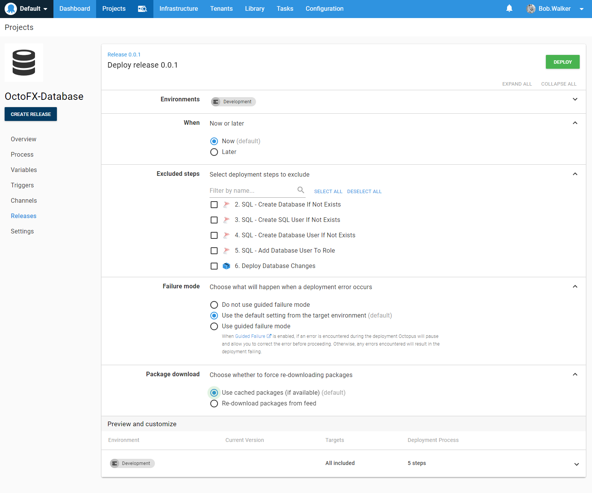

The first section we will look at is allows you to schedule when the deployment will occur.  This allows you to have a web admin or a DBA schedule a deployment to production at 7:00 PM and not have to be online when the deployment occurs.  If they are like most web admins and DBAs we have worked with they are really busy and they only want to be involved with a deployment when something bad happens.

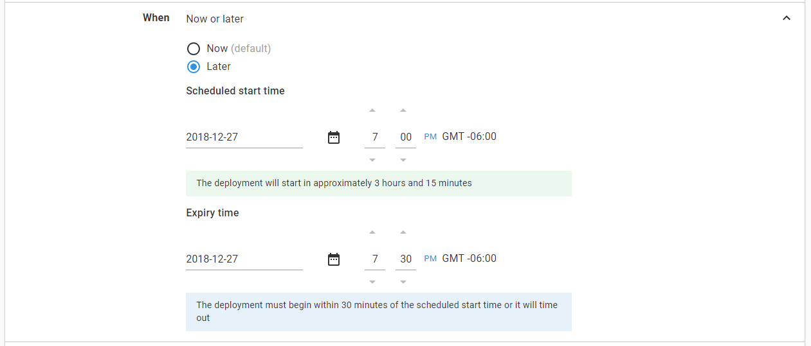

The next section allows you to configure if any steps are disabled with this deployment.  We don't recommend using this feature for regular deployments.  But if you are testing something out and it keeps failing on a specific step then disabling steps will decrease the turn around time.  

>  Excluding steps using this interface provides a nice alternative to disabling the steps in the process.  This will allow you to turn off steps without changing your process, which requires a new release to be created.  

The next section configures how the Octopus Server will handle a failure.  You have a couple of options when it comes to failures.  You can fail the deployment.  Or you can tell the Octopus Server to pause and wait for input when a failure occurs.  Guided failures are useful when you have a deployment step which randomly fails and you want to be notified of it so you can choose what to do with the step (skip it, retry or abort the deployment).  

>  After a process is configured and tested the chances of it failing are very slim.  Typically we see a failure occur because a permission on a database got changed, a file share isn't available or something else directly unrelated to the deployment.  Those types of failures require an external change (fix the database permission) and then a retry will work.

The final section is the package download option.  We recommend leaving this option alone.  The only reason you would want to force a download of the package is for debugging purposes.  Just like any other cache, using the package cache should speed up the overall deployment process.

Because this is the first time we are running this deployment process we should leave all those options alone and click on the `deploy` button at the top right corner of the screen.

## First Database Project Deployment

And unsurprisingly, the deployment failed.  A real surprise would be if the deployment was successful on the first try.  Almost every project fails on the first release.  Do not get frustrated when that happens.  Believe us, it happens to everyone.

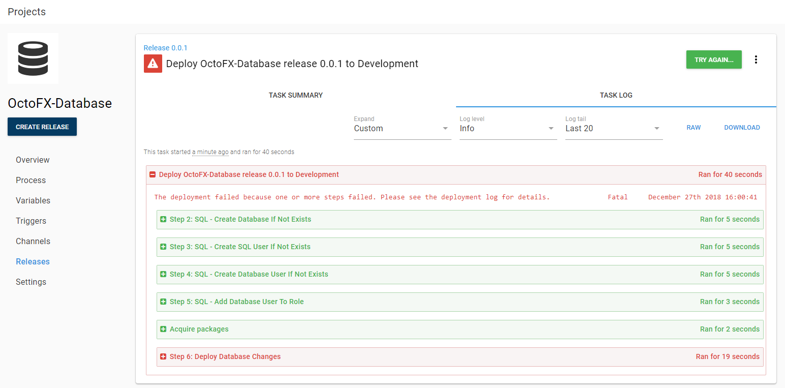

By clicking on the error message on the overview screen we can dive right into the error message and see where the failure happened.  It is making mention of the unable to find the instance to deploy to.  Based on the fact the deployment was successful in the previous steps, this leads us to believe there might be a problem with some variables that were configured.

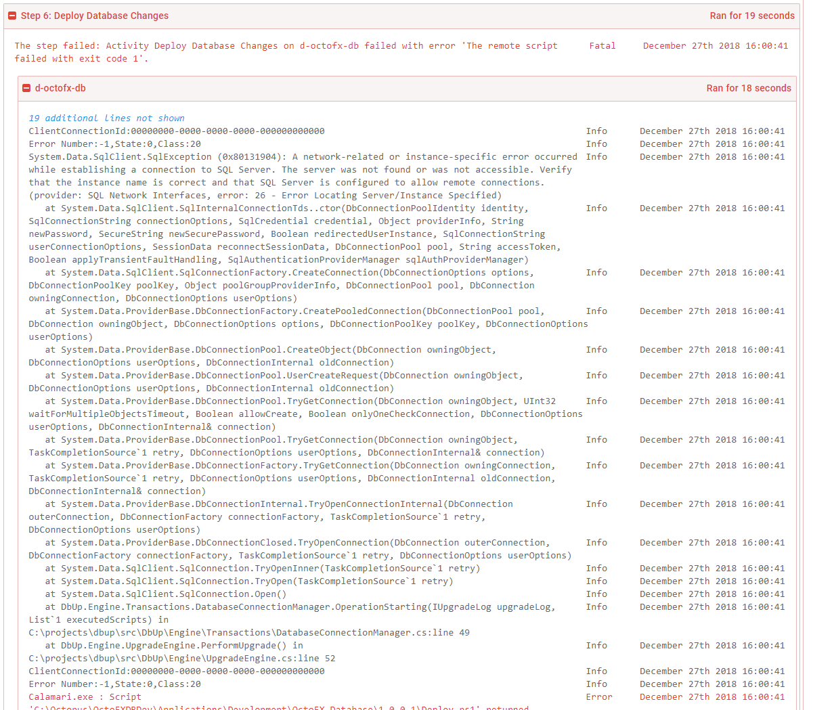

After a few adjustments to the variables, everything is now working!

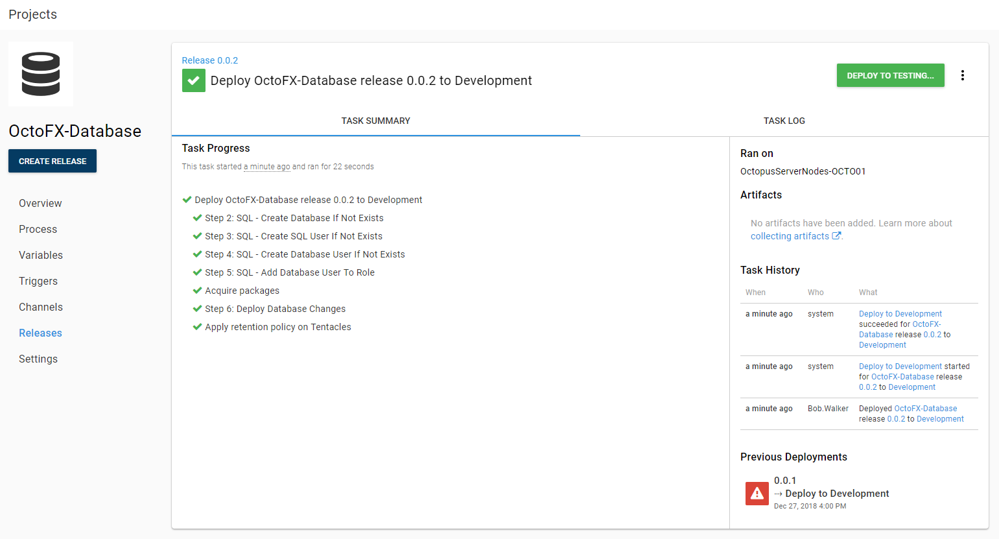

Now that we have a successful release we should take a moment to look at the task log and in particular the highlighted section below.

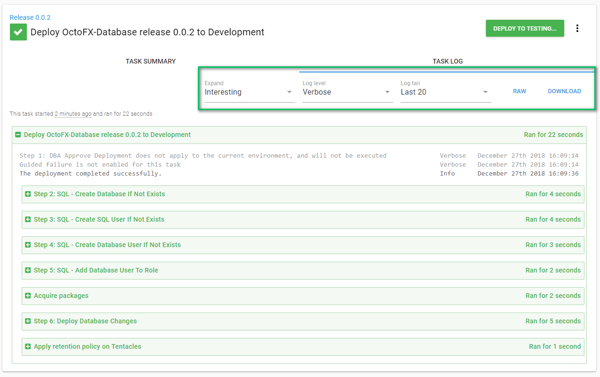

By changing the log level from info to verbose you can get a lot more detail about each step.  For successful deployments this isn't very useful.  It should really be used for debugging purposes or when a failure occurs.

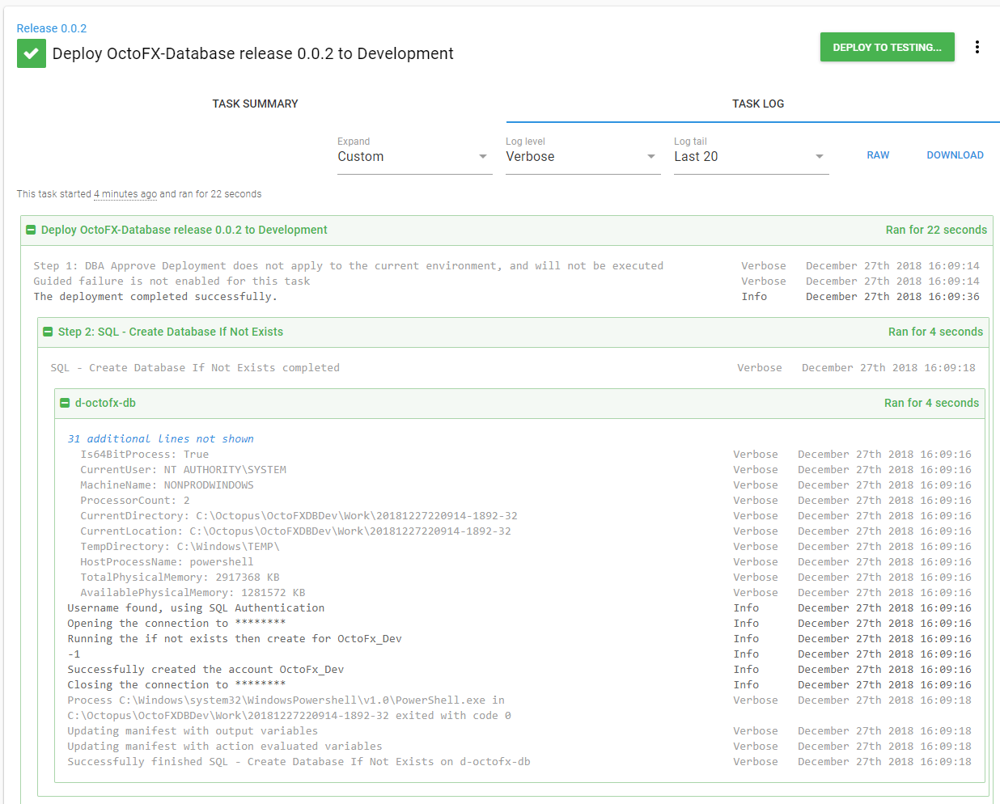

Clicking on the `Raw` button will allow you to view the log without any of the formatting.  This view shows both the verbose and info log levels as well as any errors.  

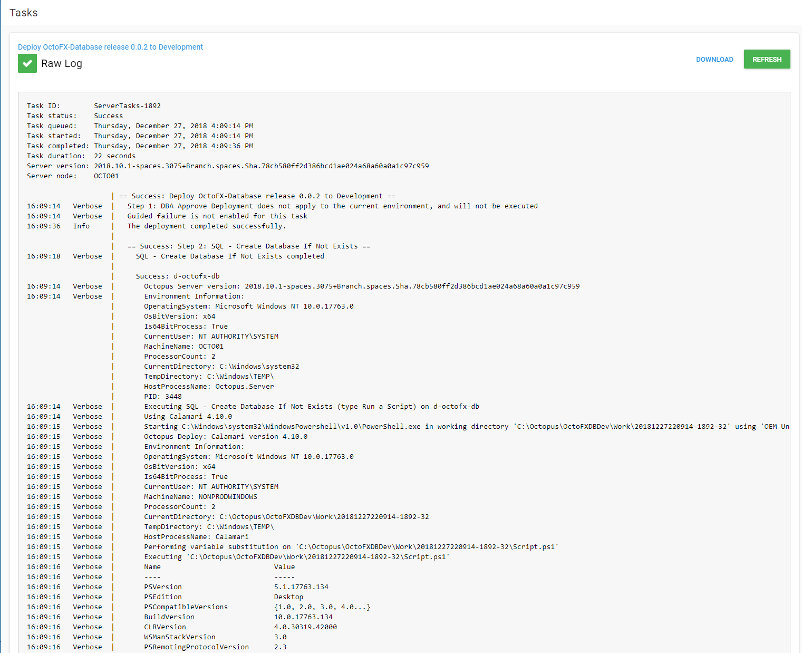

Finally the `Download` button will download the logs so they can be zipped up and emailed to support.  

## First WebUI Project Deployment

The database project has been deployed.  Next up is the WebUI project.  Just like with the database project, we are going to create a release for the WebUI project.  

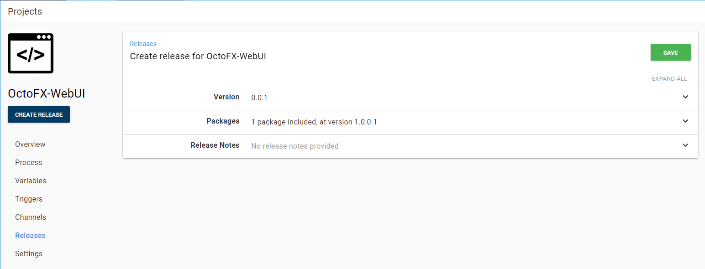

And we will go ahead and deploy that to dev. And just like the database project it took a couple of times to get it to work.

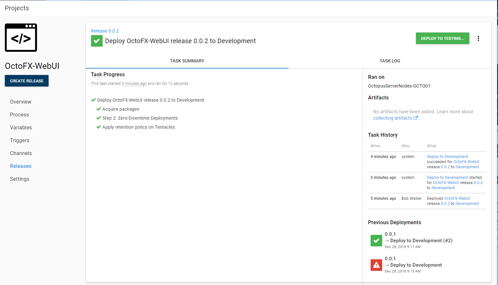

Now for the moment of truth, checking the website to make sure it actually deployed.  Which we can see it did.  

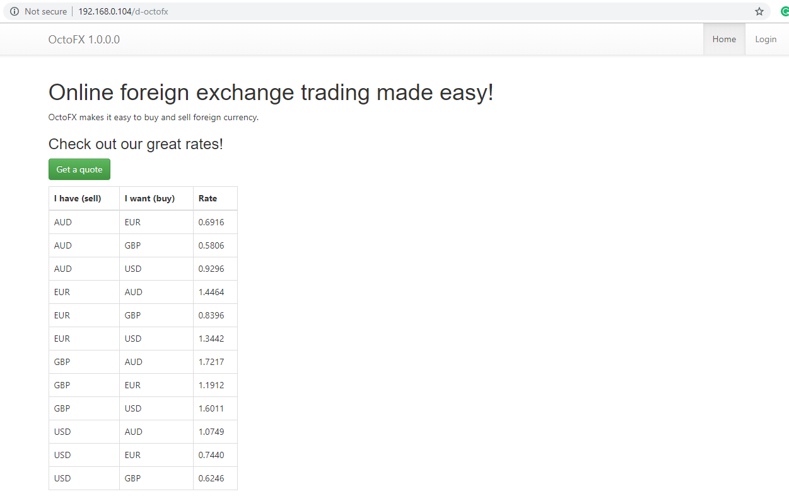

In looking at the dashboard, we can see both projects were successfully deployed to the development environment.

## First Traffic Cop Deployment

If you recall from earlier, the Traffic Cop project doesn't deploy to the Development environment.  This is because we configured it use a special lifecycle which skips Development and starts with Testing.  The reason for this is because in most CI/CD scenarios the build server is the one creating the releases for the Database and WebUI project.  The build server wouldn't create the Traffic Cop release because not all releases will be deploying both applications.  There are several scenarios where only a database change is needed (sproc bug fix, new index, etc) or only a code fix is needed (bug fix, updating css, etc).  

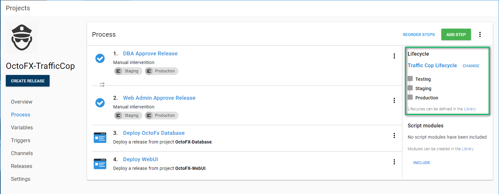

Because this is the first time this project is being deployed via Octopus Deploy it makes sense to take advantage of the traffic cop project.  Let's first start with creating the release.  

One thing you will notice the project will first try to create a release version of `0.0.1` but the projects it is deploying are currently on release `0.0.2`.  We recommend keeping versioning the traffic cop release so it matches the same Major.Minor.Patch release.  For example, if you have deployed `1.5.2.1` to the WebUI and `1.5.2.10` to the Database then the first release for the Traffic Cop should be `1.5.2.1`, or `1.5.2-Release1`.  

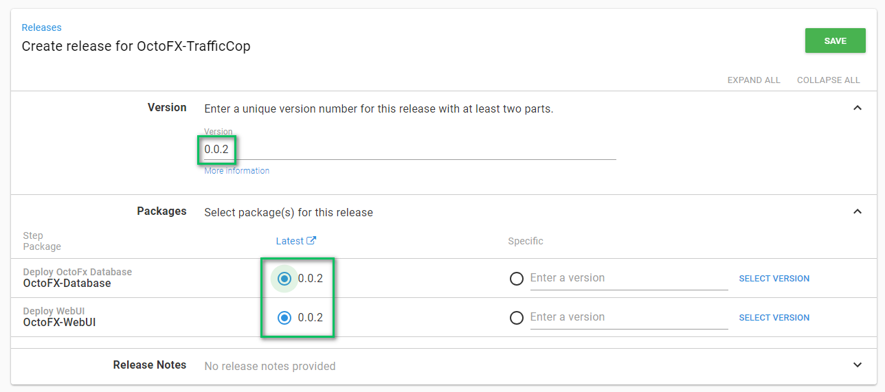

Because the lifecycle skips dev, the release will allow you to go directly to staging.  Please note, the version of the projects being deployed is included in the snapshot.  If you were to create a new WebUI release or a new Database release then you would need to create a new TrafficCop release.

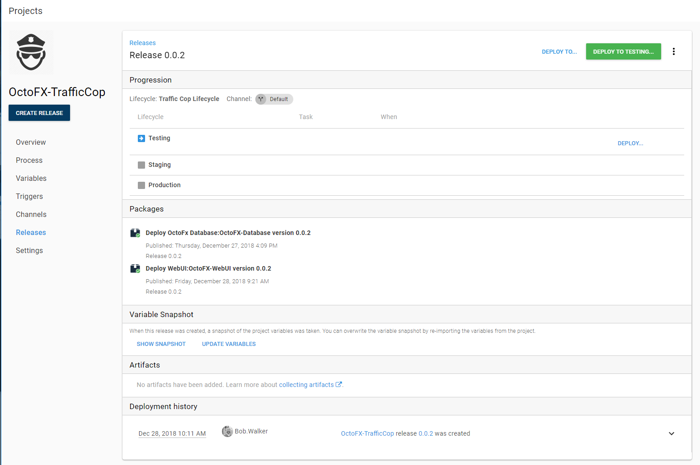

And unlike before, the first release of TrafficCop works because we sorted out any issues in Dev.

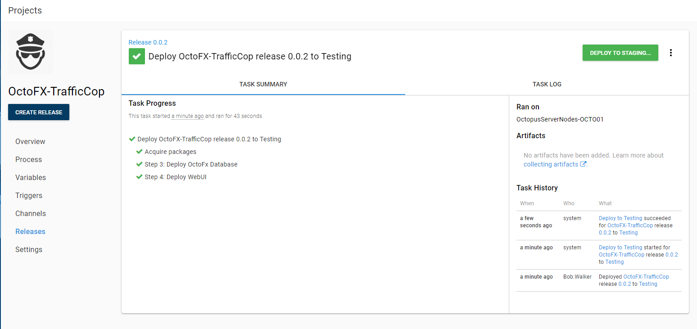

Taking a look at the dashboard shows the successful results.

And the website successfully loads.

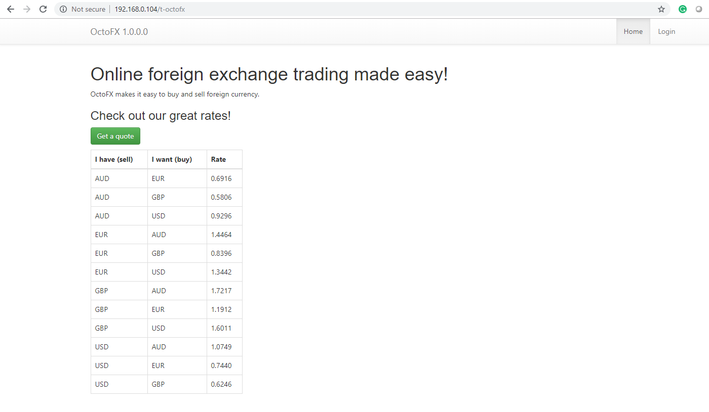

## Conclusion

We've finally done it.  We finally have Octopus Deploy deploying code to a target.  Even better the code successfully loads.  The only downside is all the releases we did in this chapter were done through the UI.  This is okay for testing purposes.  However, we need to configure the build server to automatically create the WebUI and Database releases to add more automation into the CI/CD pipeline.