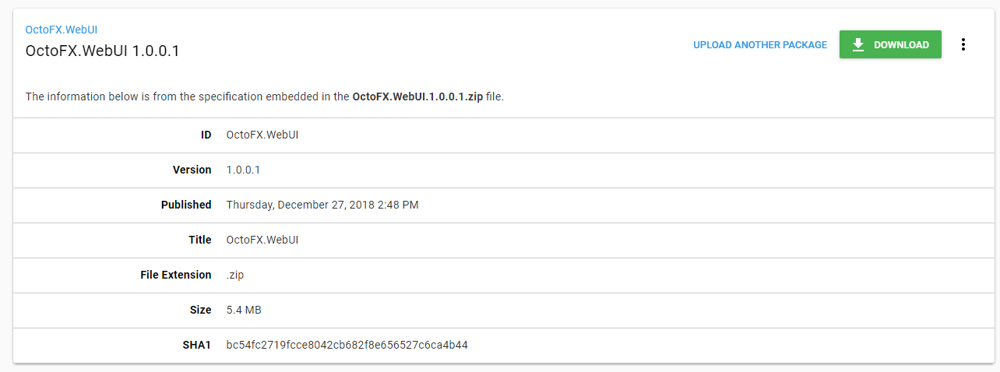

# Let's Deploy Some Code!

In previous chapters we got the environment scaffolding put together, then we created some projects for our application and finally we wrapped it up by setting up deployment targets for the projects to push code to.  After all that (whew!) it is finally time to deploy some code!

>  Typically the previous chapters will take anywhere from 10 to 20 minutes to set up and configure.  It does seem like a lot at first, the overall goal of the previous chapters was to provide you the foundation to get all the scaffolding configured so you can scale your Octopus Deploy.

Octopus Deploy will deploy code using what is known as a release.  When a release is created the project, variables, and packages being used are snapshotted.  You then deploy that release to the various environments and servers.  The idea behind a release is the core concept of Octopus Deploy, you build your code once, and you deploy that same code to all environments.  The same is true of the release.  The release is created once and that same release is deployed to all environments.

## Creating the first release

At this point we do not have our build server integration set up.  Which is okay, we don't need to do that at this very second.  An easy way to test our deployment process for the Web UI is to go to a development web server and zip up the application folder.  This will let us test our deployment process without having to worry about configuring the build server and getting that connection wired up.

For this first release I have created two packages, one for the website project and another for the database project.  For the website we went out to the dev server and packaged up the website into a zip file.  

Now we just need to upload them to the Octopus Server.  This can be done by going to Library -> Packages and clicking the upload packages button in the top right.

Now we have some packages to work with.

Before diving into the release let's talk about everyone's favorite subject, version numbers.  

## Version Numbers

The technology you're working with will, in some cases, determine the type of versioning scheme that you choose. We recommend using Semantic Versioning for your applications, unless you are deploying artifacts to a Maven repository, in which case you will need to use Maven Versions.

Consider the following factors when deciding on the versioning scheme you'll use for your applications and packages:

1. Can you trace a version back to the commit/check-in the application/package was built from? For example: We stamp the SHA hash of the git commit into the metadata component of the Semantic Version for Octopus Deploy which makes it easier to find and fix bugs. We also tag the commit with the version of Octopus Deploy it produced so you can quickly determine which commit produced a particular version of Octopus Deploy.
2. Can your users easily report a version to the development team that supports #1?
3. Will your version numbers be confusing, or will they help people understand the changes that have been made to the software? For example: bumping a major version component (first part) means there are potentially breaking changes, but bumping a patch (3rd part) should be safe to upgrade, and safe to rollback if something goes wrong.
4. Does your tool chain support the versioning scheme? For example: Octopus Deploy supports Semantic Versioning, which enables enhanced features like Channels.

The Octopus Deploy ecosystem includes a wide variety of external services which care about versions, with some of them being quite opinionated in their versioning implementations, with potential inconsistencies amongst them. Rather than implementing a "lowest common denominator" approach, we've taken a "string-based" approach. This enables you to leverage the idiomatic/natural versioning schemes of your target ecosystem.

Octopus Deploy supports regular Semantic Versioning or SemVer.  A typical example would be: `1.5.2`:

- Major
- Minor
- Patch

We also support pragmatic versioning, as not every version can fit into three numbers.  This means including a fourth number, or `1.5.2.3`:

- Major
- Minor
- Patch
- Build

Octopus Deploy also supports pre-release tags, for example `1.5.2.3-rc.1`.  

As you can see after uploading the packages the package versions are `1.0.0.1`.  This is because Octopus Deploy read the version number from the file name.

Strictly speaking about SemVer 2.0, a version like `1.5.2-rc.1` is considered a "pre-release" and `1.5.2` would be considered a "full release".  In practice, these concepts carry weight when you are talking about hierarchies of application dependencies like classical NuGet packages or NPM dependencies. This kind of strict semantic versioning enables dependency management tooling to interpret what kind of changes each package version represents. For example, they can automatically protect your software, by preventing accidental upgrades to pre-release versions, or versions that might introduce breaking changes.

A typical Maven version string is split into 5 parts:

- Major
- Minor
- Patch
- Build number
- Qualifier

The Major, Minor, Patch and Build number are all integer values.  The Qualifier can hold any value, although some qualifiers do have special meaning.

## Creating the release

We are going to first create a release to deploy the database changes.  No sense in deploying code if there isn't a database to connect to.  This can be 