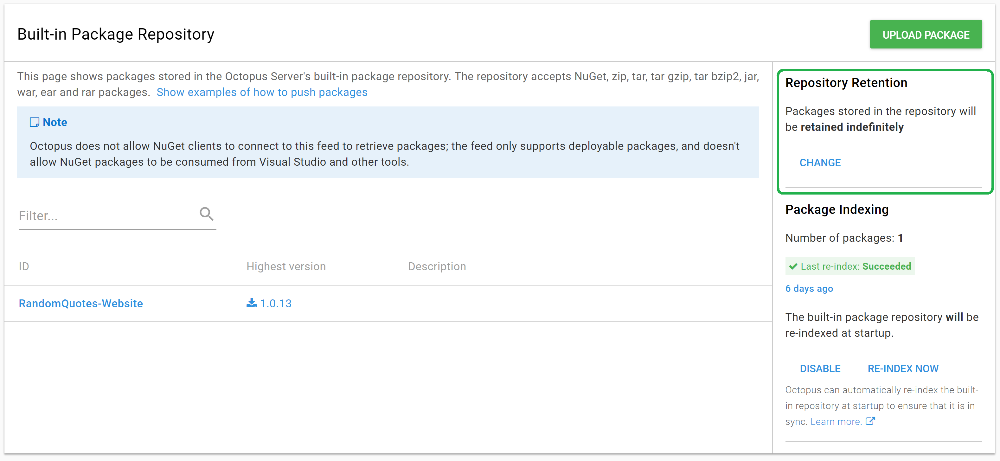
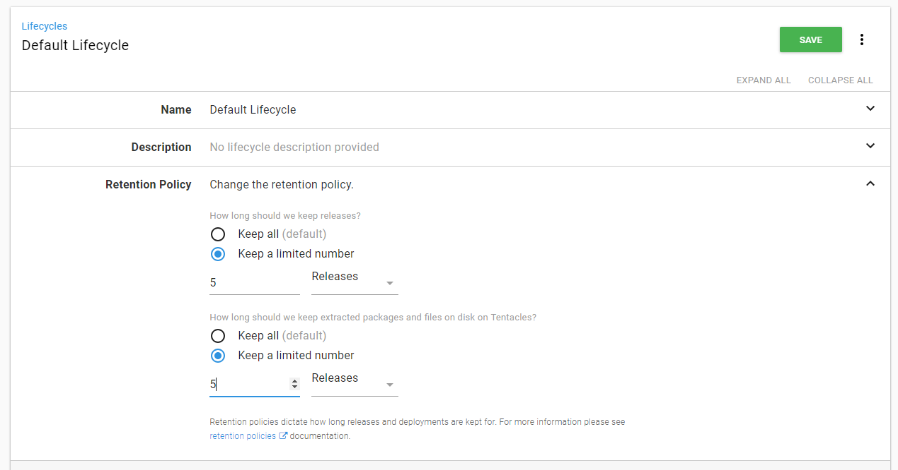
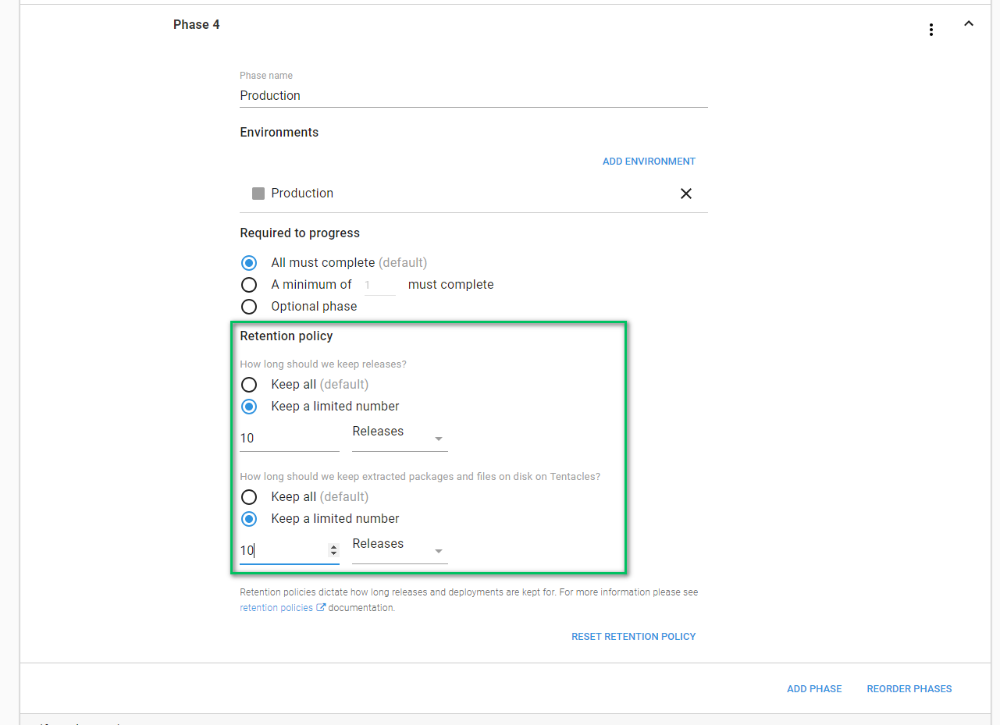

# Retention Policies

I've reviewed a number of Octopus Deploy server configurations for Data Center customers in the past year, and the first thing that I ask to see is usually the retention policies. Setting appropriate retention policies are an easy win and they are usually not changed from the default during a trial and not revisited after setting up a production configuration.

Without setting retention policies, Octopus will keep all releases created and packages uploaded indefinitely. If you have small packages or don't release frequently, you may never notice any adverse affects, but as your usage grows, you might run into disk space or performance issues as you server turns into a hoarder.

We haven't covered what packages and releases are yet, but it's okay to set these values now and revisit them once you have a better understanding of what they are.

## Package Retention

First, we'll look at the built-in package repository retention policy. If you're not planning to use the built-in repository, then you don't necessarily need to set this, but it's good to go ahead and set it so that you won't have to remember it if you do start using the repository in the future.

You can see this policy by navigating to Library > Packages and looking for **Repository Retention** on the right side of the page.

Let's click *CHANGE* and set this to something less than forever.

Choosing the **A limited time** option will allow you to choose the number of days to keep a package in the repository. The default value is 30, but you can choose something shorter or longer based on your needs. I normally pick something shorter, like one week.

It's important to note here that only packages that are not associated with releases will be cleaned up. That means that even if a package is older than the value you choose, if it is attached to an *existing* release, it won't be cleaned up until that release is also cleaned up.

Which leads us to release retention policies!

## Release Retention

## Default Lifecycle Retention Policy

By default, Octopus Deploy will keep every release and every deployment until the end of time.  We do not want to delete anything without you knowing about it and you manually changing the setting.

In reality...it doesn't make sense to keep every release and every deployment until the end of time.  In six months time do you really want to go back to that previous code?  Is it still useful?  Keeping all those releases is not good for performance either.  Octopus has to hold onto everything for that release, logs, packages, artifacts, snapshot of the process, everything.  That takes up space in your database and on your hard drives.

That is where retention policies are used.  They dictate how long a release is kept on both the server and the tentacle.  Our recommendation is to set the default retention policy to keep five releases by default.

You can override that retention policy for a specific environment.  Which is why for production we recommend increasing that limit to 10.  If you deploy once a week, this will keep 10 weeks worth of production deployments.  Which should cover you for quite a while.

>  If this is your first time applying retention policies then start with a large number (say 600) and work down to your desired number.  Periodically Octopus will automatically apply retention policies.  This task blocks other deployments.  Starting with a large retention policy and going small will allow you to slowly remove releases without blocking deployments.