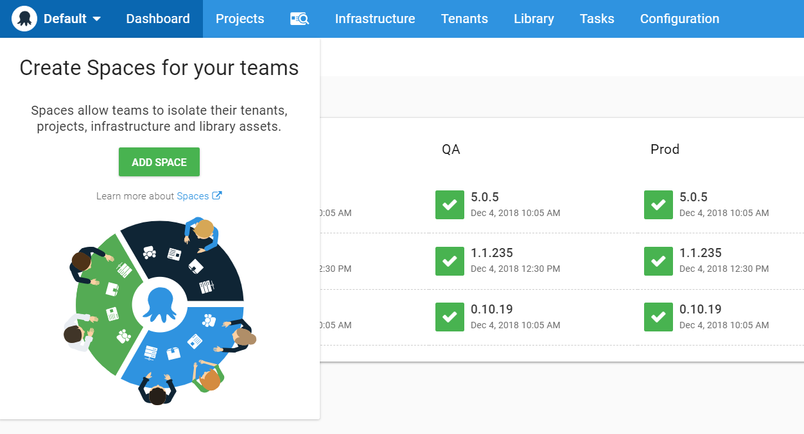
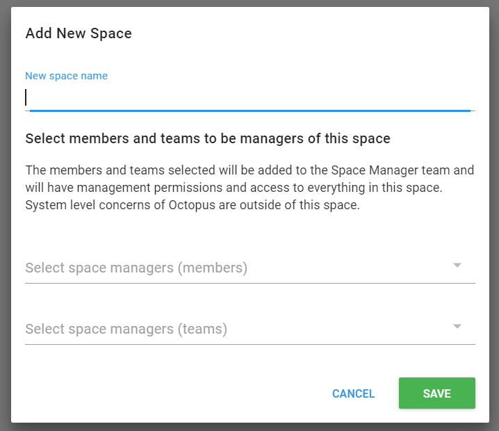
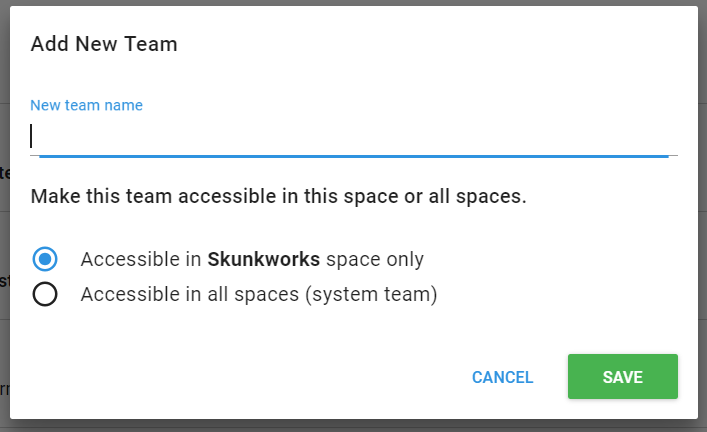

# Spaces

Do you have multiple teams or departments using Octopus Deploy? Are you creating team specific environments or lifecycles to keep your teams as separate as possible? In the past, you might have also considered configuring a completely separate Octopus server for your teams. Spaces might be the solution you didn't know you needed.

Spaces is a new way to organise your Octopus Server. They make it easy to group your projects, environments, and most other things into a Space for each team. It’s like moving teams from a large open plan office to private offices.

You might find Spaces useful if:

* You are constantly scrolling through a long list of projects to find the one you are working on
* You have trouble finding the environments or tenants you’re deploying to
* You see dropdowns with hundreds of items, and you struggle to know which option to pick

## For Admins

It's not hard to create a good separation between teams in one server with some effort and configuration. It might lead to less than optimal practices like creating a new set of environments and lifecycles per team or product. And even though your teams will have nice views of Octopus, your Octopus Administrators will not be as lucky.

Octopus Administrators see everything in the Octopus server. They will see all of the projects, environments, tenants, and targets. This leads to highly populated pages that make it hard to find what you are looking for.

And they'll have fewer Octopus servers to maintain. Victories all around!

## For Teams

### Give Teams Their Own Space

Depending on the permissions you already have configured, your teams may not noticed a change in their day to day usage of Octopus. If the teams are not configured to hide environments or projects that they do not work with, then moving to Spaces will give them a cleaner interface and let them focus only on the items that matter to them.

At time of writing, all Octopus items are unique per space. This means that each Space has their own projects, environments, targets, tenants, templates, variable sets, and so on. In the future, some of these items may span across spaces, but for now, they are all unique per space and cannot be shared.

### Put Team Leads in Control

Often, permissions are very locked down for teams that are sharing an Octopus server. This is for good reason as you wouldn't want someone to accidently remove the wrong machine from the production environment or change some variables used by another team. Most of the time, these restrictions are in place to keep one team from inadvertantly breaking deployments for another team.

This can lead to teams waiting for their request for a new target or project to be added before they can continue their work.

When an Octopus Administrator creates a space, they will designate Space Managers, who can perform any adminstrator task required within the space.

This is great because now you can put teams in control of their own space. They will not have to wait to have changes or additions made, and you won't need to worry that they are affecting any other team spaces.

## The Default Space

When you configure a new Octopus Server, it will come with a single space named "Default." Not only will it be named "Default," but it will be designated as the Default Space. This is important because if you are using any API requests that do not specify the Space Id, the server will assume that you are acting on the Default Space.

Everything we have done so far, has been added to the Default Space. Let's look at how we can set up new spaces.

## Switching Between Spaces

You can easily jump between spaces using the navigation bar. The left most item on the navigation bar displays the name of the space you are in. If you click on that name, you can choose to switch to one of your other spaces.

## Creating Your First Space

Since we haven't created any other spaces yet, you will have the option to add a new space when you click on the space switcher. This button will take you to the Spaces page and from there you can click Add Space to bring up the Add Space Dialog.

Give the space a name and then choose the Space Managers. You can choose a combination of individual users or teams to be space managers. Not that if you do not choose yourself to be a manager, you won't be able to switch to the space until one of the managers gives you access.

Once you've saved that space, you'll be taken to the space page. Here you can change the name, managers, description, and also the logo. Yes! You can have a different logo for each space!

## Space Teams and System Teams

First, can we start with just how fun it is to say Space Team?

Now that that is out of the way, let's give some users access to the space. Currently, only the space managers have access to the space. You will assign teams to the space to give other users access.

The first type of team is a Space Team. This is a team that exists only within the space it is created in and cannot be seen from other spaces. For example, you can create a Developers team within each space.

The second type of team is a System Team. This is a team that exists outside of spaces and can be given access to multiple spaces. Octopus Administrators is an example of a system team. You can also create your own system teams. For example, you might create a QA team that has access to multiple spaces.

## Conclusion

In this chapter, we introduced spaces, what they can do for your teams, and how to create and configure one.