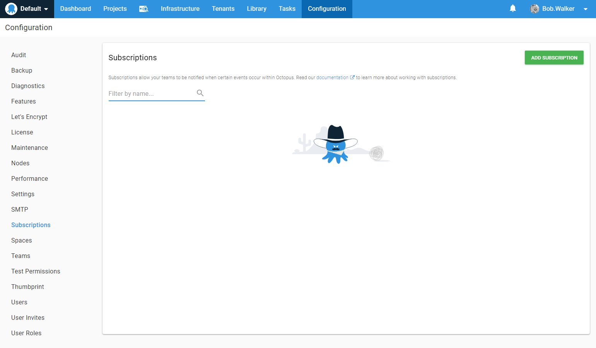
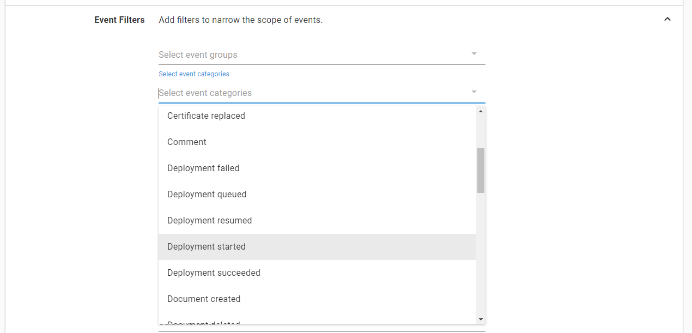
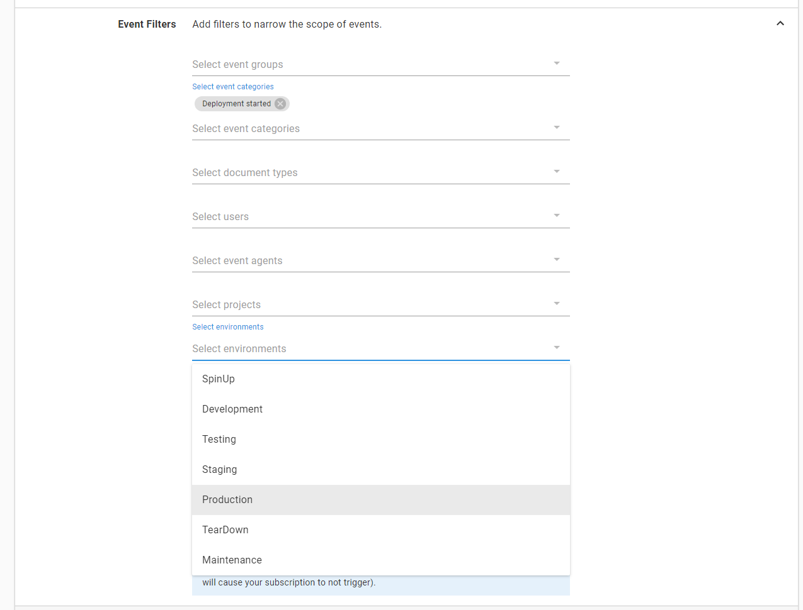
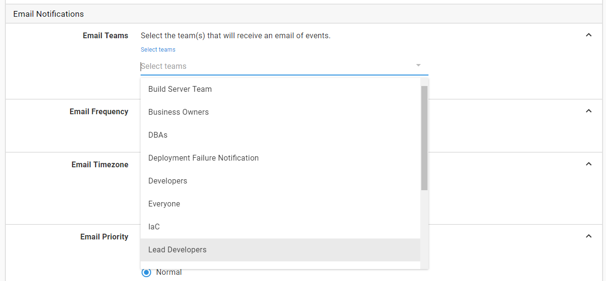
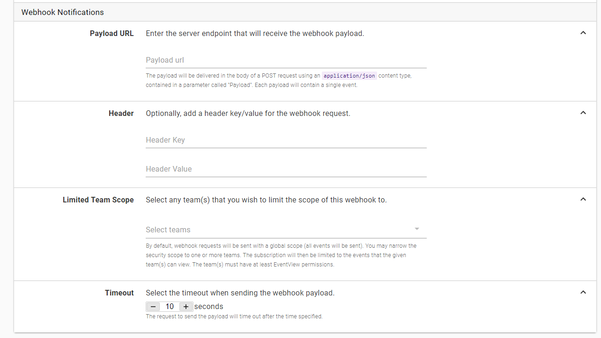

# Subscriptions

Who changed that project's deployment process? Who removed Bob from the administrator's group?

The Octopus audit log will tell you who did these actions which are useful after the fact, but wouldn't you rather know _when_ specific changes happen?

If you answered "yes," then you're in luck! This is precisely what the Subscriptions feature is for.

Let's create a subscription that will notify administrators whenever a production deployment starts. You can create an email step or Slack notification step in each project and scope it to the Production environment, but we can be notified about all production deployments with a single subscription.

## Creating Subscriptions

Navigate over to **Configuration > Subscriptions** to see any existing subscriptions.

Click the Add Subscription button to create a new subscription.

Let's give it a descriptive name like "Production Deployment." We'll leave it enabled since we want it to be active after we create it.

### Event Filters

Now we need to create a filter that represents production deployments. The first drop down is the event group selection. Event groups are great if you want to filter to a known set of events. For example, `machine critical-events` includes `machine cleanup failed` and `machine failed to be unavailable`. We'll leave this blank since we're only looking for a single event.

We want to know when a production deployment starts, so click on `select event categories` and choose `deployment started`.

A document type is the type of record to watch.  Examples are `Project`, `Variable-Set`, and `Machine Policy`.  If you were to look in the database document types would almost match up with table names.  Not exactly though, but close.  For this particular subscription, we only care about deployments to production.  No filter is needed here.

User filters allow you to filter certain actions for specific users.  A useful example would be sending a notification if a service account user fails to log in.  This filter isn't helpful for this particular subscription we are setting up.  Leave that blank as well.

The project filter allows you to select specific projects.  For this filter, maybe you only want to be notified when specific key projects go to production.  This would be one of the first filters to look at when/if the subscription starts being too noisy.  

The last piece for the filter is the environment. Click `select environments` and choose `Production`.

There are two options for how to deliver the notification, email or webhook.

### Email Notifications

We're going to set up this subscription with an email notification.

First, choose a team to receive the email. When the subscription fires, an email will be sent to each member of the team with the permissions to see that event.

Emails are sent at the frequency we choose. The default is one hour, so every hour this subscription will be evaluated, and a digest of all matching events will be sent out. One hour seems a bit long for monitoring production deployments, so let's turn that up to every five minutes.

Select your desired timezone and email priority. Because this is production, set the priority to high for this subscription.

Notice that small text at the bottom of the screenshot above.  All the emails sent out will include a deep link to the audit screen.  The deep link will allow the recipients to view the details of the deployment, such as who triggered it, when it was triggered, and other helpful information.

### Webhook Notifications

You can also configure the subscription to send the event payload to a webhook. We won't be configuring a webhook in this chapter, but we will cover the settings available.

The URL to an endpoint will accept the subscription payload. The payload will be delivered in the body of a POST request using an application/json content type, contained in a parameter called "Payload." Each payload will contain a single event.

You can also set an optional header to be sent with the request.  Typically this is an authentication header for the application hosting the webhook.  

By default, all events that match the filter will be sent to the webhook. You can limit this to events that match the permissions for one or more teams.

The last option is the timeout for the webhook request.

## Conclusion

In this chapter, we introduced subscriptions and configured a subscription that will send us email notifications when releases are deployed to production.
