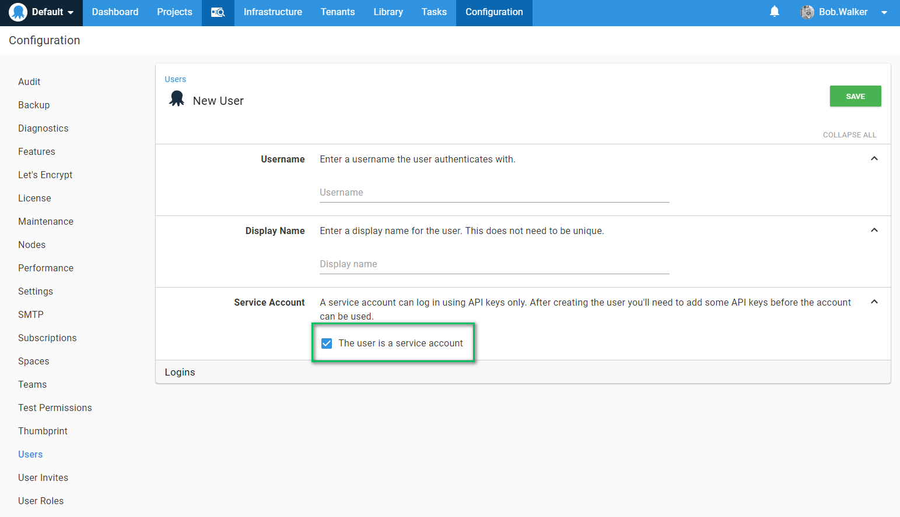
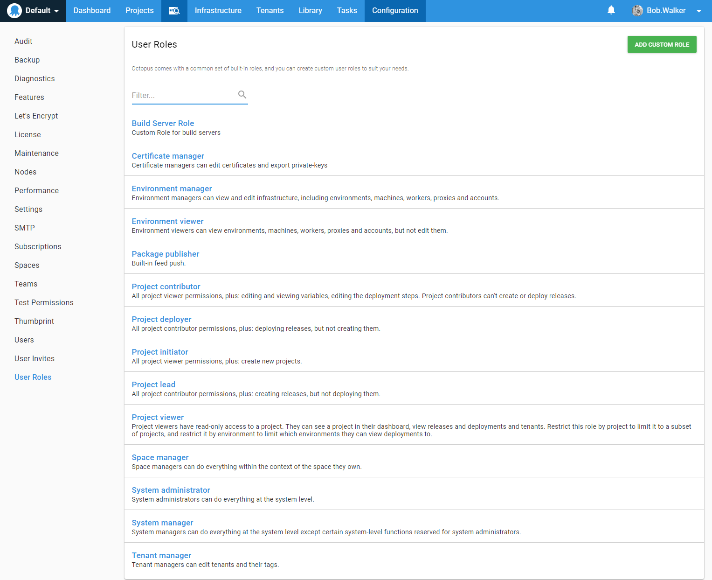
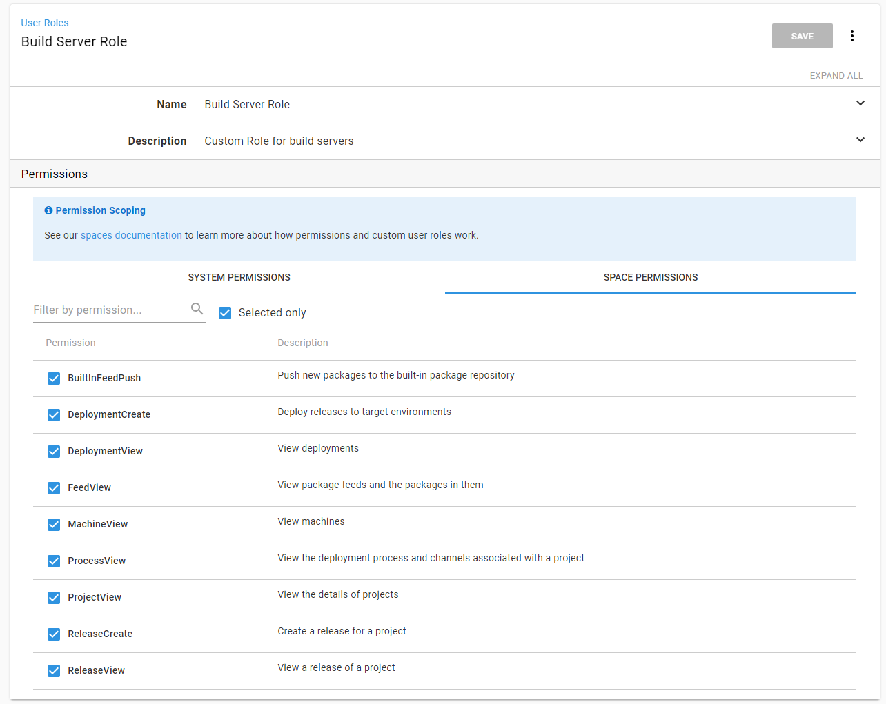
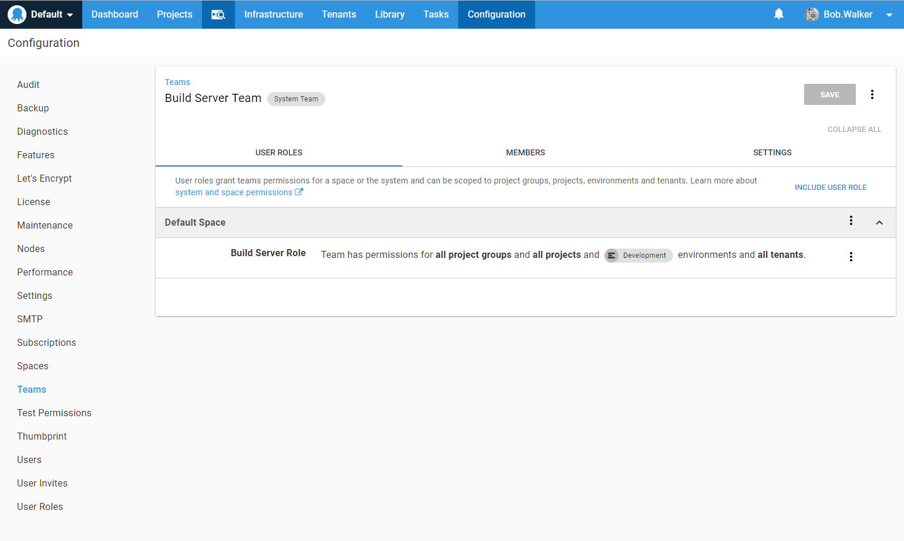
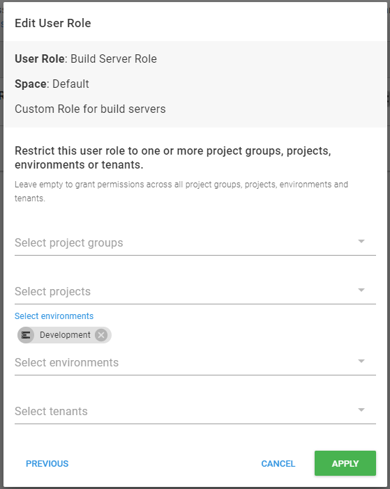
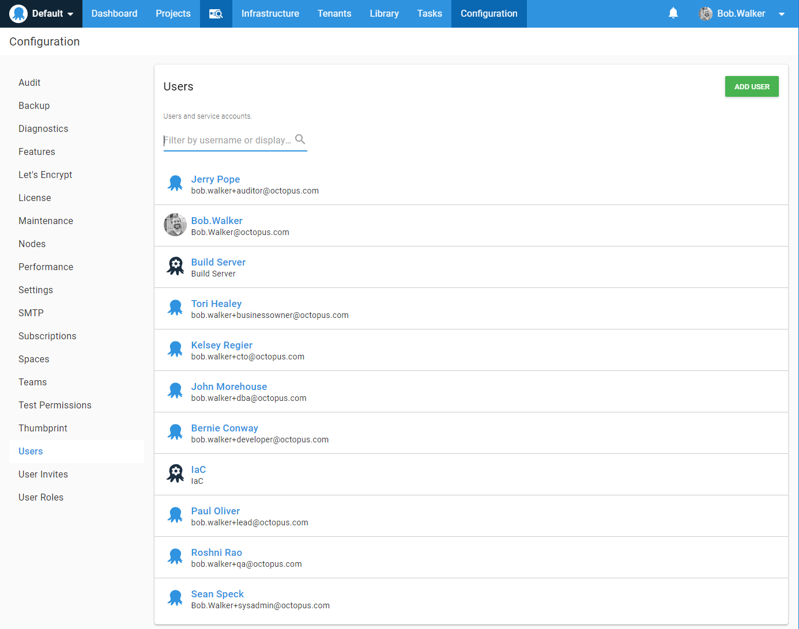
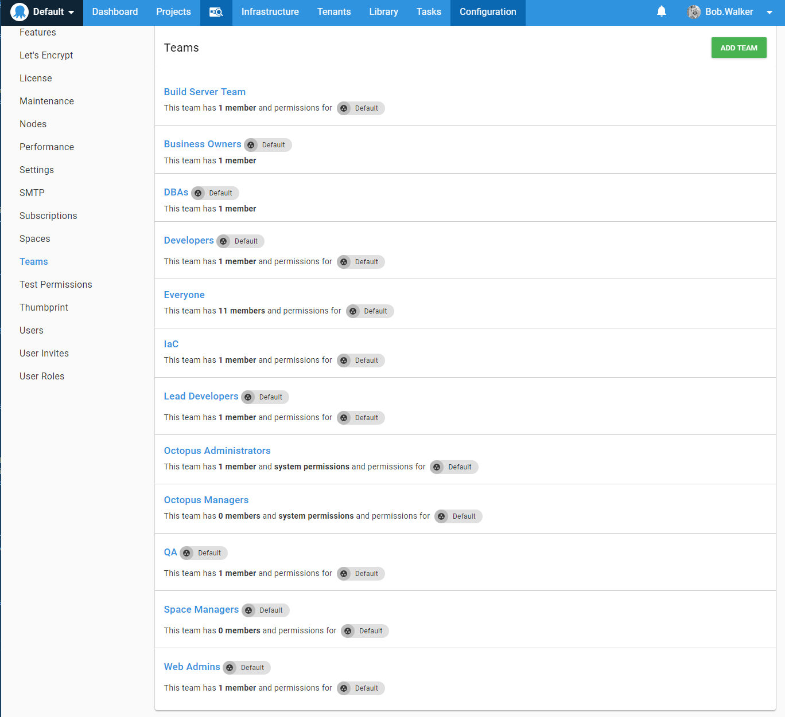
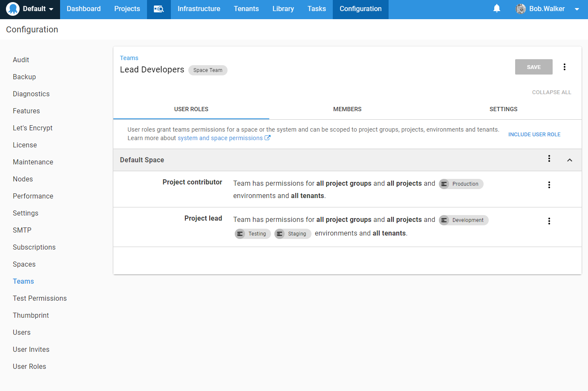
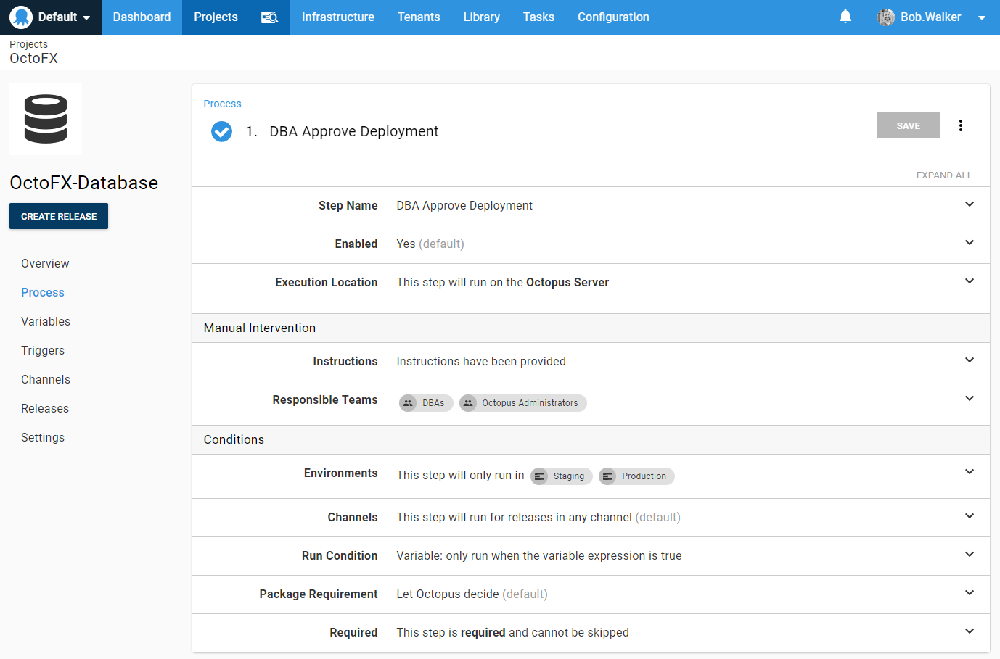

# Stopping Your Developers From Deploying to Production

In our time at Octopus Deploy we have seen a lot of different team dynamics and security requirements.  Some companies are okay with developers deploying to development, testing and staging.  While other companies only allow their developers to deploy to development.  QA deploys to testing, and the web admins deploy to staging and production.  

Rather than try to create a one size fits all security model, Octopus Deploy took the approach of fine-grained security.  We wanted to give you as much control as reasonably possible in defining your security module.  Like everything else with Octopus Deploy, this can be a double-edged sword.  In some cases, people attempt to use Octopus Deploy to solve a people problem rather than a technical problem.

It would be impossible for this book to cover every possible security scenario.  The goal of this chapter is to give you a set of guidelines for you to adapt to your own Octopus Deploy configuration.

## Scenarios

We recommend applying the "trust but verify" approach to security with Octopus Deploy.  You either trust your team, or you don't.  Do not try to come up with a security solution to limit a subset of people, for example, your "cowboy developers," from making mistakes.  You are going to end up creating a maintenance nightmare with very fine-grained permissions.

Personas or roles we will be creating on our Octopus Deploy instance.

- **Octopus Administrator:** the group of in-house Octopus Deploy experts.  They have unlimited rights in the system.  They know with great power comes great responsibility.
- **Web Admins:** the group of people responsible for setting up new machines and ensuring everything is functioning correctly.  Some of them are experts with Octopus Deploy while others are not.  They are responsible for adding new deployment targets.  They also trigger deployments to staging and production.
- **DBAs:** The group of people accountable for keeping all the databases up and running.  For this demo, DBAs are assigned the manual intervention steps for database projects for staging and production.
- **Business Owners or project managers:** the group of people who are responsible for signing off on a release before it goes to production.  They are assigned all non-DBA manual intervention steps for staging and production.
- **Lead Developers or Technical Leads:** The technical leader of the team.  Typically has been with the company for several years and knows when something doesn't work they are the first ones triaging the issue.  They have permissions to make changes to projects as well as deploy to Development, Testing, and Staging.  They also have permissions to edit variable sets.  
- **Developers:** They have permissions to change projects but cannot edit variable sets.  Day to day interaction is focused on writing code and fixing bugs.  When something goes wrong with a deployment, they typically will bring in the lead developer if they cannot figure out how to solve the issue in a few minutes.
- **QA:** QA test the application.  They want control over their environment because their tests fail if they suddenly
- **Build Servers:** Service accounts used by build servers to push packages to Octopus Deploy and trigger deployments to development.  
- **Managers, VPs, and CTOs:** They are not concerned with triggering builds.  They want to be able to see the status of the deployments and if there are any significant problems.
- **Auditors:** These individuals do not trigger builds.  Nor do they update projects or variables.  They only want to see who deployed and approved a version of code to a specific environment on a specific date.

## Service Accounts

Use service accounts for when you need an account for automation, such as build server integration or API interaction.  Do not use regular user accounts for automation.  Service accounts do not have passwords.  They only have API Keys.

We recommend this for many reasons.  Using a user account throws off auditing.  All releases and deployments to development will appear as if it came from that user.  If that user were ever to leave you would need to switch the keys over to someone else (typically when you create the service account).  

Service accounts are set when you create a new user.  Once a user is created they cannot be made into a service account.  Once a service account is created they cannot be made into a user.

## Built-In User Roles

Octopus Deploy comes with many built-in user roles to support these scenarios.

A team of people can be assigned to one or more roles.  To support our scenarios, we will be assigning the following roles to the following teams.

- **Everyone**: Assign everyone project viewer role.  By default, allow everyone to see projects and events but not edit them.
- **Octopus Administrator:** System administrator role
- **Web Admins:** Environment manager and project deployer
- **DBAs:** No additional rights needed (they have project viewer from everyone)
- **Business Owners or project managers:** No other rights required (they have project viewer from everyone)
- **Lead Developers or Technical Leads:** Project lead for development, testing and staging environments, project contributor for production
- **Developers:** Project contributor role
- **QA:** Project deployer role restricted to the testing environment
- **Build Servers:** Custom role called "Build Server Role"
- **Managers, VPs, and CTOs:** No additional rights needed (they have project viewer from everyone)
- **Auditors:** No other rights required (they have project viewer from everyone)

We typically don't recommend creating your own custom role (except for the build server role below) as you could end up spending a lot of time trying to figure out why something isn't showing up correctly.  

## Build Server Role

The build server role is a custom role which specific set of permissions.  We want to limit the ability of this account only to publish packages and create releases.  The view permissions are included, so the plug-in for the various build servers work.

When we create this team, we create it as a system team.  We can restrict it to the development environment by setting the scope when assigning the role.

If you would like to edit that permission you can by clicking on the three `...` and making the changes on the modal window.

## Users

To help make things clearer for this demo, we have created many personas (based on real-life people) for each role.

In the real world, you should set up external authentication, such as Active Directory, Okta, or Google Apps.  External authentication will allow you to assign external teams to Octopus Deploy teams.  When a new person joins your organization, they only need to be added to the external team to give them the necessary permissions in Octopus Deploy.  Also, if the user's account is deactivated in the external provider, they can no longer log into Octopus Deploy.  

## Teams

Based on those scenarios and roles these are the teams created for this demo.  You will notice that there is no Manager or Auditor team.  That is because they already have project viewer rights.  Besides, they are not going to be doing any approvals.  There is no need to create a specific team for these scenarios.

The lead developer team is a little unusual.  It has rights to do quite a bit in development, testing and staging.  However, it is limited in production.  With the new team security structure introduced with the Spaces feature, you can now assign multiple roles to a single team.

## Manual Interventions

With the above scenarios, we create a couple of teams to be used for approvals, DBAs, and Business Owners.  The temptation is to limit manual interventions to only those teams.  We recommend giving Octopus Administrators the ability to approve releases.

Octopus Administrators sometimes need to test new features.  Having the ability to approve is critical.  Alternatively, it is an emergency, and all the DBAs are out to a team lunch, and you need to get a deployment to production approved.  The Octopus Admins should know what will happen when they click on `Approved`.  They know it will be audited.  They can tell and show anyone what was done after the emergency has passed.

## Conclusion

Security in Octopus Deploy is very granular.  Our recommendation is to go through each of the roles in your organization and match up appropriate permissions with them.  At first, you will be making your best guess.  Do not be afraid to iterate through your security until you get it dialed in.  We do recommend granting the least permission as possible and then start opening it up.
