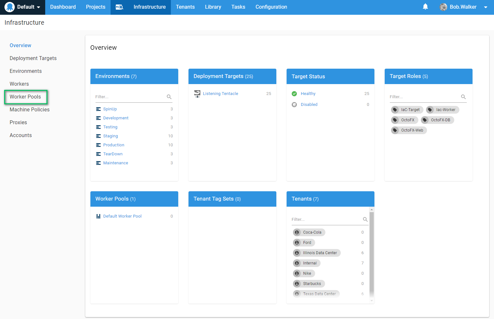
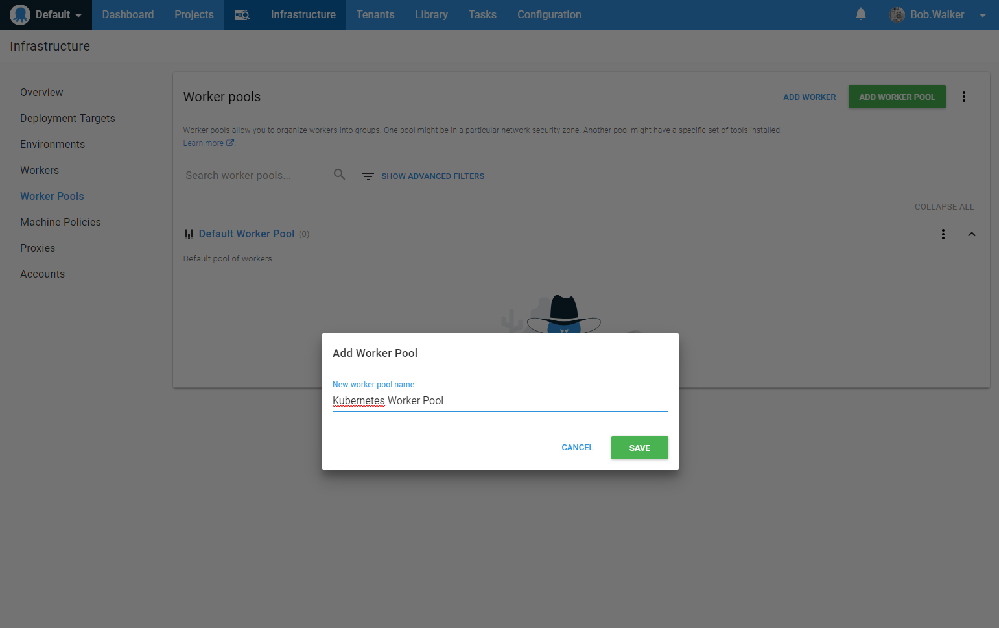
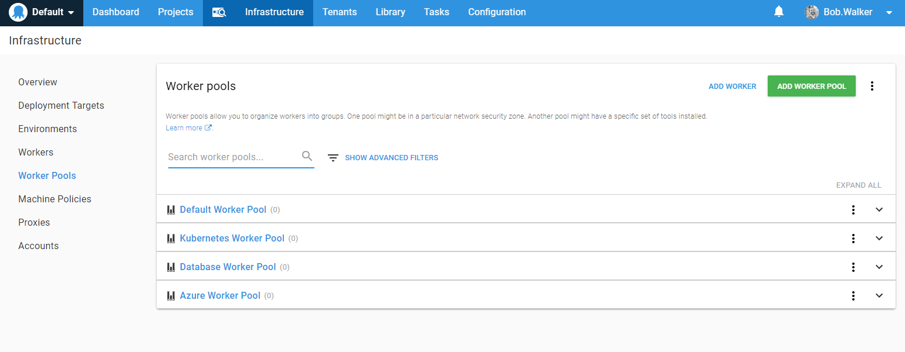

# Offloading Work Onto Workers

When you add a run a script step you are asked to define where the script will be run.  If the script is to do some clean-up work after deploying to IIS it makes sense to run it on a deployment target.  That is pretty clear.  But what about other scenarios, say sending a notification to slack.  It doesn't make a whole lot of sense to run that on a deployment target.

When Octopus Deploy was first created the number of times you would run a script on a server was limited.  Send a slack notification.  Create a folder name based on some business logic.  Notify NewRelic of a deployment.  That work is easy for the server to do.  It doesn't consume resources nor does it take a lot of time.  

With the addition of Platform as a Service options, the Octopus Server is being asked to do quite a bit more.  An Azure App Service isn't the same as a VM.  It is not a server where you can download and extract a package.  The deployments all occur over an API.  Anytime you want to deploy an Azure ARM Template, or to a Kubernetes Cluster you would run that directly on the Octopus Server.

It is completely possible to have a deployment process run on the Octopus Deploy server.  This is not a terrible thing when you have one or two projects.  It doesn't scale all that well when you have several hundred or thousands of projects.

On top of that, these scripts are running on the Octopus Server.  We like to think most people are good at heart and don't mean any ill-will.  But people make mistakes.  A missing quote here.  A missing quote there.  And before you know it the server hosting Octopus Deploy crashes.  

This is why workers were created.  They allow you to move that work from the Octopus Deploy server onto other machines.  How it works is you create a worker pool and put machines in that pool.  When work needs to be done the machine is leased from the pool, the work is done on that machine, and the machine is placed back into the pool.

In this chapter we will configure worker pools.  While we are doing that we will provide recommendations to help secure your Octopus Server and scale your worker pools.

## Worker Pools

In the diagram above there are two worker pools, Windows and Linux.  That is a good start.  However, we recommend creating a worker pool for the type of work being done.  If you are doing Kubernetes deployments, Azure deployments, and database deployments, then we would recommend three worker pools, one for Kubernetes, another for Azure and another for database.

Breaking apart the worker pools by deployment type provides a number of benefits.  The servers in each pool only have the be configured to handle the deployment type.  For Kubernetes deployments this means only having to install KubeCtl.  While the Azure deployments would only need the Azure CLI installed.  This reduces the chance of any software conflicts.  You can scale up your worker pools based on need.  If you are deploying to hundreds of databases then you could have a half dozen workers in the database worker pool.  Meanwhile if you are only deploying to a couple of Kubernetes clusters then you might only need one or two workers in the pool.  

For this demo we will be adding those three worker pools.  To start, you will go to the infrastructure page and click on worker pools.

When you come to the worker pool page you will notice there is already a worker pool, the `Default Worker Pool`.  This worker pool is automatically created when you install Octopus Deploy.  When there are no machines in the default worker pool then the Octopus Server will handle the work.  

Leave the default worker pool alone when configuring workers and worker pools.  Do not add any new machines to the default worker pool.  This will allow you keep using Octopus Deploy as is while you create new workers and workers pools.  That way you can phase in your rollout of workers rather than making big bang changes.

From here we will click on the `Add Worker Pool` button in the top right.  You will be presented with a modal window where you can enter in the new worker pool name.

When you click save you will be sent to the worker pool form.  On this form you can add a description to the worker pool as well as make it the default worker pool.  The worker pool we are adding is for Kubernetes deployments.  It will not be the default worker pool.

That is it!  We have now configured the first worker pool.  Go ahead and repeat that process two more times to add in the additional worker pools.

## Workers

Adding workers to a worker pool is just like adding a deployment target to an environment.  At the time of this writing only three types of deployment targets are supported with worker pools, polling tentacles, listening tentacles and SSH targets.  

## Changing Project Steps to Use Worker Pools

## Disabling the Default Worker